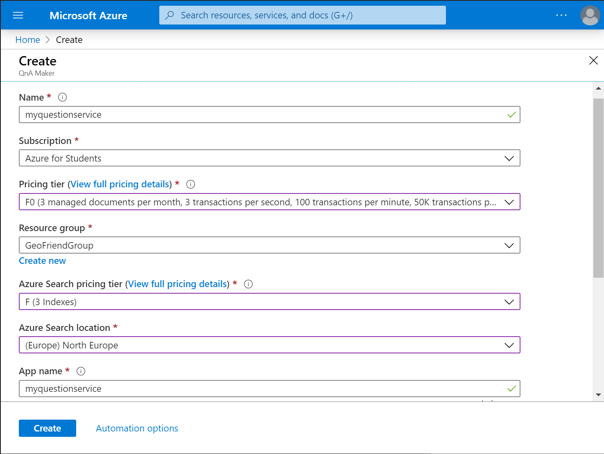
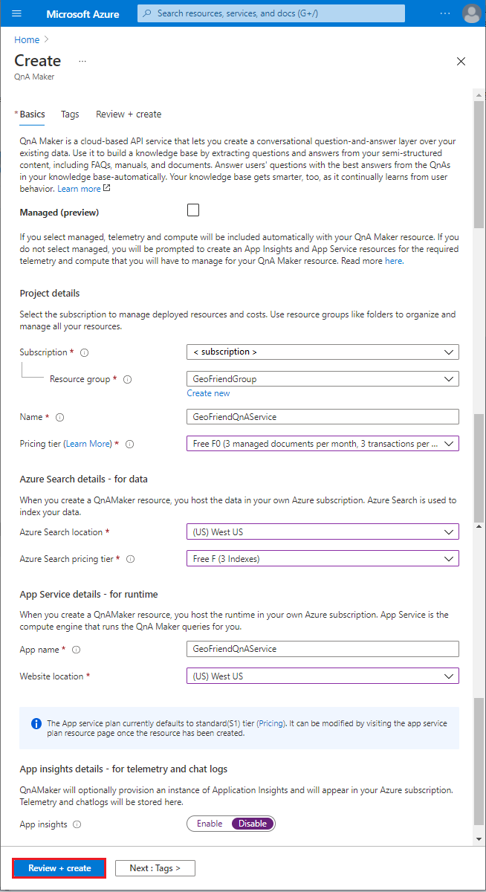
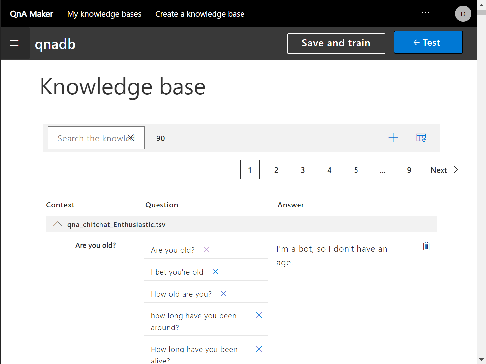
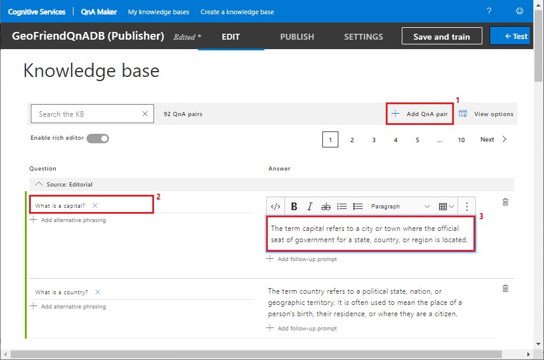
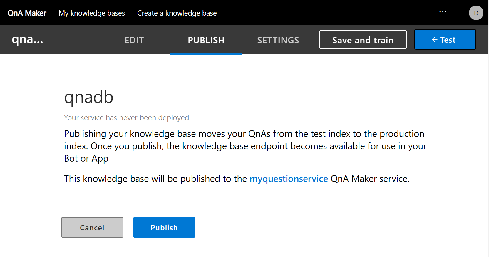
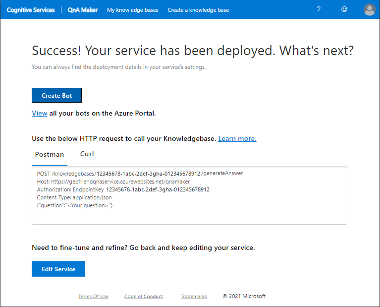

Our bot can now handle a few specific requests, but it would be nice to give the bot the ability to answer general questions about geography terminology, like a simple encyclopedia. We could use LUIS to create this functionality by creating separate intents, but there's an easier way. We'll use a separate service in Azure Cognitive Services, **[QnA Maker][QAMaker]**, to handle this scenario.


## Train your QnA Maker model

As we did with LUIS, when we add the QnA Maker service to our bot, the first thing we do is train the service by using our specific data. To begin training QnA Maker, go to [https://qnamaker.ai](https://qnamaker.ai?azure-portal=true) and sign in by using your Microsoft account.


### Create a QnA service in Microsoft Azure

The first step is to create a new QnA service to serve as our knowledge base.

1. To get started, select **Create a knowledge base** at the top.

1. Under **STEP 1**, select the **Create a QnA service** button. A new browser window opens in the Azure portal.

   

1. Configure the following settings for the new QnA service:

   1. Enter a name for the service. For our example, we use **GeoFriendQnAService**.

   1. Select the **F0 (free)** pricing tier.

   1. Select the same resource group that used for the Web App bot.

   1. For the Azure Search pricing tier, select **F (3 indexes)**.

   1. Select relevant locations for Azure Search and Azure Web App. Preferably, select the same location you used when you created the other bot components.

   1. Enter an app name. We use the same as our service, **GeoFriendQnAService**.

   1. For **App insights**, select **Disable**.
   
   1. You can ignore the **Managed (preview)** setting.

     

   When the settings are configured, select **Review + create**, and then select **Create**.

   The system validates your configuration settings and deploys your new service. The view changes to show your new service in the Azure portal.


### Connect your QnA service to a knowledge base

After the new QnA service is deployed, return to the browser window where you signed into QnA Maker.
Now we need to connect the QnA service to a knowledge base.

1. Under **STEP 2**, select the **Refresh** button to view your new service.

1. Under **Microsoft Azure Directory ID**, choose **Select tenant**. Then select your tenant ID for Azure Active Directory.

1. Select your **Azure Subscription**, and the **Azure QnA service** that you created.

1. For the language, select **English**. The selected language will be used for information extraction.

   Some of the languages shown for the **Language** setting support *chit-chat* functionality, which refers to general conversation functionality.
   For other languages, only information extraction and basic QnA functionality is available. For the purpose of this module, let's select English as the most supported language.


### Specify your database

The next step is to provide a name for the database where you'll store your knowledge base data.

- Under **STEP 3**, enter a name for your database. Our example is **GeoFriendQnADB**.


### Provide data sources

Under **STEP 4**, you can provide data sources. If you have an FAQ available, either in the form of an electronic document or a page on the web, you would enter the information here and the service can automatically index it.

For now, we won't add any files or URLs, and we can ignore the **Enable multi-turn extraction** setting. We'll manually provide questions and answers later through a web interface.

*Chit-chat*

You can enable chit-chat functionality for your service. However, even without adding chit-chat, the bot supports some general conversation, such as greeting the user and saying goodbye. General conversation capability plays an important role in responsible conversational UI because it helps build trust with the user and helps maintain a degree of emotional connection with the user.

*Personality*

We can select among different personalities for our general chat.

- Select the **Enthusiastic** personality. This style corresponds well with our goal and target audience.

In QnA Maker, chit-chat prepopulates our knowledge base with a set of potential common questions and possible answers. The personalities that we select affect our initial set of phrases. You can change the personalities and phrases later, if you want to.

> [!Note]
> Choosing a bot's personality is an important step. When you select the personality, you need to keep in mind potential diversity in the target audience. In QnA Maker, the bot can't easily switch personalities during a conversation. If you anticipate that your bot will talk to different audiences and different personalities are required, we recommend that you take a look at how to [Add chit-chat to a knowledge base][AddChitChat].


### Create your knowledge base

Now we're ready for our knowledge base to be created with our configuration settings.

- Under **STEP 5**, select **Create your KB**.

The system reviews your data and extracts the question-and-answer pairs. When the knowledge base is ready, an editing page opens.




## Add and modify question-and-answer pairs

In the **Knowledge base** editor, you can see a chit-chat knowledge base that's prepopulated with information from the *qna_chitchat_Enthusiastic.tsv* file. One column shows the existing questions and another column shows the corresponding answers. You can edit the existing questions and answers, and you can add new questions and answers.

Let's add some geography terminology to this knowledge base. We'll add two questions and answers to support the terms *country* and *capital*. Later on, you can provide more specific QnA functionality about geography, but to demonstrate the UI, we'll use these two examples.

1. On the right, select **+ Add QnA pair**.

1. On the left, under the **Question** column, select **+ Add alternate phrasing**.

1. In the **Question** edit box, enter the following question:

   > What is a country?

   To complete the entry, click outside the box. If you use the Enter key, a newline is added to your entry.

1. On the right, under the **Answer** column, select **Enter an answer**. 

1. In the **Answer** edit box, enter the following answer. To complete the entry, click outside the box.

   > The term country refers to a political state, nation, or geographic territory. It is often used to mean the place of a person's birth, their residence, or where they are a citizen.

1. Repeat the steps to add another question and answer pair:

   **Question**
   > What is a capital?

   **Answer**
   > The term capital refers to a city or town where the official seat of government for a state, country, or region is located.




## Train and test your model

After you add the new question-and-answer pairs, save and train your model.
Then check the accuracy of the model by chatting with your bot from within QnA Maker.

1. At the top right, select **Save and train**.

1. After training completes, select **Test**. A chat pane opens on the right. 

1. In the chat pane, enter a phrase or question to start a conversation with your bot. For example, *I want to know what a capital is*.

1. To see the detailed QnA Maker response to your input, select **Inspect**.

   

   The details show the probability of the selected answer. You can provide alternate phrases to improve the accuracy of the model.


## Publish your model

After you train and test your model, it's time to make it available for use.

- At the top, choose the **PUBLISH** view, and then select **Publish**. The model is published in the cloud.




### Save the access data for your service

After the publish completes and the service is deployed, QnA Maker displays details about how to access your service.



Under the **Postman** tab, you'll see the access parameters for your service:

```console
POST /knowledgebases/< Knowledge Base ID >/generateAnswer
Host: < Service Host URL >
Authorization: EndpointKey < Service Endpoint Key >
Content-Type: application/json
{"question":"<Your question>"}
```

We need to save some of the Postman parameter values to access your service from your bot source code. We'll store the values in the *appSettings.json* file for your bot project like we did for the LUIS recognizer settings.

1. Return to your bot project in Visual Studio. Open the *appSettings.json* file.

1. Add the following statements to the end of your *appsettings.json* file. Update the \<placeholders> with the access values for your service model.

   ```json
   "QnAKbId": "< Knowledge Base ID >",
   "QnAEndpointKey": "< Service Endpoint Key >",
   "QnAHostname": "< Service Host URL >"
   ```

   - `QnAKbId`: The QnA Maker knowledge base identifier, which is the sequence of numbers after `POST /knowledgebases/`, such as 1a23456b-c1d2-3456-7e8a-b1c2d34e5ab6.
   - `QnAEndpointKey`: The QnA Maker service endpoint key, which is the sequence of numbers after `Authorization: EndpointKey`, such as 987e654d-321c-098b-765a-98e76d543ca2.
   - `QnAHostname`: The QnA Maker service host URL that follows `Host:`, such as https:\/\/my-region.api.cognitive.microsoft.com/.
   
> [!NOTE]
> Notice the **Create Bot** action on this page. By using this action, you can create a bot for your QnA service from within QnA Maker. In fact, creating a bot from within QnA Maker probably is the easiest way to get a bot up and running in the cloud. Even a bot without sophisticated functionality can implement responsible UI!


## Integrate the QnA Maker model into your bot

Now we want to add QnA Maker functionality to handle chit-chat and question answering in our bot. This process is similar to how we added a LUIS recognizer in the previous exercise.

1. Return to your bot project in Visual Studio. To interact with the QnA Maker model from your code, add the Microsoft.Bot.Builder.AI.QnA NuGet package to the bot project.

   > [!Tip]
   > For the steps to install the NuGet package, see the [Install the LUIS NuGet package][InstallNuGet] section in the previous exercise.

1. Open the *Startup.cs* file, and locate the `ConfigureServices` function. In the function, find the `AddSingleton` statement for the LUIS recognizer. Add the following `AddSingleton` statement for the QnA service after the `AddSingleton` statement for the LUIS recognizer:

   ```csharp
   services.AddSingleton(sp =>
       {
           return new QnAMaker(
               new QnAMakerEndpoint
               {
                   EndpointKey = Configuration["QnAEndpointKey"],
                   Host = Configuration["QnAHostname"],
                   KnowledgeBaseId = Configuration["QnAKbId"],
               },
               new QnAMakerOptions
               {
                   ScoreThreshold = 0.9f,
                   Top = 1,
               });
       });
   ```

   To support the `QnAMaker` class, we need to add another `using` statement.
   Add the following statement near the top of the file where the other `using` statements are located:

   ```csharp
   using Microsoft.Bot.Builder.AI.QnA;
   ```

   > [!Tip]
   > Remember when Visual Studio finds an error in the code like missing information, it displays the light bulb icon near the code with the issue. The easiest way to fix the issue is to select the light bulb icon. Visual Studio will try to resolve the issue by using the best-match solution.

1. Open the *Bots\EchoBot.cs* file, and locate the `rec` variable for the LUIS recognizer. Add the following declaration for a `QnA` variable after the recognizer variable:

   ```csharp
   QnAMaker QnA;
   ```

1. Now we need to add the `QnA` parameter to the `EchoBot` constructor in the same file. Look for the `this.rec` statement for the LUIS parameter in the constructor. Add the `QnA` parameter statement after the LUIS statement:

   ```csharp
   this.QnA = QnA;
   ```

   To support the `QnAMaker` class, we need to add another `using` statement.
   Add the following statement near the top of the file where the other `using` statements are located:

   ```csharp
   using Microsoft.Bot.Builder.AI.QnA;
   ```

1. Finally, let's change our message processing code to use our QnA Maker model if the LUIS recognizer probability isn't high enough. Replace the code for the `OnMessageActivityAsync` function with this new definition:

   ```csharp
   protected override async Task OnMessageActivityAsync(ITurnContext<IMessageActivity> turnContext, CancellationToken cancellationToken)
   {
       var res = await rec.RecognizeAsync(turnContext, cancellationToken);
       var (intent, luis_score) = res.GetTopScoringIntent();
       var ans = await QnA.GetAnswersAsync(turnContext);
       var qna_score = ans == null || ans.Count() == 0 ? 0.0 : ans[0].Score;
       if (luis_score>0.3 && luis_score>qna_score)
       {
           await ProcessLuisResult(turnContext, intent, res.Entities);
       }
       else
       {
           if (ans == null || ans.Count() == 0)
           {
               await turnContext.SendActivityAsync("I am not sure I understand you fully");
           }
           else
           {
               await turnContext.SendActivityAsync(ans[0].Answer);
           }
       }
   }
   ```

   The logic in this code is clever. We need to understand subtle differences between phrases. A phrase like *What is a capital?* should be answered by QnA Maker. A phrase like *What is a capital of France?* should be answered by LUIS and our bot code. In our code, we call both LUIS and QnA Maker, and we select the service that returns the higher score. We display the corresponding result.

> [!TIP]
> You can check if you made the code changes correctly by reviewing the complete version of the bot code [on GitHub][CodeQnA]. If you want to use the GitHub project code with your bot, you need to copy the *appsettings.json* file from your project directory (*C:\bot-demo* or similar) to the root of the GitHub project.


## Try the bot

Rebuild your `EchoBot` solution, and then run your updated bot in the Bot Framework Emulator. Have a conversation to test the new logic features.

<!-- Revised code fails with errors in VS. Not able to test bot. -->

The bot we've created so far already seems fairly intelligent. Here's a sample conversation:

| Bot response | User input |
|---|---|
| | *What is a capital?* | 
| The term capital refers to a city or town <br> where the official seat of government for <br> a state, country, or region is located. | |
| | *What is a capital of Russia?* | 
| The capital of Russia is Moscow. | |
| | *How are you?* |
| Awesome! Thanks for asking. | |
| | | 


## What's next?

We've got a simple, useful, and fun bot! As our final step in this lesson, let's reexamine some of the responsible conversational AI principles to make sure we're creating a responsible bot.


<!-- Links -->

[AddChitChat]: https://docs.microsoft.com/azure/cognitive-services/qnamaker/how-to/chit-chat-knowledge-base?tabs=v1?azure-portal=true
[CodeQnA]: https://github.com/MicrosoftDocs/mslearn-responsible-bots/blob/t3-qna/src/Bots/EchoBot.cs?azure-portal=true
[InstallNuGet]: https://docs.microsoft.com/learn/modules/responsible-bots/5b-connect-luis-bot-code?azure-portal=true
[QAMaker]: https://docs.microsoft.com/azure/cognitive-services/qnamaker/?azure-portal=true
