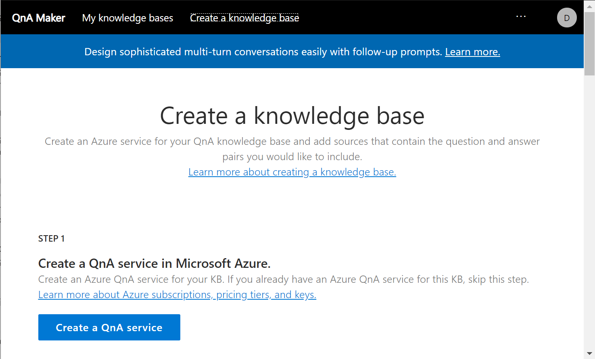
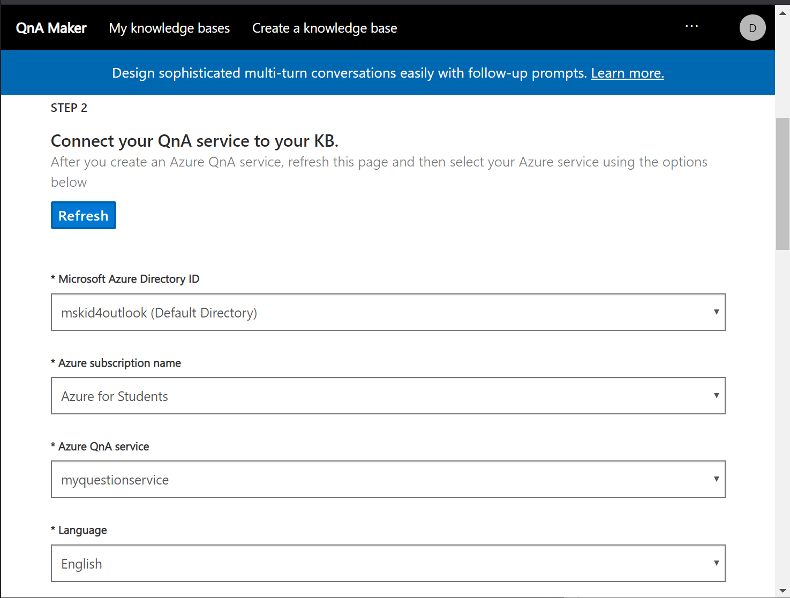
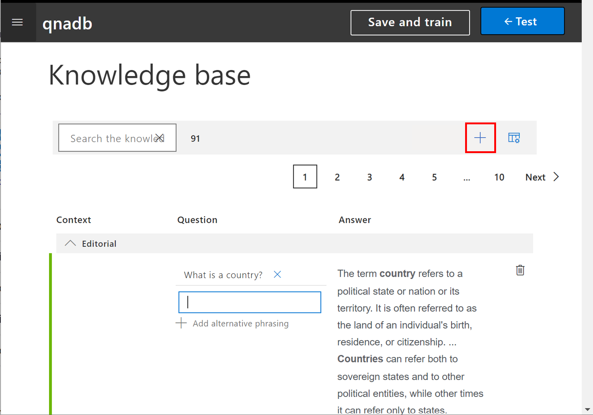
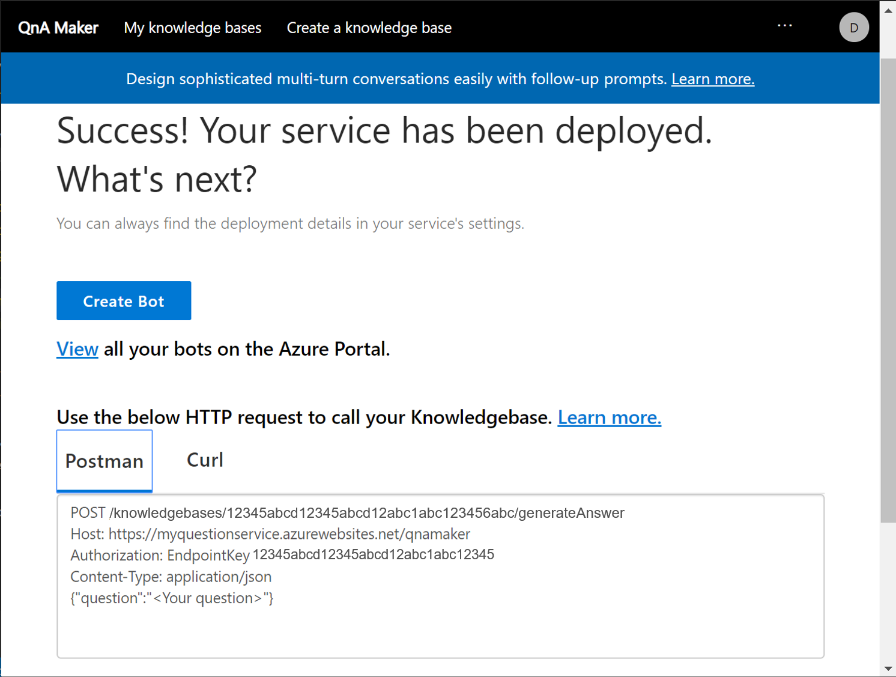

Our bot can now handle a few specific requests, but it would be nice to give the bot the ability to answer general questions about geography terminology, like a simple encyclopedia. We could use LUIS to create this functionality by creating separate intents, but there's an easier way. We'll use a separate service in Azure Cognitive Services, **[QnA Maker][QAMaker]**, to handle this scenario.

## Train your QnA Maker model

As we did with LUIS, when we add a new service to our bot, the first thing we do is train the service on our specific data. To begin training QnA Maker to use with our bot, go to [https://qnamaker.ai](https://qnamaker.ai) and sign in by using your Microsoft account.

Our first step is to create a new knowledge base. Select **Create a new knowledge base** in the top menu.



Select **Create QnA Service**. A new browser window opens in the Azure portal. In the portal, you need to fill in the parameters for the newly created service:

1. Enter a name for the service. An example is **myquestionservice**.
1. For this module, you can select the **F0 (free)** pricing tier.
1. Select the same resource group we have been using for the bot.
1. For the Azure Search pricing tier, select **F**.
1. Select relevant locations for Azure Search and Azure Web App. Preferably, select the same location that you used for other bot components.
1. Select a web app name. Our example is **myquestionservice**.
1. Disable application insights.

  

Return to the browser window that displays QnA Maker and complete **Step 2** of the setup:

1. Select **Refresh** to view your newly created service.
1. Select your tenant (Azure Active Directory directory ID), subscription, and Azure QnA Maker service names.
1. For the language to use for information extraction, select **English**.

    > [!NOTE]
    > Some languages that are available in **Language**  support *chit-chat* functionality, which refers to general conversation functionality. For other languages, only information extraction and basic QnA functionality is available. For the purpose of this module, let's select English as the most supported language.



In **Step 3**, enter a name for your database. Our example is **qnadb**.

In **Step 4**, you can provide data sources. If you have an FAQ available, either in the form of an electronic document or a page on the web, you can enter the information here and have it automatically indexed by the service. In our case, skip this step; we'll manually provide questions and answers later through a web interface.

You can also enable chit-chat functionality for your service. The bot automatically supports some level of general conversation, such as greeting the user and saying goodbye.

> [!NOTE]
> General conversation capability plays an important role in responsible conversational UI because it helps build trust with the user and helps maintain some degree of emotional connection with the user.

We can select among different **personalities** for our general chat. We'll select **enthusiastic** because it corresponds well to our goal and target audience.

The way chit-chat works in QnA Maker is by prepopulating our knowledge base with a set of potential common questions and possible answers. Thus, the personality we select affects our initial set of phrases. You can change the personality and the phrases later, if you want to.

> [!NOTE]
> Choosing a bot's personality is an important step. In selecting the personality, we need to keep in mind potential diversity in the target audience. In QnA Maker, the bot can't easily respond to and switch personalities during a conversation. If you anticipate that your bot will talk to different audiences and different personalities are required, we recommend that you take a look at [Project Personality Chat][ProjectPersonalityChat].

Select **Create**. The knowledge base editing page opens.


In the **Knowledge base** pane, you can see a chit-chat knowledge base that's prepopulated with information from the *qna_chitchat_Enthusiastic.tsv* file. In the UI, you can edit all questions and answers. You can even provide a question (or a set of possible questions) and a corresponding answer.

Let's add some geography terminology to this knowledge base. In the task bar, select **+** (the button is highlighted in the following image). 



Let's add questions about definitions of the terms *country* and *capital*. You can provide more specific Q & A functionality for the problem domain of geography, but to demonstrate the UI, we'll use just two examples (shown in the following image).

When you've added some data, select **Save and train**. Then, select **Test** to see your model in action. A chat dialog opens, and you can enjoy the conversation right in QnA Maker. To see the detailed QnA Maker response to your query, including the probability of the selected answer, select **Inspect**. You also can provide feedback to improve the accuracy of the model.


When you're finished adding data and training the model, select **Publish**. The model is published in the cloud.


When publishing (deployment) is successful, QnA Maker displays details about how to call the service.



> [!NOTE]
> The **Create a Bot** button begins the process of creating a bot that is tied to the QnA Maker service. In fact, using QnA Maker probably is the easiest way to get a bot up and running in the cloud. Even a bot without sophisticated functionality can implement responsible UI!

## Add the QnA Maker model to your bot

In our case, we already have a working bot; we just want to add QnA Maker functionality to handle the chit-chat and question answering of the bot we already created. This process is  similar to adding a LUIS recognizer.

After you published your QnA Maker model, QnA Maker displayed these details of the deployed service:

```
POST /knowledgebases/b36405a5-3858-43d2-b41f-7fb4fd4db81d/generateAnswer
Host: https://myquestionservice.azurewebsites.net/qnamaker
Authorization: EndpointKey a10aa460-2bf4-4be9-804c-82a7f8b3f4c8
Content-Type: application/json
{"question":"<Your question>"}
```

From this text, you need the following three parameters:

- **Knowledge base ID**: The sequence of numbers that follow `POST /knowledgebases/`.
- **Endpoint key**: The sequence of numbers after `Authorization: EndpointKey`.
- **Host name**: The URL that follows `Host:`.

You add this information to the *appSettings.json* file. Anywhere in that file, paste the following code, using the values provided on the final pane in QnA Maker:

```json
"QnAKbId": "<your knowledge base id>",
"QnAEndpointKey": "<your qna maker subscription key>",
"QnAHostname": "<your qna maker url>"
```

Next, we need to make some changes to the application code:

1. In the bot project in Visual Studio, use NuGet to add `Microsoft.Bot.Builder.AI.QnA` to the project.
1. Open `Startup.cs`, locate the function `ConfigureServices`, and insert the following code below the code that adds the LUIS recognizer:

   ```csharp
   services.AddSingleton(sp =>
       {
           return new QnAMaker(
               new QnAMakerEndpoint
               {
                   EndpointKey = Configuration["QnAEndpointKey"],
                   Host = Configuration["QnAHostname"],
                   KnowledgeBaseId = Configuration["QnAKbId"],
               },
               new QnAMakerOptions
               {
                   ScoreThreshold = 0.9f,
                   Top = 1,
               });
       });
   ```

   To make the code compile, add `using Microsoft.Bot.Builder.AI.QnA;` to the top of the file. The easiest way to make this change to the file is to go to parts of code that show errors (`QnAMaker` or `QnAMakerEndpoint`). Select the lightbulb icon that appears next to it.
1. Open `Bots\EchoBot.cs` and add the following line to the class to define the local variable for the QnA Maker instance:

   ```csharp
   QnAMaker QnA;
   ```

1. To add the `QnAMaker QnA` parameter to the `EchoBot` constructor, add the following line inside the constructor:

   ```csharp
   this.QnA = QnA;
   ```

1. Finally, let's change our message processing code to use our QnA Maker model if the LUIS recognizer probability isn't high enough:

   ```csharp
   protected override async Task OnMessageActivityAsync(ITurnContext<IMessageActivity> turnContext, CancellationToken cancellationToken)
   {
       var res = await rec.RecognizeAsync(turnContext, cancellationToken);
       var (intent, luis_score) = res.GetTopScoringIntent();
       var ans = await QnA.GetAnswersAsync(turnContext);
       var qna_score = ans == null || ans.Count() == 0 ? 0.0 : ans[0].Score;
       if (luis_score>0.3 && luis_score>qna_score)
       {
           await ProcessLuisResult(turnContext, intent, res.Entities);
       }
       else
       {
           if (ans == null || ans.Count() == 0)
           {
               await turnContext.SendActivityAsync("I am not sure I understand you fully");
           }
           else
           {
               await turnContext.SendActivityAsync(ans[0].Answer);
           }
       }
   }
   ```

   The logic here is quite clever because we need to understand subtle differences between phrases. For example, a phrase *What is a capital?* should be answered via QnA Maker. The phrase *What is a capital or France?* is answered via LUIS and our bot code. In our code, we call both LUIS and QnA Maker, and select the service that gives us the higher score. We then display the corresponding result.

> [!TIP]
> For help putting the code in the right place, you can [view the complete project code at this stage][CodeQnA].

At this point, you can run the project and test it by using Bot Emulator.

## Try the bot

The bot we have created so far already seems quite intelligent. Here's a sample conversation I had with the bot I created:

What is a capital?

*A capital is the city or town that functions as the seat of government and administrative center of a country or region.* 

What is a capital of Russia?

*The capital of Russia is Moscow.*

How are you?

*Awesome! Thanks for asking.*

Next, we'll add some final touches that implement responsible conversational UI principles.

[QAMaker]: https://docs.microsoft.com/azure/cognitive-services/qnamaker/
[ProjectPersonalityChat]: https://www.microsoft.com/research/project/personality-chat/
[CodeQnA]: https://github.com/MicrosoftDocs/mslearn-responsible-bots/tree/t3-qna
