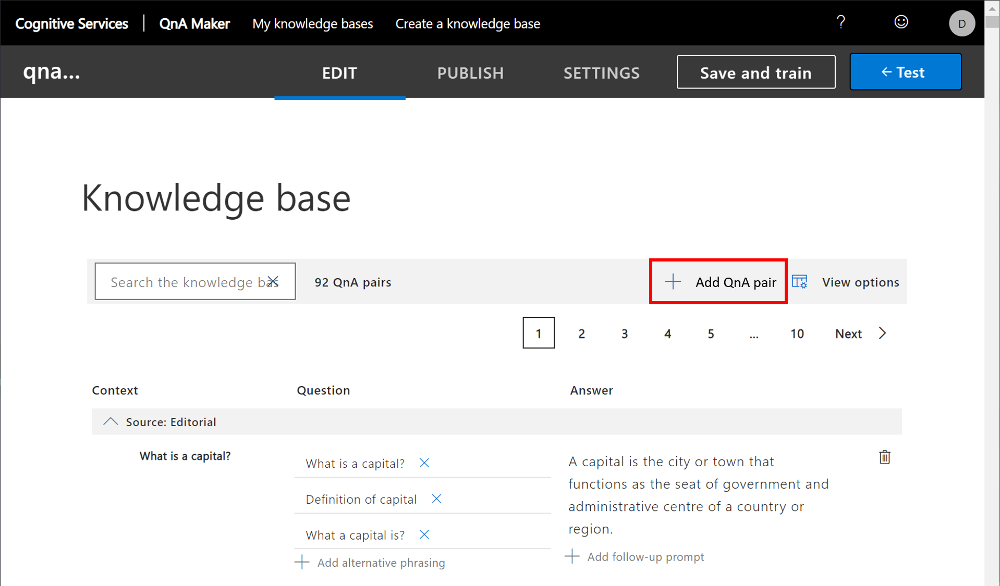
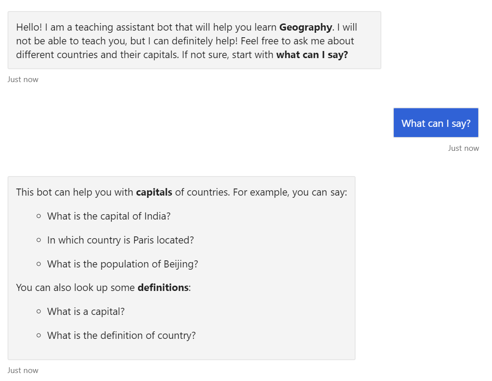

So far, we've added some good functionality to our bot, however we need to revisit our **responsible conversational UI** principles. Let's make some improvements and learn about others we could make!

## Help your users

When a user first starts to work with a bot, they don't always know what to say. Students across the world will speak multiple languages and come from many different cultures. Although a bot can be designed with natural language understanding, its capabilities are still limited. In many cases, all of the bot's functionality isn't immediately clear. Users find it helpful when a bot begins with a brief overview and sample commands.

> [!TIP]
> Design your bot so users can't _get lost_ in the functionality. Always provide a "last resort" option, so users can keep going. A good approach is to have a **help** feature with a **menu** of tasks and commands that the bot understands.

Let's add a **help** feature to our bot! Because we're already using QnA Maker, all we need to do is add corresponding text to the knowledge base through the QnA Maker UI.

1. Go to the [QnA Maker portal][QnAPortal]. Sign in with your Microsoft account or work or school account.

1. Open the knowledge base we created in the previous unit.

1. Select **+ Add QnA Pair**.

   > [!div class="mx-imgBorder"]
   > 

1. Enter phrases to trigger the **help** feature.

    Here are some examples:
    - What can I say?
    - Help
    - I do not know what to do

1. Add the bot response message for the help request.

    Briefly describe the bot functionality. Give examples of phrases that the bot understands. Use Markdown syntax to make your message more readable. You can include URLs for some images, but don't overcomplicate!

    ```markdown
    This bot can help you with **capitals** of countries.
    For example, you can say:

    * What is the capital of India?
    * In which country is Paris located?
    * What is the population of Beijing?

    You can also look up some **definitions**:

    * What is a capital?
    * What is the definition of country?
    ```

1. After you add the help message, select **Save and Train**.

1. After the model training is done, select **PUBLISH** to push the model online.

Now come back to your bot code in Visual Studio and try it out in the Emulator!

> [!TIP]
> You can design a complex multi-turn help system with QnA Maker by using [follow-up prompts and multi-turn conversations][QnAFollowUp].

## Show a welcome message

The **Echo Bot** template includes functionality to send the user a welcome message. The `OnMembersAddedAsync` function in the `Bots\EchoBot.cs` file monitors new users in a chat session. When a new user enters the chat session, the bot sends a welcome message to the user.

A welcome message provides three important pieces of information:

- Informs the user that they're **talking to a bot**.
- Outlines the **bot's primary purpose**. As an option, shows limitations and typical use cases.
- Explains **what the user can do** with the bot. Mentions the **help** feature. Shows the **menu** of options and examples of understood phrases.

It's easy to add a meaningful welcome message to a bot. A good welcome helps to build trust with your users. The difficult task is to share all pieces of information in a single message that fits on a small screen.

Try removing the existing `welcomeText` variable defined in the `OnMembersAddedAsync` method, and defining your own as a string constant, like the one below, at the beginning of the `EchoBot` class where you define your other local variables.

Here's a sample welcome message for our bot:

```csharp
readonly string welcomeText =
    "Hello!\n"+
    "I am a teaching assistant bot that will help you learn **Geography**. I will not be able to teach you, but I can definitely help! Feel free to ask me about different countries and their capitals. If not sure, start with **What can I say?**";
```

The [sample code for this unit][GitFlag] also defines a better message to respond to the user with when the bot doesn't understand the user's input, along with other neat features. Feel free to check it out and try it yourself!

Here's an example of an initial conversation between our bot and a user:

> [!div class="mx-imgBorder"]
> 

## Support language diversity

In the first unit, we learned that an ideal responsible bot supports diversity. There are many different ways to add language diversity.

- Store multiple sets of output messages, so the bot can switch between different conversation styles.
- Examine the emotional sentiment of the user's utterances to detect the appropriate style to use. Azure [Text Analytics][TextAnalytics] can detect user sentiment.
- Offer chit-chat functionality with [Project Personality Chat][PersonalityChat].
- Design your bot to support multiple languages. This implementation is helpful for users, but it requires significant development effort. Switching between output languages can be as simple as selecting different sets of output messages, but support for language understanding requires separate LUIS models.
- Support multiple languages by using **automatic translation** with the Azure Cognitive Services [Translator Text API][TranslatorAPI]. The API offers automatic [language detection][LangDetection] of user input messages. The API [translates][Translation] output messages to the user's language.

To incorporate translation into our bot, we can use the concept of [Bot Framework Middleware][Middleware]. We can add this component to pre-process and post-process all messages to and from the user. The Middleware component can:

- Detect the language of the incoming message.
- Translate the incoming message into English.
- Complete all standard processing steps, including LUIS and QnA Maker operations that are trained on English phrases.
- Translate the result message into the user's language.

In more complex scenarios, we can include language-switching logic. This logic can confirm the user's language, and use the language for the duration of the session.

The code to use the translation middleware is available in the [Microsoft > BotBuilder-Samples > Multilingual bot][BotTranslateSample] GitHub repository.

## Support speech

Bots should welcome diversity. A responsible conversational bot accepts user input as text or speech - from a keypad, mouse, or touch-screen, and also from a microphone.

Add a speech interface to your bot with the Azure [Speech Service][SpeechSDK]. The Bot Framework supports embedding speech data into messages in the form of **Simple Speech Markup Language** (SSML). Update your bot code to [add speech to messages][AddSpeech]. The bot also needs speech support from the conversation client. Web chat control integrates with the Microsoft Speech SDK to support both text-to-speech and speech-to-text.

> [!NOTE]
> To support more communication channels, you can receive speech as an attachment, and convert the attachment to text on the server side by using the [Speech SDK][SpeechSDK].

In this unit, we reviewed several ways to improve our bot and provide a robust conversational UX for our users. Remember that Azure Bot Framework is just a tool to make bot development easy - making your bot responsible is still up to the developer!

<!-- Links -->
[QnAPortal]: https://qnamaker.ai?azure-portal=true
[QnAFollowUp]: https://docs.microsoft.com/azure/cognitive-services/qnamaker/how-to/multiturn-conversation
[BotAttachments]: https://docs.microsoft.com/azure/bot-service/bot-builder-howto-add-media-attachments?view=azure-bot-service-4.0&tabs=csharp
[AdaptiveCards]: https://docs.microsoft.com/adaptive-cards/getting-started/bots
[WikiFlags]: https://en.wikipedia.org/wiki/National_flag
[CountryFlagsFile]: https://github.com/#TODO
[GitFlag]: https://github.com/MicrosoftDocs/mslearn-responsible-bots/tree/t4.0-flags
[TextAnalytics]: https://docs.microsoft.com/azure/cognitive-services/text-analytics/
[PersonalityChat]: https://aischool.microsoft.com/conversational/learning-paths/advanced-conversational-ai/ttmb-implementing-project-personality-chat
[TranslatorAPI]: https://azure.microsoft.com/services/cognitive-services/translator-text-api/
[LangDetection]: https://docs.microsoft.com/azure/cognitive-services/Face/quickstarts/csharp
[Translation]: https://docs.microsoft.com/azure/cognitive-services/translator/quickstart-translator
[MiddleWare]: https://docs.microsoft.com/azure/bot-service/bot-builder-concept-middleware?view=azure-bot-service-4.0
[BotTranslateSample]: https://github.com/microsoft/BotBuilder-Samples/tree/master/samples/csharp_dotnetcore/17.multilingual-bot
[BotDialogs]: https://docs.microsoft.com/azure/bot-service/bot-builder-concept-dialog?view=azure-bot-service-4.0
[BotDialogsSample]: https://github.com/microsoft/BotBuilder-Samples/tree/master/samples/csharp_dotnetcore/19.custom-dialogs
[SpeechSDK]: https://docs.microsoft.com/azure/cognitive-services/speech-service/
[AddSpeech]: https://docs.microsoft.com/azure/bot-service/rest-api/bot-framework-rest-connector-text-to-speech?view=azure-bot-service-4.0
