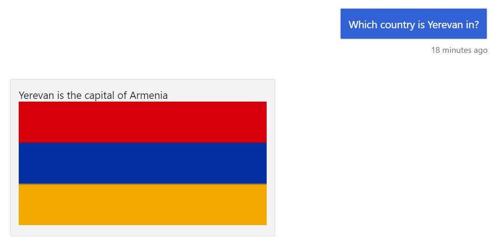

By now, we've added most of the functionality to our bot, but some small pieces are missing. In this unit, we'll make small improvements to the bot to implement more  **Responsible Conversational UI** principles.

## Providing help

When a user starts using a bot for the first time, he or she does not always know what to say. Even though we all know how speak a human language, bots natural language understanding capabilities are not always up to the standards. That's why it is very helpful to provide user with some examples of possible commands that bot will definitely understand.

Also, in many cases all functionality of a bot is not immediately clear, and giving a brief overview with sample commands is extremely helpful to the user.

> [!TIP]
> Make sure that a user never feels lost, and he always knows what to do as the last resort. This can be achieved by implementing **help** command, or giving **menu** of possible options.

Let's add **help** command to our bot! Because we are using QnA Maker already, all we need to do is to add corresponding text to the knowledge base through the QnA Maker UI.

1. Visit [QnA Maker Portal][QnAPortal] and sign in with your Microsoft Account
1. Open the knowledge base we have created in the previous unit.
1. Click on **+ Add QnA Pair**

   

1. Type in different phrases that can bring up the help message, for example:
   - *What can I say?*
   - *Help*
   - *I do not know what to do*
1. As a response, provide some explanatory text about the bot functionality, with the exact examples of phrases.

   ```markdown
   This bot can help you with **capitals** of countries. For example, you can say:
    * What is the capital of India?
    * In which country is Paris located?
    * What is the population of Beijing?
   
   You can also look up some **definitions**:
    * What is a capital?
    * What is the definition of country?
   ```

   > [!TIP]
   > You can use markdown syntax to make your message more readable. You can even include URLs to some images (but do not overcomplicate)!

1. After you have added the help message, click on **Save and Train**
1. When training is done - click **PUBLISH** to put the model online.

At this point you can start your bot code in Visual Studio and see how it works in the Emulator.

> [!TIP]
> You can design complex multi-turn help system with QnA Maker using [follow-up prompts and multi-turn conversations][QnAFollowUp].

## Meaningful welcome message

Original Echo Bot code contained the functionality to send  user a welcome message. Function `OnMembersAddedAsync` in `Bots\EchoBot.cs` is responsible for monitoring new users in a chat, and when new user enters - it sends him/her a welcome message.

This welcome message ideally should serve three important purposes:

- Inform a user that he is **talking to a bot**.
- Outline the **bot's goal**, possibly showing some limitations and typical use cases
- Make it clear to the user what he can do, for example, mention **help** command that he can user to find more details, or **menu** command to enter menu system with options.

 Providing meaningful welcome message is a simple thing to do, but it can go a long way. The difficult thing here is to fit all those three important points into one concise message that will look reasonably nice in a small messenger screen. Here is a welcome message I have created for our bot:

```csharp
readonly string welcomeText = 
    "Hello!\n"+
    "I am a teaching assistant bot that will help you learn **Geography**. I will not be able to teach you, but I can definitely help! Feel free to ask me about different countries and their capitals. If not sure, start with **what can I say?**";
        
readonly string unknownText = 
    "I am not sure I understand you fully.\n"+
    "If you are not sure what to say, ask **what can I say?**";
```

I have also changed the message that the bot displays if it does not understand the command, and moved those messages into string constants in the `EchoBot` class, so they are easy to modify. 

Here is how the initial conversation with our bot might look like:


## More visual interaction

Interacting with a bot using plain text solves most of the problems, but sometimes it is useful to be able to communicate through more visual means. Bot Framework supports that by using the following mechanisms:

- A user can send an **attachment** to the bot, which can be a picture, a document, or essentially any file. Programmatically we receive the URL of that document, and can do whatever we want with it. Learn more about attachments [in the documentation][BotAttachments].
- A bot can return back an **adaptive card**, which is a way to represent richer content than just text. A card can contain an image, a button, or a carousel of images. Learn more about cards [in this documentation][AdaptiveCards].

With attachments and adaptive cards, you can have many different ways of interacting with a bot:

- A bot can take some pictures as an input, and use cognitive services to extract some information from them. For example, a user can send pictures of printed documents, and the bot will be able to get the text using OCR.
- You can also ask the user to send things like his/her location to retrieve points of interest nearby. However, you need to make sure that messengers you are planning to use support locations.
- Adaptive cards can be used to organize menu-based interaction with the bot, instead of natural text. Menus are more clear to use, but it takes more time to navigate to the exact position in the hierarchy. However, you can always use some mixture of menu-driven interaction and natural text phrases.

To add some more visual interactions to our bot, let's display country flags as part of the messages that mention countries. To do that, we first need to find some data on country flags - for example, we can use [this page on Wikipedia][WikiFlags]. We have collected the list of URLs for all country flags, and put them into [countryflags.csv][CountryFlagsFile] file. We do not need to download actual pictures, because during the bot dialog we just need to send back the URL, and the original flag from Wikipedia will be displayed.

To incorporate those changes to our code, we will put `countryflags.csv` into our bot project, and add `GetFlag` function into our `CountryData` class. We will store the URLs corresponding to country names into a `Dictionary`:

```csharp
protected Dictionary<string,string> Flags { get; set; }

public CountryData(string fn,string cf)
{
    ...
    Flags = new Dictionary<string, string>();
    foreach (var x in (File.ReadAllLines(cf).Skip(1)))
    {
        var t = x.Split(',');
        Flags.Add(t[1].ToLower(), t[0]);
    }
}
```

In the bot itself, we will change slightly the logic for displaying a country corresponding to a given capital inside `ProcessLuisResult` function:

```csharp
    case "get_country":
        var cou = CData.GetCountry(loc);
        var fl = CData.GetFlag(cou);
        if (fl != null)
        {
            await turnContext.SendActivityAsync(
                MessageFactory.ContentUrl(fl, "image/png", 
                text: $"{loc} is the capital of {cou}"));
        }
        else
        {
            await turnContext.SendActivityAsync(cou == null
                    ? $"I do not know the city named {loc}"
                    : $"{loc} is the capital of {cou}");
        }
        break;
```

To create an attachment, we use `MessageFactory` object. There are many different functions that correspond to different attachment types. We use simplest one that provides text with some corresponding `ContentUrl`.

> [!TIP]
> Some messages support markdown syntax, including image embedding. In this case, we might just use normal text message with image embedding command, instead of more complex adaptive card mechanism. However, you always need to check how those markdown messages will be rendered by all messenger platforms that you are planning to use.

Here is how our conversation with attachment look like in the emulator:



> [!NOTE]
> In this example, we can see one more potential problem: the spelling of non-English names can differ, and our system does not support different possible transliteration for Yerevan, a capital of Armenia. When developing responsible bots we need to be careful and support different possible transliterations, or offer suggestions in case of slight variations in city names.

> [!NOTE]
> The code for the application at this point is available [in this github repository][GitFlag].

## Support language diversity

We have learned in the first unit that the ideal responsible bot should support **diversity**. Diversity can come in many flavors:

- **Different styles of conversation** are suitable for different people, and for different moods.
  - We can switch between styles using different sets of output messages.
  - We can try to detect the appropriate style from the emotional sentiment of user's utterances. [Text analytics][TextAnalytics] cognitive service can be used for detecting sentiment.
  - If we implement chit-chat functionality, we can use [Project Personality Chat][PersonalityChat]
- Using **different languages** for a conversation is also a possibility, however, implementing it requires more efforts. Switching output language may be as simple as selecting different sets of output messages, but implementing language understanding properly would require separate LUIS models.

However, it is also possible to provide support for many languages by utilizing **automatic translation** via [Translator API][TranslatorAPI]. This API would offer both automatic [language detection][LangDetection] of user's input message, as well as [translation][Translation] of output messages to the desired language.

To incorporate translation into our bot, we can use the concept of [Bot Framework Middleware][Middleware]. Middleware is a component that can be added to pre- and post-process all messages to and from the user during message processing pipeline. Thus middleware can do the following:

- detect the language of the incoming message
- translate it into English
- perform all standard processing steps (including LUIS/QnA Maker trained on English phrases
- translate the result back into user's language

In more complex scenarios we can include some language switching logic, which will confirm user's language, and then use it for the duration of the session.

> [!NOTE]
> An example of using translation middleware can be found [here][BotTranslateSample].

## Adding dialog interactions

So far, all interactions with our bot have been based on request-response pattern, and the bot did not have to track the context of the conversation. However, there are scenarios when interaction with the user involves several consecutive steps, for example:

- Filling a form with several fields
- Confirming some action
- Chosing exact items in the menu

For example, in our bot we have defined a phrase to play a quiz game to test student's knowledge of capitals. This game should probably switch the bot into a different mode, when it randomly selects a country, and expects user to type back it's capital (or vice versa). When the user gets tired, he/she can type "end", and receive his/her score.

To implement this functionality, Bot Framework provides the concept of [Dialogs][BotDialogs]. A dialog defines a separate branch of conversation, such as our "capital quiz". Once the user enters the dialog, conversation would be handled by a different programming logic, until dialog ends (or until another dialog is initiated). Using this concept, a user can decompose complex conversation logic into simpler modular parts, and then combine them together into a complex conversation flow.

> [!NOTE]
> Implementing dialogs is out of scope of this module. You can see dialog implementation in [this sample][BotDialogsSample], and read [more documentation on the subject][BotDialogs].

Another feature that could be implemented using dialogs is collecting feedback. One of the principles of responsible conversational UI is to give an opportunity to the user to provide feedback on bot's work. We can detect "end-of-conversation" phrases using LUIS, and as a response initiate a separate "good bye" dialog, which will collect multi-step feedback from the user and store it into the database for further processing.

> [!IMPORTANT]
> A good responsible bot should give user an opportunity to provide feedback!

## Supporting Speech

As we know, bots should welcome diversity, and thus ideally they should support users who are not able to communicate via text, be that visually impaired users, or those who cannot type because their hands are busy. Luckily, support for speech interface can be added to the bot through [Speech API][SpeechAPI]. Bot Framework supports embedding speech data into messages in the form of **Simple Speech Markup Language** (SSML), so we just need to tweak our bot code to include this data as described [here][AddSpeech]. We also need a speech support from conversation client, and Web Chat control can integrate with Microsoft Speech API to support both text-to-speech and speech-to-text.

> [!NOTE]
> To support more communication channels, you can also receive speech as an attachment, and then convert it to text on the server side through [Speech API][SpeechAPI].

## Conclusion

We have discussed many ways in which our bot could be improved. And even though we did not discuss implementing all that functionality in detail, I hope that you are now confident that Bot Framework provides all necessary means to build responsible bot UI.

<!-- Links -->
[QnAPortal]: https://qnamaker.ai
[QnAFollowUp]: https://docs.microsoft.com/azure/cognitive-services/qnamaker/how-to/multiturn-conversation
[BotAttachments]: https://docs.microsoft.com/azure/bot-service/bot-builder-howto-add-media-attachments?view=azure-bot-service-4.0&tabs=csharp
[AdaptiveCards]: https://docs.microsoft.com/adaptive-cards/getting-started/bots
[WikiFlags]: https://en.wikipedia.org/wiki/National_flag
[CountryFlagsFile]: https://github.com/#TODO
[GitFlag]: https://github.com/MicrosoftDocs/mslearn-responsible-bots/tree/t4.0-flags
[TextAnalytics]: https://docs.microsoft.com/azure/cognitive-services/text-analytics/
[PersonalityChat]: https://aischool.microsoft.com/conversational/learning-paths/advanced-conversational-ai/ttmb-implementing-project-personality-chat
[TranslatorAPI]: https://azure.microsoft.com/services/cognitive-services/translator-text-api/
[LangDetection]: https://docs.microsoft.com/azure/cognitive-services/translator/quickstart-detect?pivots=programming-language-csharp
[Translation]: https://docs.microsoft.com/azure/cognitive-services/translator/quickstart-translate?pivots=programming-language-csharp
[MiddleWare]: https://docs.microsoft.com/azure/bot-service/bot-builder-concept-middleware?view=azure-bot-service-4.0
[BotTranslateSample]: https://github.com/microsoft/BotBuilder-Samples/tree/master/samples/csharp_dotnetcore/17.multilingual-bot
[BotDialogs]: https://docs.microsoft.com/azure/bot-service/bot-builder-concept-dialog?view=azure-bot-service-4.0
[BotDialogsSample]: https://github.com/microsoft/BotBuilder-Samples/tree/master/samples/csharp_dotnetcore/19.custom-dialogs
[SpeechAPI]: https://docs.microsoft.com/azure/cognitive-services/speech-service/
[AddSpeech]: https://docs.microsoft.com/azure/bot-service/rest-api/bot-framework-rest-connector-text-to-speech?view=azure-bot-service-4.0
