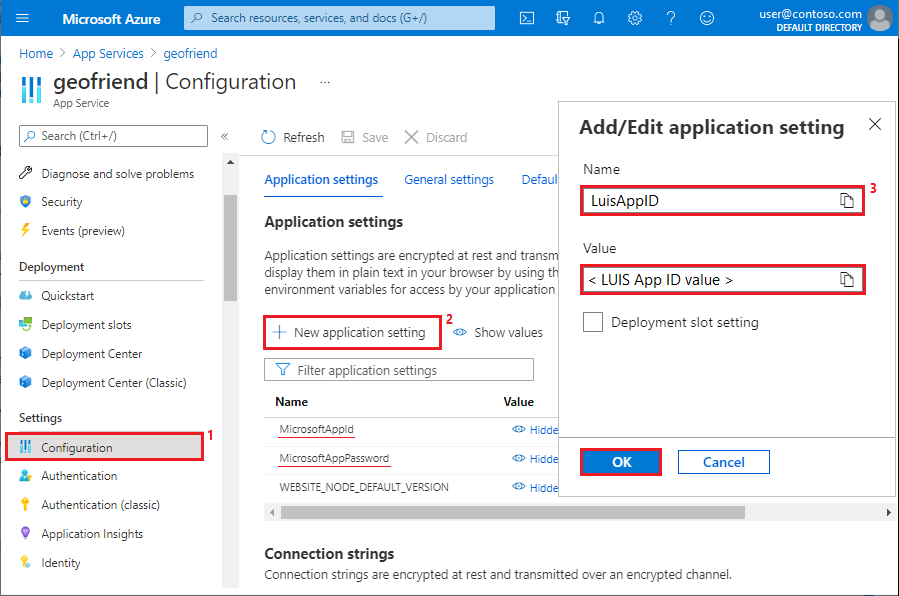
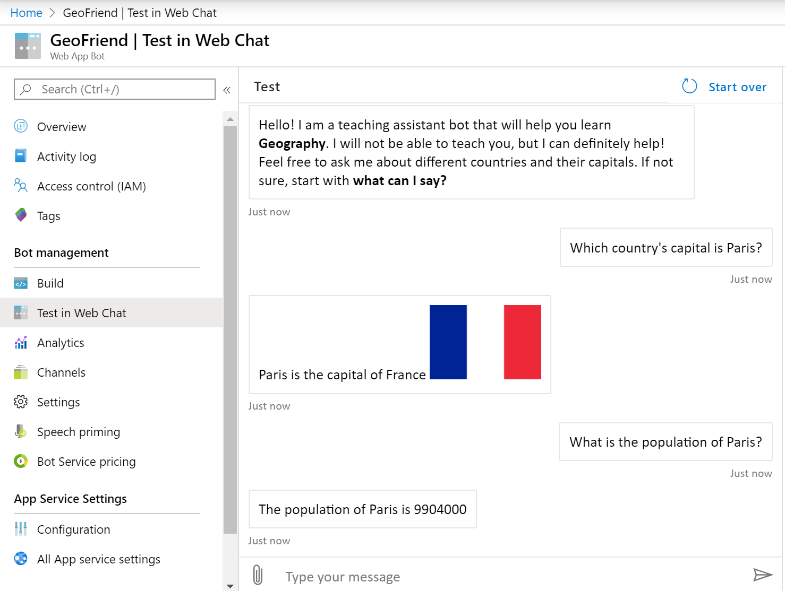
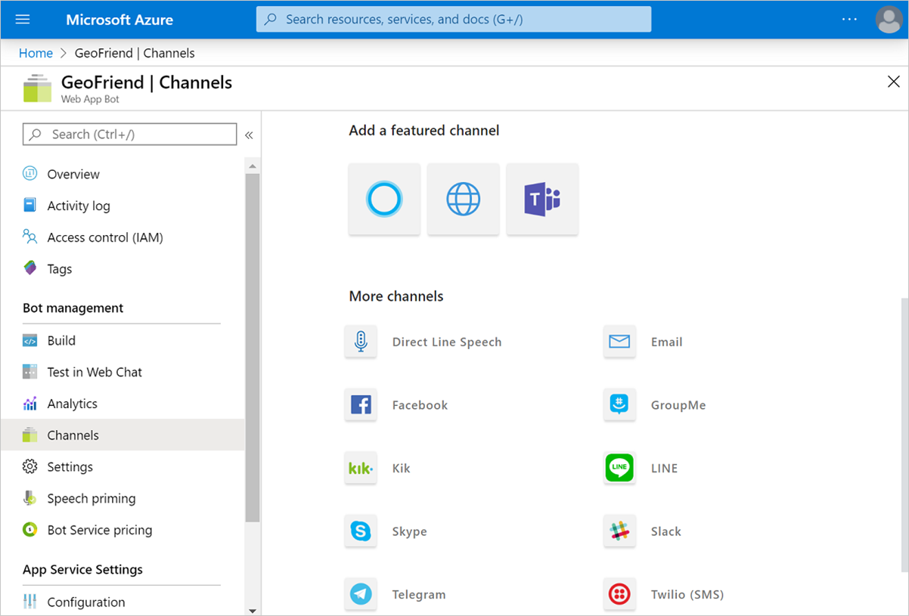
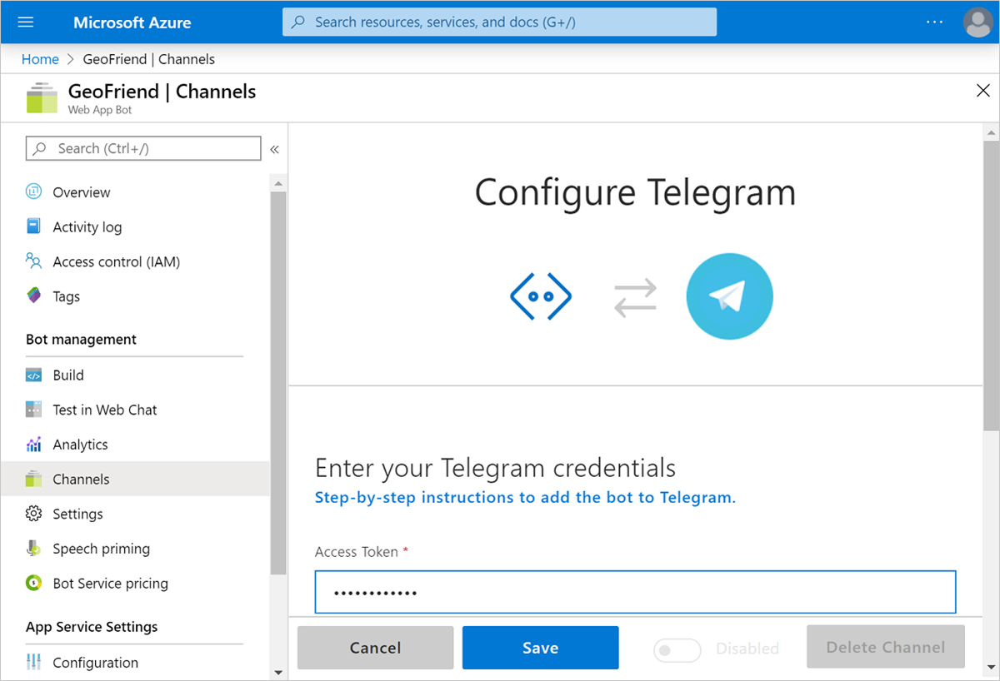

At this point, we've implemented much of the bot's logic. Now we need to republish our bot to the cloud so all of the features are available.

We can publish the bot to the cloud easily from within Visual Studio, just like we did earlier. This time, the publish process is even more simple because we already defined a publishing profile for our project. We can complete the entire process in a single step in Visual Studio:

- In the **Solution Explorer** in Visual Studio, right-click your **EchoBot** project, and select **Publish**.

## Update bot configuration settings in the Azure portal

After we publish our bot, the last step is to add the configuration settings for the bot in the Azure portal.

Earlier in this lesson, we defined LUIS and QnA Maker configuration parameters in the *appsettings.json* file. The parameters in this JSON file are used when the bot runs locally. For cloud deployment, we need to define similar configuration settings in the Azure portal.

1. In the Azure portal, go to the **geofriend** App service overview page for your bot.

   > [!Tip]
   > An easy way to go to this location in the Azure portal is to browse to **Home** > **App Services** > **geofriend**.

1. In the left menu, under **Settings**, select **Configuration**.

   You should see the `MicrosoftAppId` and `MicrosoftAppPassword` configuration settings in the list.

1. In **Application settings**, select **New application setting**.

   

1. We need to create LUIS and QnA Maker application settings like the ones we added in the *appsettings.json* file for your bot project.

   Repeat the following steps to add six new application settings:  `LuisAppId`, `LuisAPIKey`, `LuisEndpointUrl`, `QnAKbId`, `QnAEndpointKey`, and `QnAHostname`. 

   1. In **Add/Edit application setting**, enter the setting name.

   1. Set the value to the same value that you assigned to the setting in your *appsettings.json* file.

   1. Leave the **Deployment slot** setting cleared.

   1. Select **OK**.

   After you add the six new settings, select **Save**, and then select **Continue**.

   > [!Note]
   > Alternatively, you can select **Advanced edit** on the **Configuration** pane and edit the JSON file directly. However, the format of this JSON file is different than the format that's used in the *appsettings.json* file for your bot project. If you add the settings by using this alternative method, you'll need to do some manual conversion.

## Test your final bot

Updating the application settings for your bot in the Azure portal was the final step! Now, you should be able to enjoy chatting with your bot.

- In the Azure portal, return to your bot **Overview** page. Under **Settings**, select **Test in Web Chat**.

<!-- After code works, refresh image. Similar image from unit 3 > Run your bot = azure-portal-web-chat-1.png -->

## Connect the bot to communication channels 

After you create a bot, you'll probably want to share it with your friends through some common communication channels, such as email or Telegram. You can easily share your app by using the bot management page in the Azure portal. In the left menu, select **Channels**:

For example, to add the bot to Telegram:

1. Select **Telegram** from the list of channels.

1. In the Telegram application, create a new bot by sending a message to the **@BotFather** bot. The process is described under **Step-by-step instructions** on the Telegram setup page.

1. Copy the **access token** you receive from **@BotFather** and paste it into the corresponding text box in the Azure portal.

   

1. Select **Save**.

The bot will be functional in Telegram, and you can share the link with your friends and students who want to learn.
