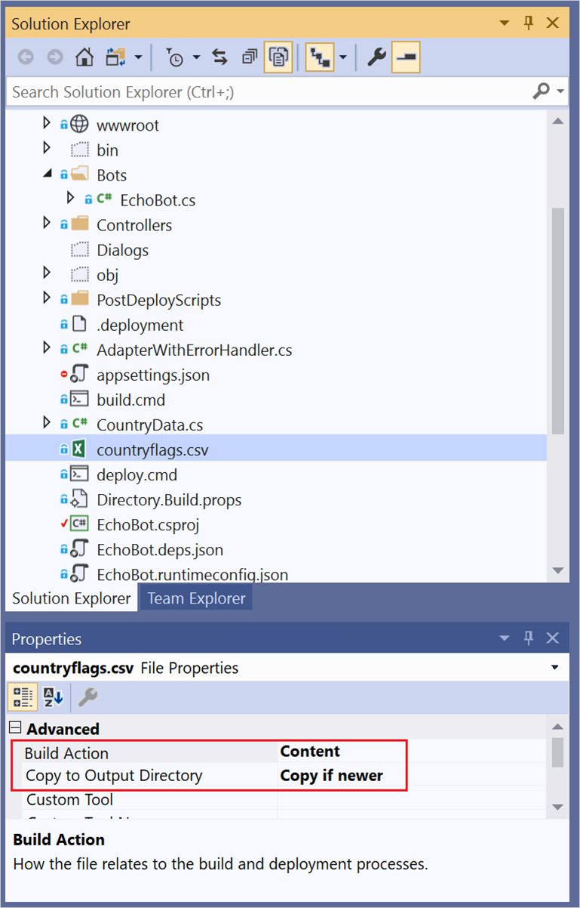
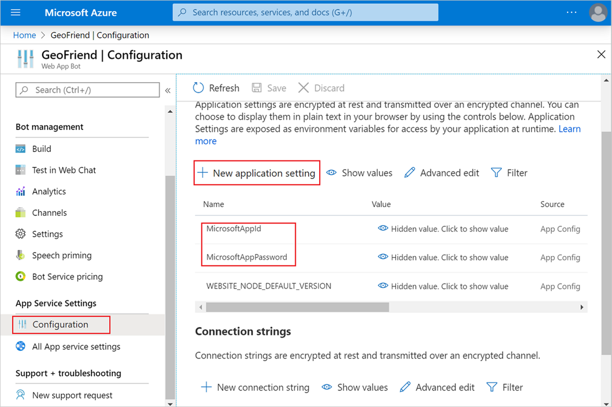

Now that we've implemented much of the bot's logic, we need to publish it back to the cloud. We can publish the bot to the cloud easily from within Visual Studio, just like we did earlier. Now, it's even simpler, because we already defined a publishing profile for our project. We can complete the entire process by selecting one button in Visual Studio.

## Final steps

After we publish our bot, we need to complete two more steps for the bot to work:

- Update the properties of the files our bot uses in Visual Studio Solution Explorer.
- Add settings on the bot management page in the Azure portal.

To make sure that the files *worldcities.csv* and *countryflags.csv* are copied with our project, we change the file properties:

1. In Visual Studio Solution Explorer, find the two files.
1. For each file, under **Properties**, expand **Advanced**.
1. Set **Build Action** to **Content**.
1. Set **Copy to Output Directory** to **Copy if newer**.

> [!div class="mx-imgBorder"]
> 

The final step is to make a settings change in the Azure portal. We already defined additional configuration parameters in *appsettings.json*. Parameters in the JSON file are used when the bot runs locally. For cloud deployment, parameters are defined in the Azure portal.

To provide all required parameters for our bot:

1. In the Azure portal, go to the bot management page.
1. In the left menu, select **Configuration**. You'll see configuration settings for **MicrosoftAppId** and **MicrosoftAppPassword**:

   > [!div class="mx-imgBorder"]
   > 

1. Select **New application setting**.
1. Enter all the settings from the *appsettings.json* file that are missing. The specific settings to add are **LuisAppId**, **LuisAPIKey**, **LuisEndpointUrl**, **QnAKbId**, **QnAEndpointKey**, and **QnAHostname**.

   Alternatively, you can select **Advanced edit** on the **Configuration** pane and edit the JSON file directly. The format of this JSON file is different than the format that's used in *appsettings.json*. If you add the settings by using the alternative method, you'll need to do some manual conversion.

Updating the settings was the final step. Now, you should be able to enjoy chatting with the bot. To test the bot, select **Test in Web Chat** in the bot management menu:

> [!div class="mx-imgBorder"]
> 

## Connect the bot to communication channels 

After you create a bot, you probably will want to share it with your friends through some common communication channels, such as email or Telegram. You can easily share your app by using the bot management page in the Azure portal. In the left menu, select **Channels**:

> [!div class="mx-imgBorder"]
> 

For example, to add the bot to Telegram:

1. Select **Telegram** from the list of channels.
1. In the Telegram application, create a new bot by sending a message to the **@BotFather** bot. The process is described well under **Step-by-step instructions** on the Telegram setup page.
1. Copy the **access token** you receive from **@BotFather** and paste it into the corresponding text box in the Azure portal.

   > [!div class="mx-imgBorder"]
   > 
1. Select **Save**.

The bot will be functional in Telegram, and you can share the link with your friends and potential students.
 