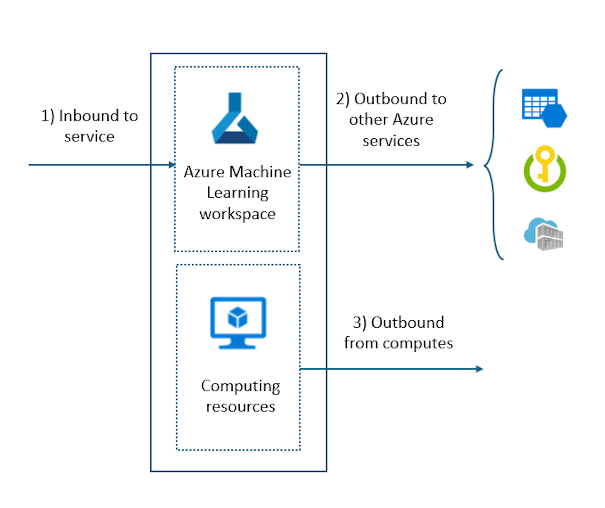

Network isolation is a security strategy that involves dividing a network into separate segments or subnets, each functioning as its own small network. This approach helps to improve security and performance within a larger network structure. Major enterprises require network isolation to secure their resources from unauthorized access, tampering, or leakage of data and models. They also need to adhere to the regulations and standards that apply to their industry and domain. Managed virtual network isolation streamlines allows you to automate network isolation for Azure Machine Learning workspaces.

Azure Machine Learning managed virtual networks secure your managed Azure Machine Learning resources, such as compute instances, compute clusters, serverless compute, and managed online endpoints.

Network isolation must be considered in three areas within Azure Machine Learning:

- Inbound access to the Azure Machine Learning workspace. For example, for your Data Scientists to securely access the workspace.
- Outbound access from the Azure Machine Learning workspace. For example, to access other Azure services.
- Outbound access from the Azure Machine Learning compute resources. For example, to access data sources, Python package repositories, or other resources.

