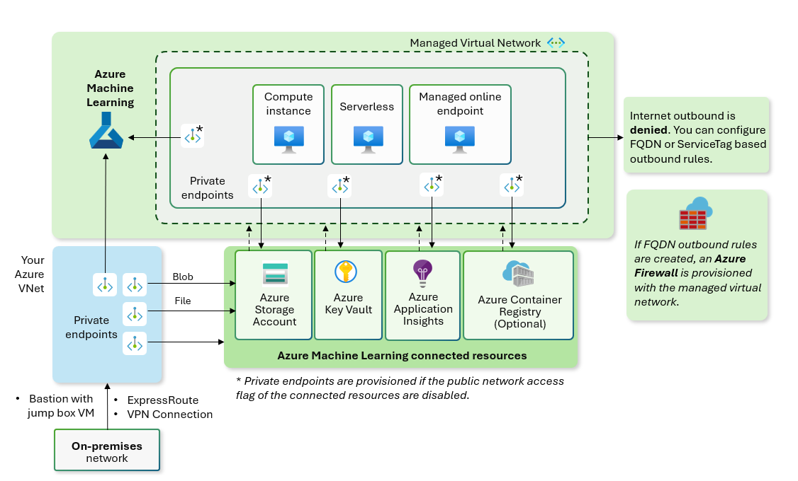

Using a managed virtual network provides an easier configuration for network isolation. It automatically secures your workspace and managed compute resources in a managed virtual network. You can add private endpoint connections for other Azure services that the workspace relies on, such as Azure Storage Accounts. Depending on your needs, you can allow all outbound traffic to the public network or allow only the outbound traffic you approve. Outbound traffic required by the Azure Machine Learning service is automatically enabled for the managed virtual network. For outbound traffic, using a managed network provides two options:

- **Allow internet outbound mode**: Use this option if you want to allow your machine learning engineers access the internet freely. You can create other private endpoint outbound rules to let them access your private resources on Azure.
- **Allow only approved outbound mode**: Use this option if you want to minimize data exfiltration risk and control what your machine learning engineers can access. You can control outbound rules using private endpoint, service tag, and FQDN.

