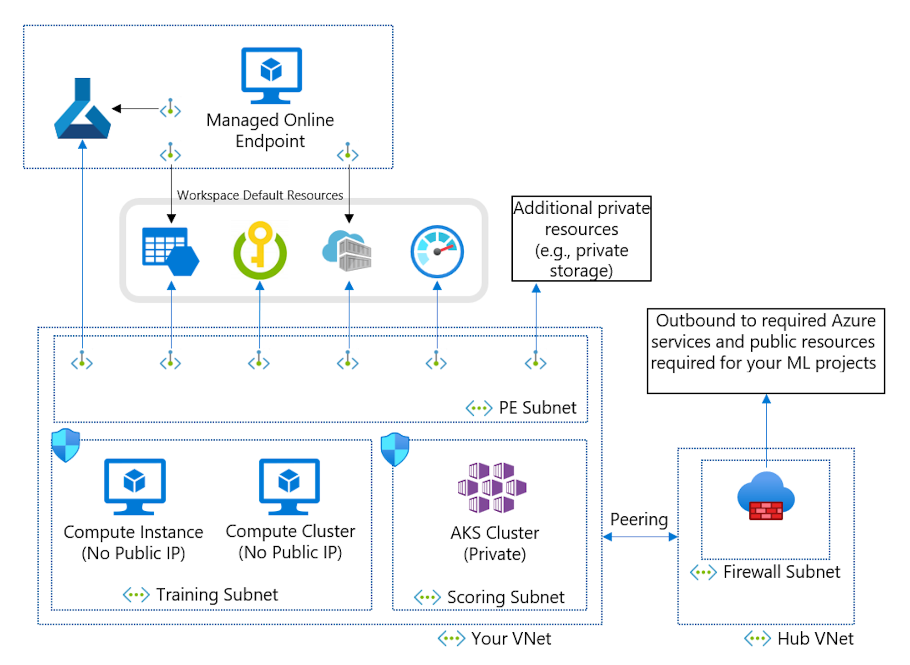

If a managed virtual network doesn't suit your needs, you can configure and manage an Azure virtual network to implement network isolation. 

For scenarios using custom network isolation, Microsoft recommends the following best practices:

- Put all resources in the same region.
- A hub virtual network, which contains your firewall and custom DNS set-up.
- A spoke virtual network, which contains the following resources:
  - A training subnet contains compute instances and clusters used for training ML models. These resources are configured for no public IP.
  - A scoring subnet contains an AKS cluster.
  - A 'PE' subnet contains private endpoints that connect to the workspace and private resources used by the workspace (storage, key vault, container registry, etc.)

Custom virtual networks aren't recommended as misconfigurations are more likely to occur compared to managed virtual networks.
