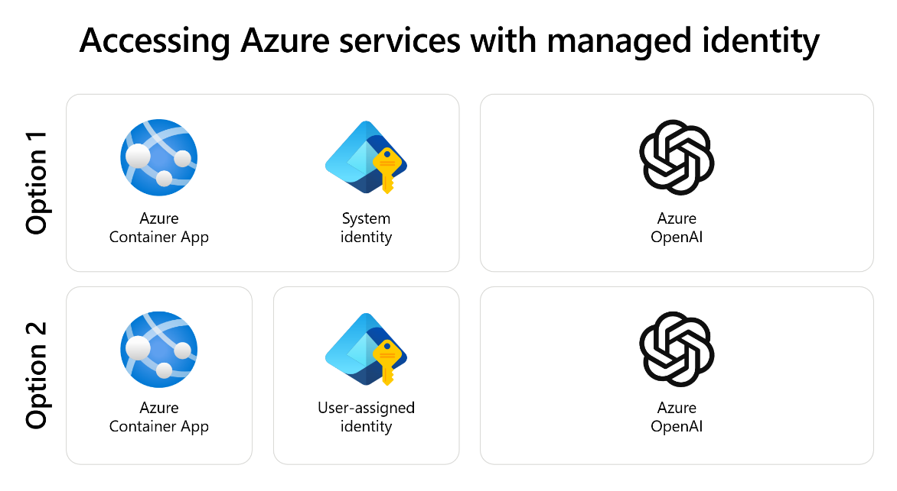

Azure OpenAI supports several methods of authentication to ensure secure and controlled access to its resources. The primary methods are:

- **API Keys**: Azure OpenAI also supports API key-based authentication. API keys are generated within the Azure portal and can be used to authenticate requests to the Azure OpenAI service. This method of authentication isn't recommended from a security perspective and should only be used as a last resort. If you must use this method of authentication, it's important to handle API keys securely and rotate them periodically to reduce the risk of unauthorized access.
- **Microsoft Entra ID:** This method leverages the robust identity and access management capabilities of Microsoft Entra. Users and applications authenticate using Microsoft Entra identities, which can be traditional user accounts or managed identities. This method ensures that only authenticated and authorized users can access the Azure OpenAI resources.
- **Entra** **Managed Identities:** Managed identities for Azure resources provide an automatically managed identity in Microsoft Entra for applications to use when connecting to resources that support Microsoft Entra authentication. These identities can be system-assigned, meaning they're tied to a specific Azure resource, or user-assigned, which allows a single identity to be shared across multiple resources. Managed identities simplify the management of credentials and enhance security by eliminating the need for hard-coded credentials in application code.

## Why managed identities are more secure than API keys

Managed identities in Microsoft Azure offer a more secure alternative to API keys for several reasons: 

1. Managed identities eliminate the need for developers to handle credentials directly, thereby reducing the risk of accidental exposure or misuse. 
1. When using API keys, developers must embed these keys within their application code or configuration files.

API keys can be inadvertently exposed through source code repositories, logs, or other means. This exposure can lead to unauthorized access and potential security breaches. In contrast, managed identities provide an automatically managed identity for applications to use when connecting to resources that support Microsoft Entra (previously Azure AD) authentication. This means that credentials aren't stored in the application code, reducing the risk of leaks and unauthorized access.

Moreover, managed identities streamline the authentication process by allowing Azure services to authenticate to other Azure services securely without the need for explicit credentials. This is achieved by using tokens issued by Microsoft Entra, which are automatically managed and rotated, ensuring that the credentials are always up-to-date and reducing the risk of credential theft. API keys, on the other hand, are static and require manual rotation, which can be error-prone and often neglected, leading to potential vulnerabilities. By using managed identities, developers can leverage Azure's built-in security features, such as role-based access control (RBAC), to grant precise permissions to resources, further enhancing security. 

Microsoft recommends that you use Managed Identity over API keys when authenticating to Azure OpenAI, or any other Azure service that supports Managed Identity.

## Differences between using API keys and managed identities within Azure OpenAI

Let's evaluate the impact of a leaked client ID versus a leaked API key.

An API key functions similarly to a regular password. If it's compromised, anyone with the key can access the resource. For Azure OpenAI, this means unrestricted use of AI models like GPT-4. If the network is publicly accessible, the security impact could be even greater.

Conversely, if the client ID is leaked, the risks are minimal. This is because the client ID alone can't establish a connection to Azure OpenAI. To utilize a Managed Identity, the service must be operating on Azure and even if Azure OpenAI is public, you can't connect from a local environment or across a network using an application.

In summary, compared to the ramifications of a leaked API key, exploiting a leaked client ID involves several steps, making it harder for malicious actors to exploit. 

For these reasons, Managed Identities offer a safer method to manage operations compared to API keys. It's recommended in the strongest possible terms that you use Managed Identity over API keys when authenticating to Azure OpenAI, or any other Azure service that supports Managed Identity.

## System versus user assigned identities

When building an Azure OpenAI application, understanding the distinction between system-assigned and user-assigned identities is crucial for optimal security and resource management.

- **System-assigned identities** are created and managed by Azure for a specific resource. When a resource is deleted, its associated system-assigned identity is also deleted, ensuring that the identity lifecycle is tightly coupled with the resource it belongs to. This type of identity is ideal for scenarios where the identity only needs to be used by a single resource, providing simplicity and reducing the administrative overhead since Azure manages the identity's credentials.
- **User-assigned identities** are created independently of any specific resource and can be shared across multiple resources. This makes them highly versatile for applications that require a consistent identity across different resources, enabling easier management of permissions and access controls. User-assigned identities persist even after the resources using them are deleted, allowing for greater flexibility in redeploying and reusing identities.

Choosing between system-assigned and user-assigned identities depends on the specific needs of your application. For single-resource applications where simplicity and minimal management are priorities, system-assigned identities are typically the best choice. Conversely, for applications that require a shared identity across multiple resources, user-assigned identities offer greater flexibility and reusability.

