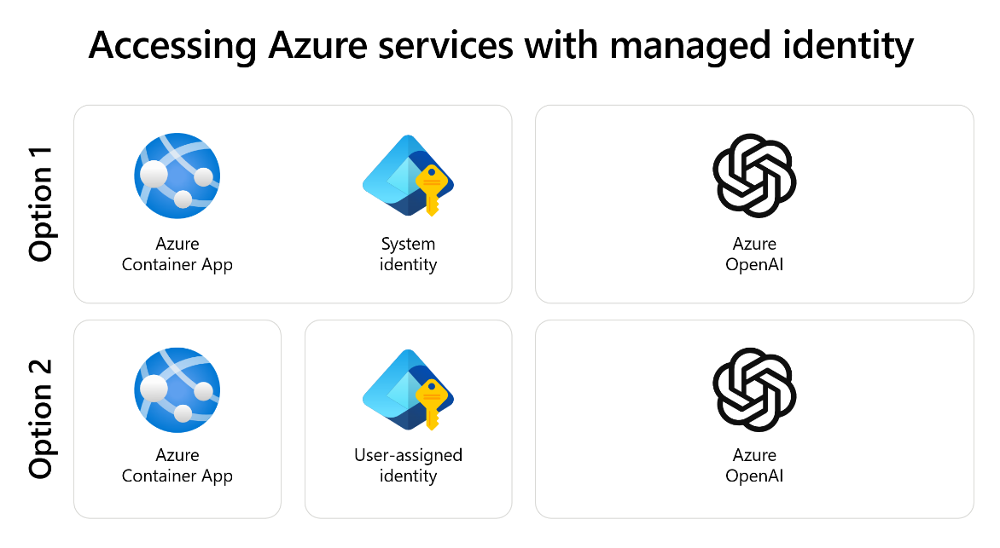

Azure OpenAI in Microsoft Foundry supports two primary authentication patterns:

- **Key-based authentication**, also called local authentication, uses an API key as a possession-based secret. For REST calls, send the key in the `api-key` header, not in the `Authorization` header. Any caller that has a valid key and network access can authenticate until the key is revoked, rotated, or local authentication is disabled. Keys can grant broad access to the Azure OpenAI resource and its deployed models according to what the service permits, so protect them in a secret store, never commit them to source control or logs, and rotate them regularly if you must use them.
- **Microsoft Entra ID authentication**, also called keyless authentication, uses a Microsoft Entra token instead of an API key. A user, app registration, service principal, or managed identity obtains a token and calls the Azure OpenAI endpoint with that token. For REST calls, send the token in the `Authorization: Bearer <token>` header. Access is controlled by role-based access control (RBAC) at the appropriate Foundry resource or project scope.

Use the RBAC role set that matches the surface the caller uses. Some role names are similar, but they aren't interchangeable.

| Scenario | Roles to consider | What the roles authorize |
| --- | --- | --- |
| Current Microsoft Foundry project access | **Foundry User**, **Foundry Project Manager**, **Foundry Account Owner**, **Foundry Owner** | Use **Foundry User** as the usual least-privilege project role for readers and project data actions to build, develop, or consume project assets. Use **Foundry Project Manager** when someone also needs project management or conditional assignment of **Foundry User**; assign it at the **Foundry resource scope** when the user must publish agents. A project-scope assignment is valid for existing-project work that doesn't require agent publishing. Use **Foundry Account Owner** only for elevated account administration; it can manage accounts, projects, resources, and models and conditionally assign specified roles, but it doesn't include project data actions. Use **Foundry Owner** for broad owner-level capability, including management plus build and develop data actions. |
| Direct Microsoft Foundry Models keyless inference | **Cognitive Services User** | Use **Cognitive Services User** at the Foundry resource scope when a workload calls the Microsoft Foundry Models inference endpoint directly with Microsoft Entra ID. This documented built-in role is broader than inference-only because it can read and list keys and includes broad `Microsoft.CognitiveServices/*` data actions. For a narrower custom-role option, use the documented `Microsoft.CognitiveServices/accounts/MaaS/*` data action, but treat it as wildcard-based access rather than strict per-operation least privilege. This role is different from **Cognitive Services OpenAI User** and doesn't replace Foundry project roles for project assets. |
| Azure OpenAI feature access | **Cognitive Services OpenAI User**, **Cognitive Services OpenAI Contributor**, **Cognitive Services Contributor**, **Cognitive Services Usages Reader** | Use **Cognitive Services OpenAI User** for least-privilege Microsoft Entra-authenticated inference on a classic Azure OpenAI resource or for OpenAI features on an Azure OpenAI resource upgraded to Foundry. Use **Cognitive Services OpenAI Contributor** for OpenAI authoring tasks such as model deployment or fine-tuning. Use **Cognitive Services Contributor** for resource management and key access; by itself, it can't make Microsoft Entra-authenticated inference calls. Use **Cognitive Services Usages Reader** at the subscription scope for quota and usage visibility. In the Foundry portal, deployment or edit workflows can also depend on subscription-scope **Cognitive Services Usages Reader** in addition to the authoring role; it doesn't grant inference or authoring access by itself. |

> [!NOTE]
> The Foundry RBAC roles were recently renamed: **Foundry User**, **Foundry Owner**, **Foundry Account Owner**, and **Foundry Project Manager** were previously named Azure AI User, Azure AI Owner, Azure AI Account Owner, and Azure AI Project Manager. Role IDs and core permissions are unchanged; prefer role definition IDs for scripted assignments when possible during the rename rollout.

## Prerequisites for Microsoft Entra ID authentication

Before an app, user, service principal, or managed identity can authenticate with Microsoft Entra ID, make sure that:

- The caller uses the endpoint for the surface being called and a token credential that can request Microsoft Entra tokens for the service.
- The caller has the required role assignment for the surface being called, such as a Foundry project role, **Cognitive Services User** for direct Foundry Models inference, or an applicable Azure OpenAI role for Azure OpenAI feature access on a classic resource or a resource upgraded to Foundry.
- An Azure-hosted workload that uses managed identity has a system-assigned or user-assigned managed identity enabled.
- The resource uses an endpoint that supports Microsoft Entra ID authentication. For Foundry and Azure AI services resources that use token-based Microsoft Entra authentication, configure and call the resource's custom subdomain or custom endpoint. Regional endpoints, such as `https://<region>.api.cognitive.microsoft.com`, don't support Microsoft Entra authentication.

For keyless inference in new implementations, use OpenAI v1 endpoints with a stable OpenAI SDK. Request a token for the `https://ai.azure.com/.default` scope and send it as `Authorization: Bearer <token>`. Use a v1 base URL such as `https://<resource>.openai.azure.com/openai/v1/` or `https://<resource>.services.ai.azure.com/openai/v1/`.

If you're maintaining or migrating an existing app that still uses the deprecated Azure AI Inference SDK with the `/models` endpoint, such as `https://<resource>.services.ai.azure.com/models`, request the `https://cognitiveservices.azure.com/.default` scope instead. Plan to migrate that app to OpenAI v1 because the Azure AI Inference beta SDK is deprecated and retiring.

Role assignments usually apply within a few minutes, but they can take up to 10 minutes. If access was recently granted or removed, refresh the access token; for portal, Azure CLI, or Azure PowerShell validation, sign out and sign in again if needed. Managed identity group or role membership changes can take several hours because of back-end caching, so don't rely on those changes for immediate validation. Validate token-based access before you remove keys from an existing application configuration.

## Managed identities as Microsoft Entra credentials

Managed identities for Azure resources are Microsoft Entra identities that Azure creates and manages for supported Azure-hosted workloads. They aren't a separate authentication method from Microsoft Entra ID. Instead, they're a credential option that lets an Azure service request tokens without storing an application secret.

Managed identities are often the preferred credential for production workloads running in Azure because they reduce the number of secrets that developers must handle. For local development or workloads that don't run on Azure resources that support managed identities, use another Microsoft Entra credential, such as a developer sign-in, app registration, or service principal. Store any client secret, certificate private key, or federated credential configuration securely.

Client IDs, tenant IDs, and object IDs are identifiers, not secrets. A leaked client ID for a managed identity or app registration doesn't authenticate by itself. For a managed identity, the token request must come from an authorized Azure resource context. For a service principal, the caller also needs a valid credential such as a client secret, certificate, or federated token.

## Why Microsoft Entra ID authentication is more secure than API keys

Microsoft recommends Microsoft Entra ID authentication where possible because it enables centralized identity controls and RBAC. Compared with key-based authentication, Microsoft Entra ID authentication can:

- Grant least-privilege access to users, apps, and managed identities instead of sharing a resource key.
- Use conditional access, identity governance, auditing, and credential lifecycle controls available in Microsoft Entra.
- Avoid storing long-lived API keys in app settings, configuration files, scripts, or deployment pipelines.
- Let you rotate or revoke credentials for one identity without replacing a shared key across every workload.

API keys remain possession-based secrets. If an API key is exposed, any caller that has the key and network access can use the Azure OpenAI resource until you rotate or revoke the key or disable local authentication. Private networking and firewall rules can reduce exposure, but they don't replace secret protection or least-privilege authorization.

## Disable local authentication after migration

After all clients successfully use Microsoft Entra ID authentication and have the required RBAC role assignments, you can disable local authentication to prevent API key use. If you use a custom `Microsoft.CognitiveServices/accounts/MaaS/*` role instead of **Cognitive Services User** for direct Foundry Models inference, validate keyless access before you disable local authentication. Disabling local authentication is a production-hardening control, not a prerequisite for every Microsoft Entra ID authentication scenario.

Plan this change carefully. Disabling local authentication can break workloads that still depend on keys, and the change might take a few minutes to take effect. Confirm that you can re-enable local authentication if you need to roll back, including any Azure Policy changes or exemptions needed for emergency access. You can enforce or configure this setting by using Azure Policy, Bicep or ARM templates with the `disableLocalAuth` property, or PowerShell.

## System-assigned versus user-assigned managed identities

When you use managed identities with an Azure-hosted workload, choose the identity type that matches the workload's lifecycle and access pattern:

- **System-assigned identities** are created for a single Azure resource and share that resource's lifecycle. When the resource is deleted, Azure deletes the identity. Use a system-assigned identity when one resource needs its own dedicated identity.
- **User-assigned identities** are created as standalone Azure resources and can be attached to one or more supported Azure resources. They persist after any consuming resource is deleted. Use a user-assigned identity when several resources need the same permissions or when you need the identity to outlive a specific workload resource.

Treat managed identity assignment and code execution as privileged operations. Anyone who can run code on an Azure resource with a managed identity can use that identity's permissions. Anyone who can assign a user-assigned managed identity to another Azure resource can use that identity's permissions from that resource. Grant code-execution, administrative, and managed-identity assignment permissions only when they're needed and at the smallest appropriate scope.

Plan cleanup as part of the identity lifecycle. User-assigned managed identities persist independently of consuming resources, so delete them when they're no longer required. Deleting a managed identity doesn't automatically delete its RBAC role assignments; remove stale role assignments, including assignments that show `Identity not found`, to avoid clutter and quota pressure.

