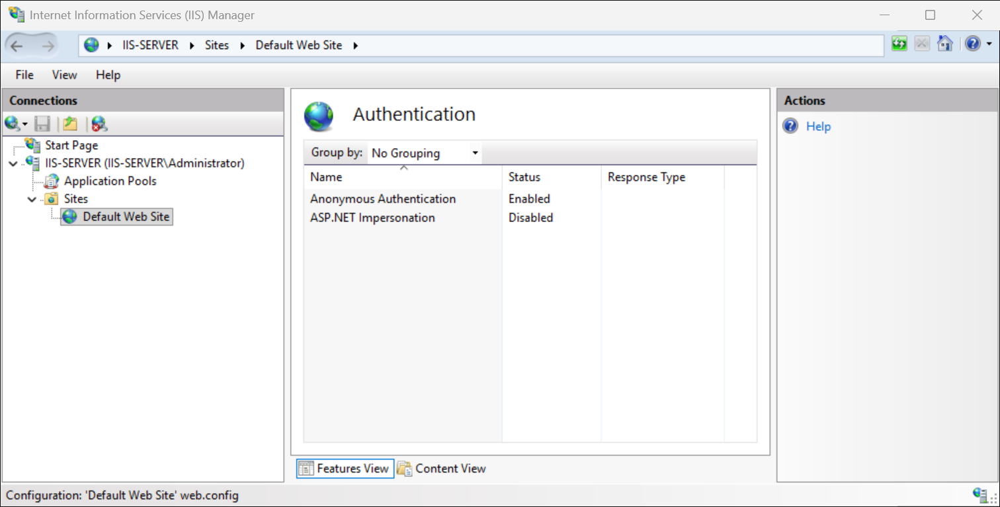
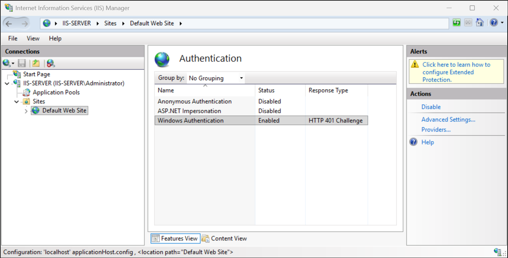
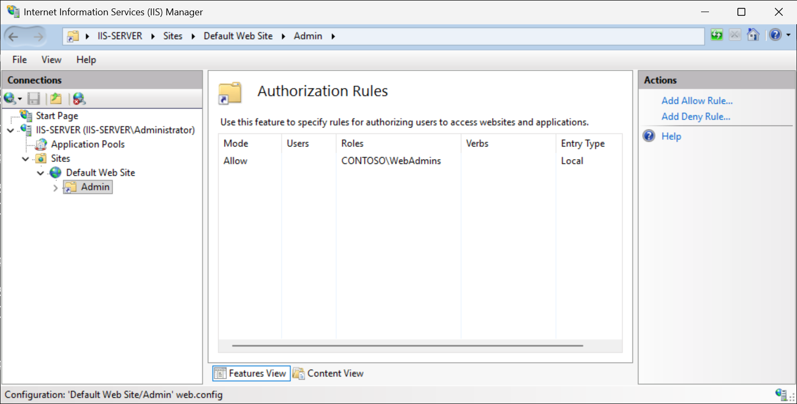
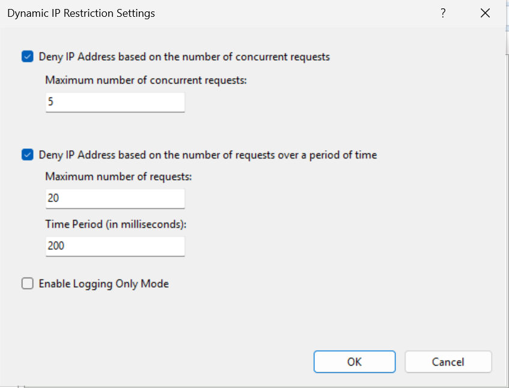
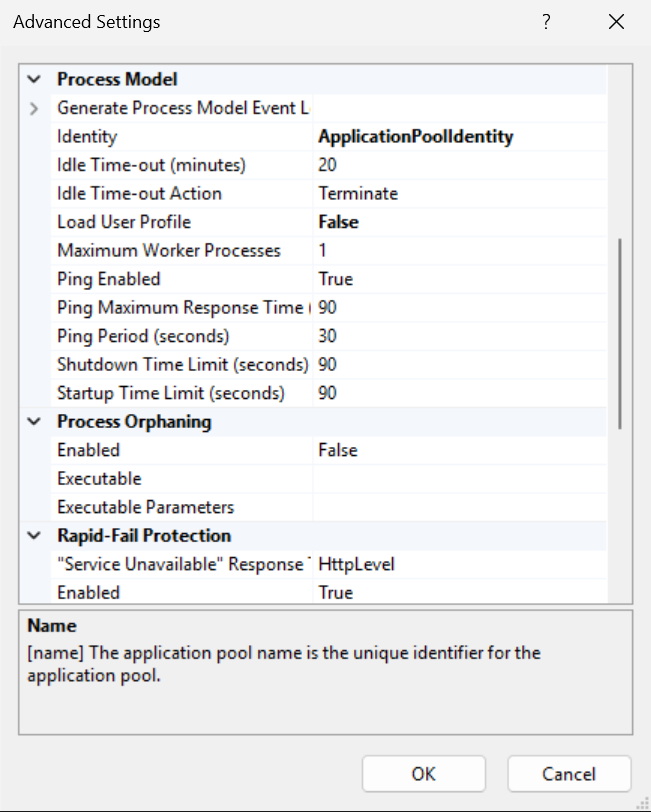

Internet Information Services (IIS) supports multiple authentication mechanisms, each suited to different scenarios. These authentication methods can be enabled or disabled at the server level, site level, or individual application level, providing you with fine-grained control of who and how information can be accessed.

## Anonymous authentication

Anonymous authentication is enabled by default in IIS and allows any client to access your website without providing credentials. IIS uses a designated anonymous user account, by default, configured as the application pool identity, to access file system resources on behalf of unauthenticated visitors. Anonymous authentication is appropriate for public-facing websites where all content should be accessible to anyone.

To configure anonymous authentication in IIS Manager, perform the following steps:

1. Open IIS Manager. In the Connections pane, select your server, site, or application.
1. In Features View, double-select Authentication.
1. In the Authentication pane, confirm Anonymous Authentication shows a status of Enabled.
1. Right-select Anonymous Authentication and select Edit.
1. In the Edit Anonymous Authentication Credentials dialog box, ensure Application pool identity is selected (recommended).
1. Select OK.



You can manage anonymous authentication using the Get-WebConfigurationProperty PowerShell cmdlet. For example, to check anonymous authentication on the default website, run the following PowerShell code:

```powershell
# Check anonymous authentication status on a site
Get-WebConfigurationProperty `
    -Filter "system.webServer/security/authentication/anonymousAuthentication" `
    -Name "enabled" -PSPath "IIS:\Sites\Default Web Site"
 
# Enable anonymous authentication on a site
Set-WebConfigurationProperty `
    -Filter "system.webServer/security/authentication/anonymousAuthentication" `
    -Name "enabled" -Value $true -PSPath "IIS:\Sites\Default Web Site"
 
# Disable anonymous authentication on a site (to require credentials)
Set-WebConfigurationProperty `
    -Filter "system.webServer/security/authentication/anonymousAuthentication" `
    -Name "enabled" -Value $false -PSPath "IIS:\Sites\Default Web Site"
```

## Windows authentication

Windows Authentication (also known as Integrated Windows Authentication) authenticates users transparently using their domain credentials via Kerberos or NTLM. The browser automatically passes the user's Windows credentials to IIS without prompting for a username and password on domain-joined client machines. Use this type of authentication for internal intranet sites and applications where all users are Active Directory domain members.

To enable Windows Authentication in IIS Manager, perform the following steps:

1. In IIS Manager, select the site or application in the Connections pane.
1. Double-select Authentication in the Features View.
1. Select Windows Authentication and select Enable in the Actions pane.
1. Right-select Windows Authentication and select Providers.
1. Verify that Negotiate (Kerberos) is listed above NTLM. This order ensures Kerberos is attempted first, with NTLM as a fallback.
1. Select OK.
1. Select Anonymous Authentication and select Disable in the Actions pane to ensure all visitors are authenticated.



To configure Windows Authentication using PowerShell, first disable anonymous authentication and then enable Windows Authentication with the Set-WebConfigurationProperty cmdlet. To do this on the site named IntranetSite, run the following code:

```powershell
# Install the Windows Authentication role service if it isn't already present
Install-WindowsFeature -Name Web-Windows-Auth
# Disable anonymous auth and enable Windows auth on a site
Set-WebConfigurationProperty `
    -Filter "system.webServer/security/authentication/anonymousAuthentication" `
    -Name "enabled" -Value $false -PSPath "IIS:\Sites\IntranetSite"
 
Set-WebConfigurationProperty `
    -Filter "system.webServer/security/authentication/windowsAuthentication" `
    -Name "enabled" -Value $true -PSPath "IIS:\Sites\IntranetSite"
 
# Verify providers order (Negotiate should appear before NTLM)
Get-WebConfiguration `
    -Filter "system.webServer/security/authentication/windowsAuthentication/providers/*" `
    -PSPath "IIS:\Sites\IntranetSite"
```

## Basic authentication

Basic Authentication prompts users for a username and password. Credentials are transmitted as a Base64-encoded string. Because Base64 isn't encryption, Basic Authentication must only be used over HTTPS (TLS) to prevent credentials from being intercepted. You should choose basic authentication for sites that need credential prompting for nondomain clients, always paired with HTTPS.

> [!NOTE]
> The Basic Authentication role service must be installed. Verify it's present by running the `Get-WindowsFeature -Name Web-Basic-Auth` PowerShell command.

To enable Basic Authentication in IIS Manager, perform the following steps:

1. In IIS Manager, select the site or application.
1. Open Authentication.
1. Select Basic Authentication and select Enable.
1. Right-select Basic Authentication and select Edit to set the Default domain and Realm.
1. Ensure HTTPS is configured on the site.

To enable Basic Authentication using PowerShell, run the following code:

```powershell
# Install Basic Authentication role service if not present
Install-WindowsFeature Web-Basic-Auth
 
# Enable Basic Authentication on a site
Set-WebConfigurationProperty `
    -Filter "system.webServer/security/authentication/basicAuthentication" `
    -Name "enabled" -Value $true -PSPath "IIS:\Sites\SecureSite"
 
# Set the default domain
Set-WebConfigurationProperty `
    -Filter "system.webServer/security/authentication/basicAuthentication" `
    -Name "defaultLogonDomain" -Value "CONTOSO" -PSPath "IIS:\Sites\SecureSite"
```

## Digest authentication

Digest Authentication addresses the primary weakness of Basic Authentication by transmitting a hashed value of the credentials rather than a plaintext-equivalent. It requires Active Directory and a Windows domain controller. Like Basic Authentication, it should be paired with HTTPS for full security.

> [!WARNING]
> Enabling Digest authentication in Active Directory requires the "Store passwords using reversible encryption" policy to be enabled for affected user accounts. Security authorities including the CIS IIS 10 Benchmark (Level 1) and MITRE ATT&CK (subtechnique T1556.005) recommend this policy be disabled, as reversible encryption can be exploited by adversaries to recover plaintext credentials. Because of these security trade-offs, you should avoid Digest authentication in modern deployments and instead implement Windows Authentication or other stronger alternatives.

> [!NOTE]
> Digest Authentication requires the IIS server to be a member of an Active Directory domain.

## Forms-based authentication

Forms-based authentication is primarily used in ASP.NET web applications. Rather than relying on HTTP-level authentication, the application presents a login form to the user. For IIS administrators, the key task is ensuring anonymous authentication is enabled at the IIS level (so unauthenticated requests can reach the login page), while the ASP.NET application handles credential validation through its web.config.

> [!IMPORTANT]
> Forms-based login pages must also be served over HTTPS to protect credentials in transit, paralleling the guidance given for Basic authentication.

## Authorization rules

Once authentication is in place, IIS authorization rules control which authenticated users or groups can access specific URL paths. These rules work alongside NTFS file system permissions to provide layered access control.

### Understanding IIS authorization

IIS Authorization Rules can be applied to:

- All users (including anonymous)
- All authenticated users
- Specific Windows users (by username)
- Specific Windows groups (by group name)

Rules are evaluated in order from top to bottom. The first matching rule applies.

> [!IMPORTANT]
> IIS Authorization Rules supplement, but don't replace, NTFS permissions. Both must be configured correctly. IIS authorization controls which requests IIS processes, while NTFS permissions control which accounts can actually read the underlying files.

To configure authorization rules in IIS Manager, perform the following steps:

1. In IIS Manager, select the site, application, or directory you want to protect.
1. Double-select Authorization Rules in the Features View.
1. In the Actions pane, select Add Allow Rule or Add Deny Rule.
1. In the dialog box, select one of the following:
   - All Users: Applies to everyone, including anonymous visitors.
   - All Anonymous Users: Applies only to unauthenticated visitors.
   - Specified roles or user groups: Enter domain group names (for example, CONTOSO\WebAdmins).
   - Specified users: Enter specific usernames (for example, CONTOSO\orin).
1. Select OK.

For example, to restrict an /admin directory to WebAdmins group only, perform the following steps:

1. In IIS Manager, navigate to and select the /admin directory under your site.
1. Double-select Authorization Rules.
1. If an "Allow All Users" rule exists, select it and select Remove.
1. Select Add Allow Rule, select Specified roles or user groups, enter CONTOSO\WebAdmins, select OK.



To manage authorization rules using PowerShell, use the following code:

```powershell
# Add the Authorization Rules role service
Install-WindowsFeature -Name Web-Url-Auth
# Add an allow rule for a specific Windows group on a sub-path
Add-WebConfiguration `
    -Filter "system.webServer/security/authorization" `
    -PSPath "IIS:\Sites\MySite\admin" `
    -Value @{accessType="Allow"; roles="CONTOSO\WebAdmins"}
# Remove the default Allow All Users rule
Remove-WebConfiguration `
    -Filter "system.webServer/security/authorization" `
    -PSPath "IIS:\Sites\MySite\admin" `
    -Value @{accessType="Allow"; users="*"}
# View existing authorization rules
Get-WebConfiguration `
    -Filter "system.webServer/security/authorization/*" `
    -PSPath "IIS:\Sites\MySite\admin"
```

### NTFS permissions for web content

In addition to IIS authorization rules, ensure NTFS permissions on web content directories are correctly configured:

- The application pool identity needs Read permission (and Write if the app writes files) to the web content directory.
- The IIS_IUSRS group should have Read access to web content directories.
- For writable directories, grant only the specific application pool identity access—not all application pools.

```powershell
# Grant the application pool identity Read access to a web directory
# IIS creates a virtual account named "IIS AppPool\<AppPoolName>"
$acl = Get-Acl "C:\inetpub\wwwroot\MySite"
$accessRule = New-Object System.Security.AccessControl.FileSystemAccessRule(
    "IIS AppPool\MySitePool", "Read",
    "ContainerInherit,ObjectInherit", "None", "Allow")
$acl.SetAccessRule($accessRule)
Set-Acl "C:\inetpub\wwwroot\MySite" $acl
```

### IP address and domain restrictions

IIS supports restricting site access by client IP address or fully qualified domain name (FQDN). The IP Address and Domain Restrictions feature lets you maintain static allow or deny lists and, when the Dynamic IP Restrictions module is installed, automatically block clients that exceed a configurable number of concurrent requests or requests per time period.

Industry security standards, including CIS IIS 10 Benchmark, recommend enabling Dynamic IP Address Restrictions to mitigate brute-force and denial-of-service attacks, particularly for administrative endpoints.

To configure IP Address and Domain Restrictions in IIS Manager, perform the following steps:

1. Ensure that you have the Web-IP-Security role service installed. 
1. In IIS Manager, select your server or site in the Connections pane.
1. Double-select IP Address and Domain Restrictions in the Features View under the Security section.
1. In the Actions pane, select Add Allow Entry or Add Deny Entry.
1. Enter a specific IP address, an IP address range, or a domain name, then select OK.
1. To enable Dynamic IP Restrictions, select Edit Dynamic Restriction Settings in the Actions pane and configure:
   - Deny IP address based on the number of concurrent requests: Set a threshold (for example, 10).
   - Deny IP address based on the number of requests over a period of time: Set a rate limit (for example, 100 requests per 10 seconds).
1. Select OK.



You can configure a static IP deny rule using the following PowerShell code:

```powershell
# Install the IP and Domain Restrictions web service
Install-WindowsFeature -Name Web-IP-Security
# Deny a specific IP address from accessing a site
Add-WebConfigurationProperty -PSPath "IIS:\Sites\MySite" `
    -Filter "system.webServer/security/ipSecurity" `
    -Name "." -Value @{ipAddress="192.168.1.100"; allowed=$false}
 
# Allow access from a specific subnet (deny all others by default)
Set-WebConfigurationProperty -PSPath "IIS:\Sites\MySite" `
    -Filter "system.webServer/security/ipSecurity" `
    -Name "allowUnlisted" -Value $false
```

> [!NOTE]
> To use domain name restrictions, enable the "Enable Domain Name Restrictions" option in the Edit Feature Settings dialog. This requires reverse DNS lookups and may affect performance.

## Application pool identities and permissions

Application pools run under a security context (identity). Following the principle of least privilege, each application pool should run under an account that has only the permissions it requires. The default and recommended setting is ApplicationPoolIdentity. This special account is created automatically for each application pool, named `IIS AppPool\\<AppPoolName>`. It runs with limited privileges and requires no password management. The default application pool identity has the following benefits:

- Automatically managed by IIS (no password to maintain)
- Each pool gets a unique identity for isolation
- Runs with low privileges by default

IIS supports the following identity types for application pools:

| **Identity Type** | **Description** | **Recommendation** |
|---|---|---|
| ApplicationPoolIdentity | A virtual account unique to each application pool, automatically created by IIS. | **Recommended for most deployments.** Provides per-pool isolation with minimal privileges. |
| NetworkService | A built-in account shared across services on the machine. | Avoid. Multiple pools share the same identity, reducing isolation. |
| LocalService | A built-in low-privilege account. | Not recommended. Doesn't provide per-pool isolation. |
| LocalSystem | A highly privileged built-in account with broad access to the system. | **Never use for web applications.** Violates the principle of least privilege. |
| Custom account | A specific Windows or domain user account. | Use only when an application requires specific credentials, such as accessing a remote SQL Server with Windows authentication. |

To verify an application pool uses ApplicationPoolIdentity, perform the following steps:

1. In IIS Manager, select Application Pools in the Connections pane.
1. Select your application pool and select Advanced Settings in the Actions pane.
1. Expand Process Model.
1. Confirm Identity is set to ApplicationPoolIdentity.



For enterprise scenarios requiring that the application pool have access to network resources, such as file shares, or SQL Server using Windows Authentication, you can run an application pool under a specific domain service account or managed service account.

> [!NOTE]
> Managed service accounts allow the password to be managed by Active Directory. This avoids the problem of service account password rotation.

To configure a custom service account, perform the following steps:

1. In IIS Manager, select Application Pools.
1. Select your pool and select Advanced Settings.
1. Under Process Model, select the Identity field, then select the ... (ellipsis) button.
1. Select Custom account and select Set.
1. Enter the username (for example, CONTOSO\WebSvcAccount), password, and confirm password. This procedure is different for managed service accounts.
1. Select OK twice.

> [!IMPORTANT]
> Always use a dedicated, least-privilege service account and best practice is to use group or domain managed service accounts. Never use privileged accounts as application pool identities.

You can configure a custom application pool identity using the Set-ItemProperty cmdlet. For example, to configure the application identity to the CONTOSO\WebSvcAccount identity, run the following PowerShell code:

```powershell
# Set a custom service account identity for an application pool
$appPool = "MySitePool"
$username = "CONTOSO\WebSvcAccount"
$password = "T@sMan1a123"  # Use secure credential management in production
Set-ItemProperty "IIS:\AppPools\$appPool" -Name processModel.userName -Value $username
Set-ItemProperty "IIS:\AppPools\$appPool" -Name processModel.password -Value $password
Set-ItemProperty "IIS:\AppPools\$appPool" -Name processModel.identityType -Value 3
# identityType 3 = SpecificUser
```

To verify the identity of an application pool using PowerShell, run the following code:

```powershell
# Check the identity type for all application pools
# processModel.identityType 'ApplicationPoolIdentity' is the recommended value
Get-ChildItem IIS:\AppPools | ForEach-Object {
    $pool = $_.Name
    $identity = Get-ItemProperty "IIS:\AppPools\$pool" -Name processModel.identityType
    [PSCustomObject]@{
        AppPool      = $pool
        IdentityType = $identity
    }
}

# Set a specific app pool to use ApplicationPoolIdentity
Set-ItemProperty "IIS:\AppPools\MySitePool" `
    -Name processModel.identityType -Value "ApplicationPoolIdentity"
```
