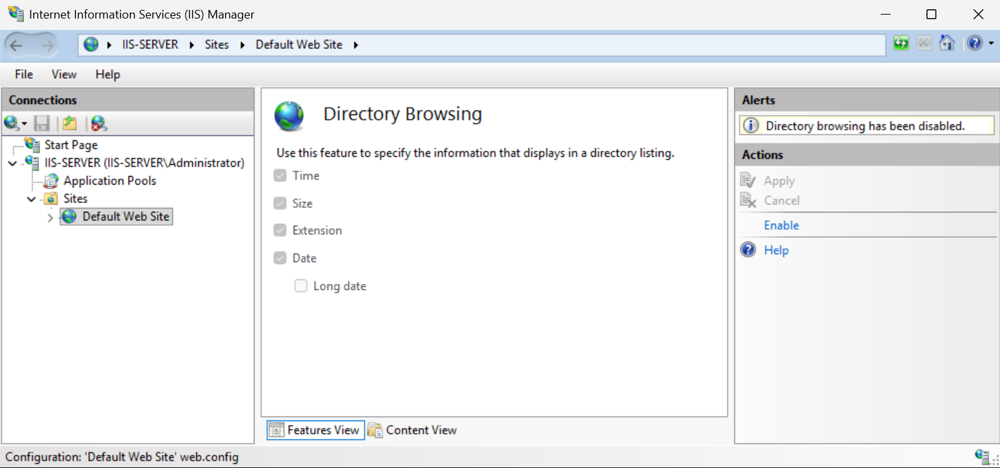

Installing IIS out of the box provides a functional web server, but the default configuration may include features, services, and settings that are unnecessary for your specific environment. A principle of securing any service is to reduce the attack surface by removing anything that isn't necessary for the workload to function. 

## Removing unused IIS features

IIS is composed of optional role services. By following the principle of least functionality, only install and enable the role services your web applications actually require. Each extra module adds code surface that could contain vulnerabilities.

To review installed IIS role services, perform the following steps:

1. Open Server Manager.
1. Select Manage > Remove Roles and Features.
1. Proceed to the Remove Server Roles page and expand Web Server (IIS) > Web Server to see installed role services.
1. Review each and determine whether it's required by hosted applications.

The table lists roles that may not be necessary on your web server deployment.

| **Role Service** | **When to Remove** |
|---|---|
| WebDAV Publishing | Remove unless applications explicitly require WebDAV. |
| FTP Server | Remove if no FTP sites are hosted. |
| CGI | Remove if no CGI scripts are used. |
| Server Side Includes | Remove if no legacy SSI applications are hosted. |
| IIS 6 Management Compatibility | Remove unless using tools that require the IIS 6 ADSI or WMI interfaces. |

You can remove roles using the Remove-WindowsFeature PowerShell cmdlet. The code example shows you how to remove the role services listed in the table:

```powershell
# Remove WebDAV Publishing
Remove-WindowsFeature Web-DAV-Publishing
 
# Remove FTP Service
Remove-WindowsFeature Web-Ftp-Service
 
# Remove CGI
Remove-WindowsFeature Web-CGI
 
# Remove Server Side Includes
Remove-WindowsFeature Web-Includes
 
# Remove IIS 6 Management Compatibility
Remove-WindowsFeature Web-Mgmt-Compat
```

> [!NOTE]
> After removing role services, test hosted applications to confirm they continue to function.

Even for installed role services, you can disable individual HTTP modules in the IIS pipeline for specific sites that don't use them.

To remove a module from a specific site, perform the following steps:

1. In IIS Manager, select your site in the Connections pane.
1. Double-select Modules in the Features View.
1. Find the module and select Remove in the Actions pane.

## Locking down default settings

Common tasks in reducing the attack surface of IIS include:

- Using a separate volume for the web content
- Disabling directory browsing
- Removing default content and samples
- Configuring host headers

### Separate volume for web content

Security benchmarks, including the CIS IIS 10 Benchmark, recommend hosting web content on a partition separate from the operating system. Storing web content on the system drive (typically C:\) increases the risk of path traversal attacks reaching operating system files and allows an attacker who fills the content directory to exhaust disk space on the OS partition. When deploying IIS, create a dedicated data partition (for example, D:\inetpub) and configure the site's physical path accordingly.

### Disabling directory browsing

When directory browsing is enabled and a directory contains no default document, IIS displays a listing of all files in that directory. This can expose sensitive information about site structure and file contents to potential attackers.

By default, directory browsing is disabled in IIS. Verify it's disabled on all production sites.

To disable directory browsing in IIS Manager, perform the following steps:

1. In IIS Manager, select the server node (to apply globally) or a specific site.
1. Double-select Directory Browsing in the Features View.
1. In the Actions pane, confirm the status shows Disabled. If enabled, select Disable.



To disable directory browsing using PowerShell, run the following code:

```powershell
# Disable directory browsing at the server level
Set-WebConfigurationProperty -Filter "system.webServer/directoryBrowse" `
    -Name "enabled" -Value $false -PSPath "IIS:\"
 
# Disable for a specific site
Set-WebConfigurationProperty -Filter "system.webServer/directoryBrowse" `
    -Name "enabled" -Value $false -PSPath "IIS:\Sites\Default Web Site"
```

### Removing default content and sample applications

IIS installs a default website with sample content in C:\inetpub\wwwroot. Before hosting production content, remove or replace this default content. Sample files can reveal IIS version information. You can do this with the following PowerShell code:

```powershell
# Remove the default IIS welcome page files
Remove-Item "C:\inetpub\wwwroot\iisstart.htm" -Force
Remove-Item "C:\inetpub\wwwroot\iisstart.png" -Force
 
# Stop the default website if it is not serving a purpose
Stop-Website -Name "Default Web Site"
```

### Configuring host headers for all site bindings

Security benchmarks such as CIS IIS 10 recommend configuring a host header value for every site binding. When a binding lacks a host header, IIS responds to requests for any hostname on that IP/port, including requests with unexpected or malformed Host headers. This can allow an attacker to reach a site by targeting its IP address directly or by using a different hostname.

To configure a host header for a binding in IIS Manager, perform the following steps:

1. In IIS Manager, select your site in the Connections pane.
1. In the Actions pane, select Bindings.
1. Select the binding and select Edit.
1. In the Host name field, enter the fully qualified domain name for the site (for example, www.contoso.com).
1. Select OK, then Close.

> [!NOTE]
> Assigning a host header to every binding prevents IIS from serving requests to unexpected hostnames and limits the site's exposure to virtual host confusion attacks.

## Locking IIS configuration

IIS allows administrators to lock configuration sections so they can't be overridden by web.config files in hosted applications. This prevents applications from modifying security-critical server-level settings.

To lock a configuration section in IIS Manager, perform the following steps:

1. In IIS Manager, select the server node.
1. Double-select Configuration Editor in the Management section of Features View.
1. In the Section dropdown, navigate to the section to lock (for example, system.webServer/security/requestFiltering).
1. In the Actions pane, select Lock Section.

## Isolating sites and applications

Each website or web application should run in its own dedicated application pool. This provides:

- **Fault isolation.** If one application crashes, other sites are unaffected.
- **Security isolation.** Each site has its own identity and permissions.
- **Resource visibility.** CPU and memory usage can be monitored per site.

To verify application pool assignments, perform the following steps:

1. In IIS Manager, select Application Pools in the Connections pane to see all pools and their associated applications.
1. For each site, right-select the site and select Advanced Settings to verify the Application Pool field shows a unique, dedicated pool.

## IIS logging

Logging is a critical component of IIS security. Without adequate logging, detecting intrusions, diagnosing attacks, or meeting compliance requirements is difficult. 

### Moving the default log location off the system drive

By default, IIS stores log files on the system drive (C:\inetpub\logs). Storing logs on the same drive as the operating system risks disk exhaustion if log volume is high, and places logs alongside system files. CIS item 5.1 recommends storing log files on a nonsystem drive.

To change the log file location for a site in IIS Manager, perform the following steps:

1. In IIS Manager, select the server node in the Connections pane.
1. Double-select Logging in the Features View.
1. Under Log File, change the Directory path to a location on a nonsystem drive (for example, D:\IISLogs).
1. Select Apply in the Actions pane.

```powershell
# Set the IIS log file directory to a non-system drive
Set-WebConfigurationProperty -PSPath "IIS:\" `
    -Filter "system.applicationHost/sites/siteDefaults/logFile" `
    -Name "directory" -Value "D:\IISLogs"
```

### Restricting log directory permissions

IIS log files can contain sensitive information such as URLs, query strings, usernames, and client IP addresses. If non-administrative users can read or modify the log directory, they could extract this information or tamper with logs to conceal evidence of an attack. Restrict NTFS permissions on the log directory so that only Administrators and the SYSTEM account have access.

```powershell
# Restrict the IIS log directory to Administrators and SYSTEM only
$logPath = "D:\IISLogs"
$acl = Get-Acl $logPath

# Remove inherited permissions and clear existing access rules
$acl.SetAccessRuleProtection($true, $false)
$acl.Access | ForEach-Object { $acl.RemoveAccessRule($_) } | Out-Null

# Grant Full Control to Administrators
$adminRule = New-Object System.Security.AccessControl.FileSystemAccessRule(
    "BUILTIN\Administrators", "FullControl",
    "ContainerInherit,ObjectInherit", "None", "Allow")
$acl.AddAccessRule($adminRule)

# Grant Full Control to SYSTEM (required for IIS to write logs)
$systemRule = New-Object System.Security.AccessControl.FileSystemAccessRule(
    "NT AUTHORITY\SYSTEM", "FullControl",
    "ContainerInherit,ObjectInherit", "None", "Allow")
$acl.AddAccessRule($systemRule)

Set-Acl $logPath $acl
```

### Enabling Advanced IIS logging fields

Standard W3C log fields record basic request details, but important security-relevant information (such as client-sent request bytes, server response bytes, and the time-taken field) is disabled by default. CIS item 5.2 recommends enabling the full set of W3C logging fields.

To enable all W3C logging fields in IIS Manager, perform the following steps:

1. In IIS Manager, select your server or site.
1. Double-select Logging.
1. Ensure Log file format is set to W3C.
1. Choose Select Fields, and enable all available fields, particularly: cs-bytes, sc-bytes, time-taken, cs-host, and cs(User-Agent).
1. Select OK, then Apply.

### Enabling ETW logging

Event Tracing for Windows (ETW) allows IIS request data to be consumed by real-time monitoring tools and SIEM systems alongside Windows event logs. CIS item 5.3 recommends enabling ETW logging.

To enable ETW logging, perform the following steps:

1. In IIS Manager, select the server node.
1. Double-select Logging.
1. Under Log Event Destination, select Both log file and ETW event, or ETW event only if you're collecting events via a SIEM.
1. Select Apply.

## Request filtering and limits

Request Filtering is a built-in IIS security feature that inspects incoming HTTP requests and rejects dangerous patterns before they reach your application code.

To configure request filtering in IIS Manager, perform the following steps:

1. In IIS Manager, select your server or site.
1. Double-select Request Filtering in the Features View under the Security section. The Request Filtering feature includes multiple tabs:
   - **File Name Extensions:** Block or allow requests based on file extension.
   - **Rules:** Custom filtering rules based on request properties.
   - **HTTP Verbs:** Allow or deny specific HTTP methods.
   - **Headers:** Block requests with specific headers or oversized header values.
   - **Query Strings:** Block requests containing specific patterns in query strings.

## Blocking dangerous file extensions

You can block execution-capable file types from being served or uploaded where user-provided content is stored. To block a file extension in IIS Manager, perform the following steps:

1. In Request Filtering, select the File Name Extensions tab.
1. In the Actions pane, select Deny File Name Extension.
1. Enter the extension to block (for example, .exe) and select OK.
1. Repeat for: .bat, .cmd, .com, .dll, .vbs, .ps1.

You can configure extension blocking using the Add-WebConfigurationProperty cmdlet. For example, the following code blocks .exe, .bat, .cmd, .com, .dll, .vbs and .ps1 files:

```powershell
# Deny dangerous file extensions
$extensions = @(".exe", ".bat", ".cmd", ".com", ".dll", ".vbs", ".ps1")
foreach ($ext in $extensions) {
    Add-WebConfigurationProperty -PSPath "IIS:\Sites\MySite" `
        -Filter "system.webServer/security/requestFiltering/fileExtensions" `
        -Name "." -Value @{fileExtension=$ext; allowed=$false}
}
```

## Setting request size limits

Limiting request size and URL length can mitigate certain denial-of-service vectors. To configure request limits in IIS Manager, perform the following steps:

1. In Request Filtering, select Edit Feature Settings in the Actions pane.
1. In the Edit Request Filtering Settings dialog box, configure:
   - Allow high-bit characters: Uncheck if URLs should contain only ASCII characters.
   - Allow double escaping: Uncheck to prevent URL double-encoding attacks.
   - Maximum allowed content length (bytes): Default is 30,000,000 (~28.6 MB). Reduce for applications that only accept small form submissions.
   - Maximum URL length (bytes): Default is 4096. Reduce to 2048 if long URLs aren't expected.
   - Maximum query string length (bytes): Default is 2048.

You can configure request limits using the Set-WebConfigurationProperty PowerShell cmdlet. For example, to set the request content length to 10 MB, maximum URL length to 2,048 bytes and disallow double escaping in URLs, run the following code:

```powershell
# Set maximum request content length to 10 MB
Set-WebConfigurationProperty -PSPath "IIS:\Sites\MySite" `
    -Filter "system.webServer/security/requestFiltering/requestLimits" `
    -Name "maxAllowedContentLength" -Value 10485760
 
# Set maximum URL length to 2048 bytes
Set-WebConfigurationProperty -PSPath "IIS:\Sites\MySite" `
    -Filter "system.webServer/security/requestFiltering/requestLimits" `
    -Name "maxUrl" -Value 2048
 
# Disallow double escaping in URLs
Set-WebConfigurationProperty -PSPath "IIS:\Sites\MySite" `
    -Filter "system.webServer/security/requestFiltering" `
    -Name "allowDoubleEscaping" -Value $false
```

## Restricting HTTP verbs

If your web application only uses a subset of HTTP verbs (also known as methods), such as GET and POST, you should restrict other HTTP verbs to reduce attack surface. For example, to deny the TRACE verb in IIS Manager, perform the following steps:

1. In Request Filtering, select the HTTP Verbs tab.
1. Select Add Verb in the Actions pane.
1. Enter TRACE, ensure Allowed is unchecked, and select OK.

To deny the TRACE verb in PowerShell, run the following code:

```powershell
# Deny HTTP TRACE verb (prevents cross-site tracing attacks)
Add-WebConfigurationProperty -PSPath "IIS:\Sites\MySite" `
    -Filter "system.webServer/security/requestFiltering/verbs" `
    -Name "." -Value @{verb="TRACE"; allowed=$false}
```
