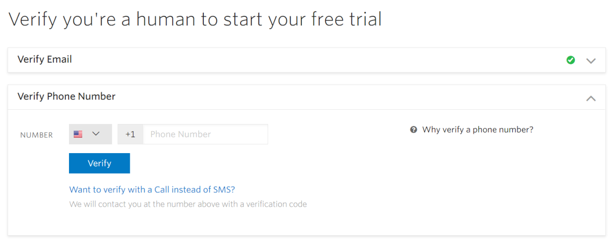
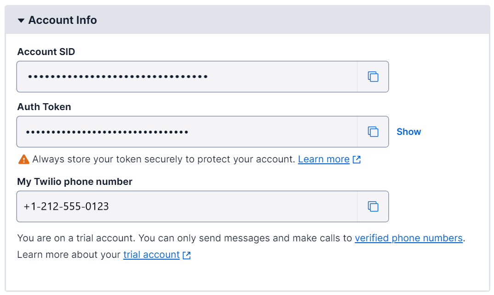

To send and receive SMS messages programmatically, you'll need a Twilio account. In this unit, you'll create a free Twilio account. The free account is more than enough to get started.

## Create a Twilio account

1. Head to [twilio.com](https://www.twilio.com?azure-portal=true)

1. Select the red **Sign Up** button in the top-right corner

1. Fill in your details and Select **Start your free trial**

1. Twilio will send you an email to verify your email address. Select the **Confirm your email** option in the verification email you'll receive, then log in to Twilio with the email and password you provided in the previous step.

1. Enter your phone number to verify. Twilio free accounts only let you send messages to verified phone numbers to stop them from being used for spam. Twilio will send you a verification code via SMS that you need to enter to verify your phone.

    

1. Work through the introductory questions asked until you get to the dashboard. These questions will be used to create a first Twilio project for you to use.

1. Select the **Get a Trial Number** button in your account dashboard. Twilio assigns you a phone number that is used to send messages.

    > [!NOTE]
    > These assigned numbers may not be able to send messages in some countries. The Twilio documentation lists [which countries have restrictions](https://support.twilio.com/hc/articles/223183068-Twilio-international-phone-number-availability-and-their-capabilities), and shows ways to send SMS messages using an [international number or AlphaNumeric sender Id](https://support.twilio.com/hc/articles/226690868-Using-Twilio-when-SMS-numbers-are-unavailable-in-your-country).

1. Take a copy of the following values from the dashboard and store them somewhere. The *Trial Number* can be selected and copied, the *Account SID* and *Auth Token* need to be copied using the **Copy** button.

   - Trial Number
   - Account SID
   - Auth token

   

   You'll need these values later in this module.

In this unit, you created a Twilio account that you'll use to send and receive SMS. Next, you'll learn how to create and deploy an Azure Function app.
