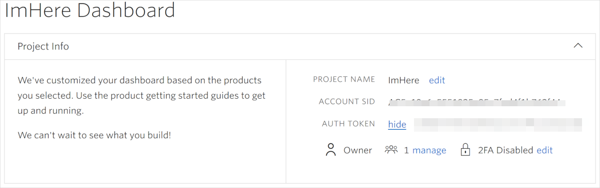

## Create a Twilio account

To be able to send SMS messages from an Azure Function, you'll need a Twilio account. The free account is more than enough to get started.

1. Head to [twilio.com](https://www.twilio.com?azure-portal=true).

1. Click the **Sign Up** button in the top-right corner.

1. Fill in your details and click **Get Started**.

1. Enter your email address, and respond to the email by providing your phone number to verify. Twilio free accounts let you send messages only to verified phone numbers to stop them from being used for spam. Twilio will send you a verification code that you need to enter to verify your phone.

    
1. Log onto your Twilio account and click **Get a trial phone number** on your account dashboard. Twilio assigns you a phone number that is used to send messages.

    > [!NOTE]
    > These assigned numbers may not be able to send messages in some countries. The Twilio documentation lists [which countries have restrictions](https://support.twilio.com/hc/articles/223183068-Twilio-international-phone-number-availability-and-their-capabilities?azure-portal=true), and shows ways to send SMS messages using an [international number or AlphaNumeric sender Id](https://support.twilio.com/hc/articles/226690868-Using-Twilio-when-SMS-numbers-are-unavailable-in-your-country?azure-portal=true).

1. Take a note of your new Twilio Trial Number; you will need it later in this module. You can also get this number anytime by clicking the ellipsis at the bottom of the left-hand menu and navigating to _SUPER NETWORK_ > _Phone Numbers_ > _Manage Numbers_ > _Active Numbers_.

## Create a new Twilio project

Before you start using Twilio to send messages to your verified number, create a project to send programmable SMS.

1. Select the drop-down at the top-left corner of the screen and select **Create New Project**.

1. Provide an account name and select **Verify**.

1. Enter your phone number again.
 
1. Enter a name for your first project, such as "I'm here", then click **Continue**.

1. Skip the step to invite a team mate.

1. From the Twilio messaging dashboard, expand the **Project Info** panel.

    

1. Note your **ACCOUNT SID** and **AUTH TOKEN** because you will need these values later.

## Launch Visual Studio

For this module, you'll develop the mobile app and Azure Functions app using Visual Studio 2017. Although Xamarin.Forms apps can be built to run on iOS, Android, and Universal Windows Platform (UWP), this module will just focus on UWP.

Launch Visual Studio 2017 on your system.

## Summary

In this unit, you created a Twilio account that you'll use to send SMS and launched Visual Studio. Next, you'll learn how to create a Xamarin.Forms app and add the Xamarin.Essentials NuGet package.

> [!IMPORTANT]
> Keep note of the Twilio  **ACCOUNT SID** and **AUTH TOKEN** and **Active Phone Number** values that you gathered in this unit, because you'll need these values later.
