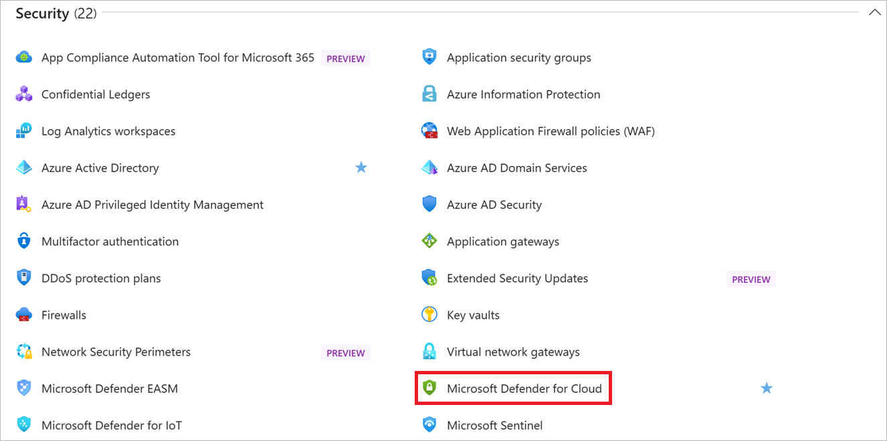
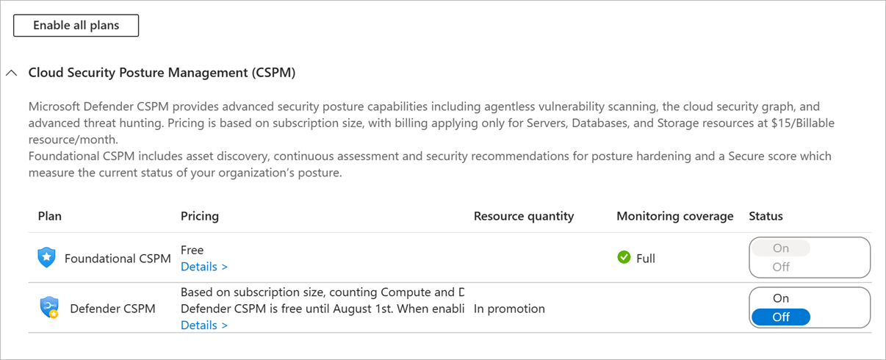

One of the biggest problems with security is being able to see all the areas you need to protect and to find vulnerabilities before hackers do. Azure provides a service which makes this much easier called Microsoft Defender for Cloud.

## What is Microsoft Defender for Cloud?

Microsoft Defender for Cloud is a monitoring service that provides threat protection across all of your services both in Azure, and on-premises. It can:

- Provide security recommendations based on your configurations, resources, and networks.
- Monitor security settings across on-premises and cloud workloads and automatically apply required security to new services as they come online.
- Continuously monitor all your services and perform automatic security assessments to identify potential vulnerabilities before they can be exploited.
- Use machine learning to detect and block malware from being installed in your services and virtual machines. You can also allowlist applications to ensure that only the apps you validate are allowed to execute.
- Analyze and identify potential inbound attacks and help to investigate threats and any post-breach activity which might have occurred.
- Just-In-Time access control for ports, reducing your attack surface by ensuring the network only allows traffic you require.

Defender for Cloud is part of the [Center for Internet Security](https://www.cisecurity.org/cis-benchmarks/) (CIS) recommendations.

## Activating Microsoft Defender for Cloud

Microsoft Defender for Cloud provides unified security management and advanced threat protection for hybrid cloud workloads and is offered in two tiers: Free and Standard. The free tier provides security policies, assessments, and recommendations while the Standard tier provides a robust set of features, including threat intelligence.

Given the benefits of Defender for Cloud, the security team at your company has decided that it be turned on for all subscriptions at your office. You got an email this morning to turn it on for your applications - so let's look at how to do that.

> [!IMPORTANT]
> Microsoft Defender for Cloud is not supported in the free Azure sandbox. You can perform these steps in your own subscription, or just follow along to understand how to activate Defender for Cloud.

1. Open the [Azure portal](https://portal.azure.com?azure-portal=true) and select **Microsoft Defender for Cloud** from the left-hand menu, if you don't see it there, you can select **All services** and find **Defender for Cloud** in the security section as shown below.

   

1. If you have never opened Defender for Cloud, the pane will start on the **Getting started** entry which might ask you to upgrade your subscription. Ignore that for now, select **Skip** at the bottom of the page, and then select **Overview**.
    - This will display the "big security picture" across all the elements available in your subscription.
    - This has a ton of great information you can explore.

1. Next, select **Coverage**, under "Policy and Compliance". This will display what subscription elements are being covered (or not covered) by Defender for Cloud. Here you can turn on Defender for Cloud for any subscription you have access to. Try switching between the three coverage areas: "Not covered", "Basic coverage" and "Standard coverage".

1. Subscriptions that are not covered will have a prompt to activate Defender for Cloud. You can press the "Upgrade Now" button to enable Defender for Cloud for all the resources in the subscription.

### Free vs. Standard pricing tier

While you can use a free Azure subscription tier with Defender for Cloud, it is limited to assessments and recommendations of Azure resources only. To really leverage Defender for Cloud, you will need to upgrade to a Standard tier subscription as shown above. You can upgrade your subscription through the "Upgrade Now" button in the **Coverage** pane as noted above. You can also switch to the **Getting Started** pane in the Defender for Cloud menu which will walk you through changing your subscription level. The pricing and features may change based on the region, you can get a full overview on the [pricing page](https://azure.microsoft.com/pricing/details/security-center/).

> [!NOTE]
> To upgrade a subscription to the Standard tier, you must be assigned the role of Subscription Owner, Subscription Contributor, or Security Admin.

> [!IMPORTANT]
> After the 30-day trial period is over, Defender for Cloud Standard is priced at **$15/node per month** and will be billed to your account.

## Turning off Microsoft Defender for Cloud

For production systems, you will definitely want to keep Microsoft Defender for Cloud turned on so it can monitor all your resources for threats. However, if you are just playing with Defender for Cloud and turned it on, you will likely want to disable it to ensure you are not charged. Let's do that now.

1. Open the [Azure portal](https://portal.azure.com?azure-portal=true) and select **Microsoft Defender for Cloud** from the left-hand menu, if you don't see it there, you can select **All services** and find **Defender for Cloud** in the security section as shown below.

    

1. Select **Security Policy** from the left-hand menu.

1. Next, select **Edit settings >**, next to the subscription for which you want to downgrade Defender for Cloud.

1. On the next screen select "Pricing Tier" from the left-hand menu.

1. A new page will appear that looks like the image below. Click on the box on the left that says "Free (for Azure resources only)".

    

1. Press the **Save** button at the top of the screen.

You have now downgraded your subscription to the free tier of Microsoft Defender for Cloud.

Congratulations, you have taken your first (and most important) step to securing your application, data and network!
