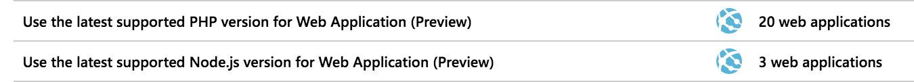

Many developers consider the frameworks and libraries they use to build their software to be primarily decided by features or personal preference. However, the framework that you choose is an important decision, not only from a design and functionality perspective, but also from a _security_ perspective. Choosing a framework with modern security features and keeping it up to date is one of the best ways to ensure your apps are secure.

## Choose your framework carefully

The most important factor regarding security when choosing a framework is how well supported it is. The best frameworks have stated security arrangements and are supported by large communities who improve and test the framework. No software is 100% bug-free or totally secure, but when a vulnerability is identified, we want to be certain that it will be closed or have a workaround provided quickly.

Often "well supported" is synonymous with "modern". Older frameworks tend to either be replaced or eventually fade in popularity. Even if you have significant experience with (or many apps written in) an older framework, you'll be better off choosing a modern library that has the features you need. Modern frameworks tend to build on the lessons learned by earlier iterations, which makes choosing them for new apps a form of threat surface reduction. You'll have one more app to worry about if a vulnerability is discovered in the older framework in which your legacy applications are written.

For more information on secure design and reducing threat surface, see [Microsoft Azure Well-Architected Framework - Security](/training/modules/azure-well-architected-security/).

## Keep your framework updated

Software development frameworks (such as Java Spring and .NET Core) release updates and new versions regularly. These updates include new features, removal of old features, and often security fixes or improvements. When we allow our frameworks to become out of date, it creates "technical debt." The further out of date we get, the harder and riskier it will be to bring our code up to the latest version. In addition, much like the initial framework choice, staying on older versions of the framework open you up to more security threats which have been fixed in newer releases of the framework.

As an example, from 2016-2017, [more than 30 vulnerabilities](https://www.cvedetails.com/product/6117/Apache-Struts.html?vendor_id=45) were found in the Apache Struts framework. The development team quickly addressed these vulnerabilities, but some companies didn't apply the patches and [paid the price in the form of a data breach](https://www.zdnet.com/article/equifax-confirms-apache-struts-flaw-it-failed-to-patch-was-to-blame-for-data-breach/). **Make sure to keep your frameworks and libraries up to date**.

### How do I update my framework?

Some frameworks, like Java or .NET, require an install and tend to release on a known cadence. It's a good idea to watch for new releases and plan to make a branch of your code to try it out when it's released. As an example, .NET Core maintains a [release notes page](https://github.com/dotnet/core/tree/master/release-notes) that you can check to find the latest versions available.

You can update more specialized libraries such as JavaScript frameworks or .NET components through a package manager. **NPM** and **Webpack** are popular choices for web projects and are supported by most IDEs or build tools. In .NET, we use **NuGet** to manage our component dependencies. Much like updating the core framework, branching your code, updating the components, and testing is a good technique to validate a new version of a dependency.

> [!NOTE]
> The `dotnet` command-line tool has an `add package` and `remove package` option to add or remove NuGet packages, but doesn't have a corresponding `update package` command. However, it turns out you can run `dotnet add package <package-name>` in your project and it will automatically _upgrade_ the package to the latest version. This is an easy way to update dependencies without having to open the IDE.

## Take advantage of built-in security

Always check to see what security features your frameworks offer. **Never** roll your own security if there's a standard technique or capability built in. In addition, rely on proven algorithms and workflows because these have often been scrutinized by many experts, critiqued and strengthened so you can be assured that they are reliable and secure.

The .NET Core framework has countless security features. Here are a few core starting places in the documentation:

* [Authentication - Identity Management](/aspnet/core/security/authentication/index?view=aspnetcore-2.1&preserve-view=true)
* [Authorization](/aspnet/core/security/authorization/index?view=aspnetcore-2.1&preserve-view=true)
* [Data Protection](/aspnet/core/security/data-protection/index?view=aspnetcore-2.1&preserve-view=true)
* [Secure Configuration](/aspnet/core/security/data-protection/configuration/index?view=aspnetcore-2.1&preserve-view=true)
* [Security Extensibility APIs](/aspnet/core/security/data-protection/extensibility/index?view=aspnetcore-2.1&preserve-view=true)

Each of these features was written by experts in their field, then battered with tests to ensure that they work as intended, and only as intended. Other frameworks offer similar features; check with the vendor that provides the framework to find out what they have in each category.

> [!WARNING]
> Writing your own security controls, instead of using those provided by your framework, isn't only a waste of time, it's less secure.

## Microsoft Defender for Cloud

When using Azure to host your web applications, Defender for Cloud will warn you if your frameworks are out of date as part of the recommendations tab. Don't forget to look there from time to time to see if there are any warnings related to your apps.

## Summary

Whenever possible, choose a modern framework to build your apps, always use the built-in security features, and make sure you keep it up to date. These simple rules will help to ensure your application starts on a solid foundation.
