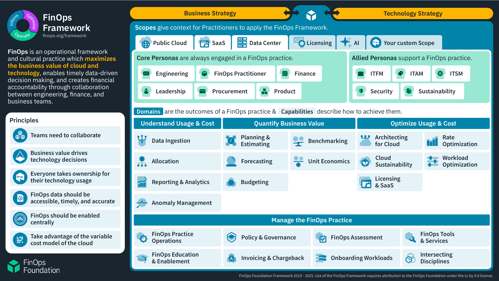

FinOps is defined as an "operational framework and cultural practice which maximizes the business value of cloud and technology, enables timely data-driven decision making, and creates financial accountability through collaboration between engineering, finance, and business teams."

The FinOps Foundation is responsible for the development of the FinOps Framework, an operating model for how to establish and excel in the practice of FinOps. Like other frameworks you may be familiar with (for example DevOps or ITIL), the FinOps Framework provides a structured approach to tackling the different areas of FinOps, on an ongoing basis. 

The FinOps Foundation is a project of The Linux Foundation, dedicated to advancing people who practice the discipline of cloud financial management through best practices, education, and standards. Microsoft and other cloud vendors are members, alongside consulting companies and customers, representing more than 15,000 organizations in total.

[*FinOps Framework*](https://www.finops.org/framework/)_ by_ [*FinOps Foundation*](https://www.finops.org/)

Many organizations have already established FinOps practices as their cloud usage has scaled and matured, though for others, AI may be the catalyst for them to assess and improve their cloud cost management processes.  

FinOps capabilities relevant to AI:

- **Cost data ingestion** - How do you retrieve information about AI application costs and make that data available to the right people, in a timely manner?
- **Cost allocation** - How can you split the cost of AI services across different applications, departments or cost centers?
- **Reporting & analytics** - What cost reports are required, what data should they display, how often do they need to be updated and who should have access to them?
- **Anomaly management** - How are cost spikes or drops identified and how are these events handled? How do they relate to usage or response anomalies in your AI applications?
- **Planning & Estimating** - What is the initial and ongoing expected cost of your AI application, to meet the business requirements?
- **Budgeting** - What cost amount can you allocate to your AI application in the billing period, what threshold amounts should trigger an alert and how should the alerts be handled? 
- **Unit economics** - How do you justify the Return on Investment (ROI) of your AI application? Can you compare the application cost to an increase in sales or revenue, or a decrease in operating expenses, at a macro level? For every dollar spent on AI, what is the resulting business benefit? 
- **Forecasting** - Based on historical usage and any predicted changes (for example, your organization launching a new product), is the cost of your AI application expected to change in the short to medium term?  
- **Benchmarking** - Under normal conditions, how much does your AI application cost? If you make any changes, will they reduce or increase this cost?
- **Workload Optimization** - How can you change your AI application to be more cost effective (for example, use different storage SKUs or handle tokens more effectively with caching)? 
- **Rate Optimization** - How can you get a better price for your AI application, using offers like commitment-based discounts?  
- **Cloud sustainability** - What is the carbon footprint of your AI application and how can you minimize that?
- **Invoicing & chargeback** - How do AI services appear on your cloud invoice, and how can you bill another department or cost center for those expenses?

People responsible for managing the cost of your cloud environment need to work together with your AI application experts to ensure that design decisions meet cost expectations, and that cost minimization strategies don't negatively impact application performance. This is true for all cloud workloads but your FinOps team may be comfortable with the architecture and operating mechanisms of serverless or virtual machine-based workloads, but unaware of how the attributes of AI services can influence costs.
