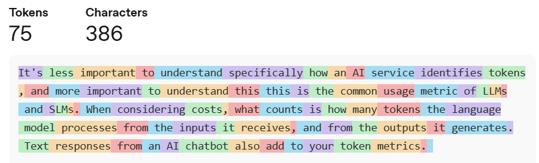

You might know how to estimate the cost of a virtual machine with a combination of processor, memory, and storage specifications. But how do you estimate the cost of an AI service? Let's start with a fundamental component of many AI services - a language model - and how it's used and billed.

## Language models and tokens explained

A language model is a machine learning algorithm that processes text or images and can also be used to generate outputs. Small language models (SLMs) are fine tuned for specific tasks, while large language models (LLMs) have a wider range of applications. LLMs are trained on large-scale datasets, have more parameters, and require more computing power.

Language models don't read text like humans do. Instead, the API of the AI service splits the input text into tokens, for the language model to process. One token is approximately four English characters of text, with other spoken languages having a higher token-to-character ratio. But it's not a simple case of taking the number of English characters and dividing it by four. The tokenization process recognizes commonly occurring sequences of characters. One token can be part of a word, a whole word, or more than one word, with rules also applying to punctuation and numbers.

It's less important to understand specifically how an AI service identifies tokens, and more important to understand that a token is the common usage metric of SLMs and LLMs. When you're considering costs, what counts is how many tokens the language model processes from the inputs it receives, and from the outputs it generates. Text responses from an AI chatbot are classed as outputs and are also added to your token metrics. 

## Azure AI Foundry language models

Azure AI Foundry is an Azure platform-as-a-service offering for enterprise AI operations, model builders, and application development. It's the home for Azure AI agents, models, and tools, without having to manage the infrastructure that those AI services run on. You can deploy a language model directly from the catalog, including models from Microsoft, OpenAI, DeepSeek, Hugging Face, Meta, and more.  

Azure OpenAI language models are priced per 1,000 tokens for Prompts (also known as Input), and per 1,000 tokens for Completion (or Output). The price varies depending on the model, but GPT-5 models are USD \$0.00125 per 1,000 input tokens and USD \$0.01 per 1,000 output tokens. Some models also have a price for cached input tokens, when data is processed and held as tokens, then reused in another part of the AI workflow without needing to reprocess the human text again. GPT-5 costs USD \$0.000125 per 1,000 cached input tokens. There are no other costs for hosting or running these language models.

Other types of models may have unique pricing characteristics - for example, fine-tuning models also have an hourly rate when they're running, and image model pricing depends on the resolution of the images.

Make sure you understand what models are required for your application and size them appropriately.  

## Azure AI Search

Azure AI Search indexes content and enables retrieval through APIs, applications, and AI agents. This retrieval is most commonly used in a process known as retrieval-augmented generation (RAG). 

Azure AI Search is priced on an hourly basis per search unit depending on the selected SKU (stock keeping unit), with each SKU defining a mix of service capabilities. A search unit represents a combination of compute and storage resources allocated to your Azure AI Search service. You can deploy more search units for better performance, availability, or increased storage.

Example pricing for selected SKUs:

| | **Free** | **Standard S1** | **Storage Optimized L2** |
|---|---|---|---|
| **Storage** | 50 MB | 160 GB | 4 TB |
| **Max indices per service** | 3 | 50 | 10 |
| **Scale out limits** | N/A | Up to 36 units per service | Up to 36 units per service |
| **Price per search unit** | USD$0 | USD$0.34 /hour | USD$7.68 /hour |

## Azure AI Speech

The unified speech services provide a wide range of speech recognition and generation capabilities including speech transcription, text-to-speech, and speech translation.

Speech to text transcription has an hourly rate (per hour of audio) that is calculated and billed per second. Text to speech is priced per 1 million text characters and can include an hourly rate for customized voice model training. There are also commitment tier discounts - discounted rates for committing to a specific number of hours or characters per month.
