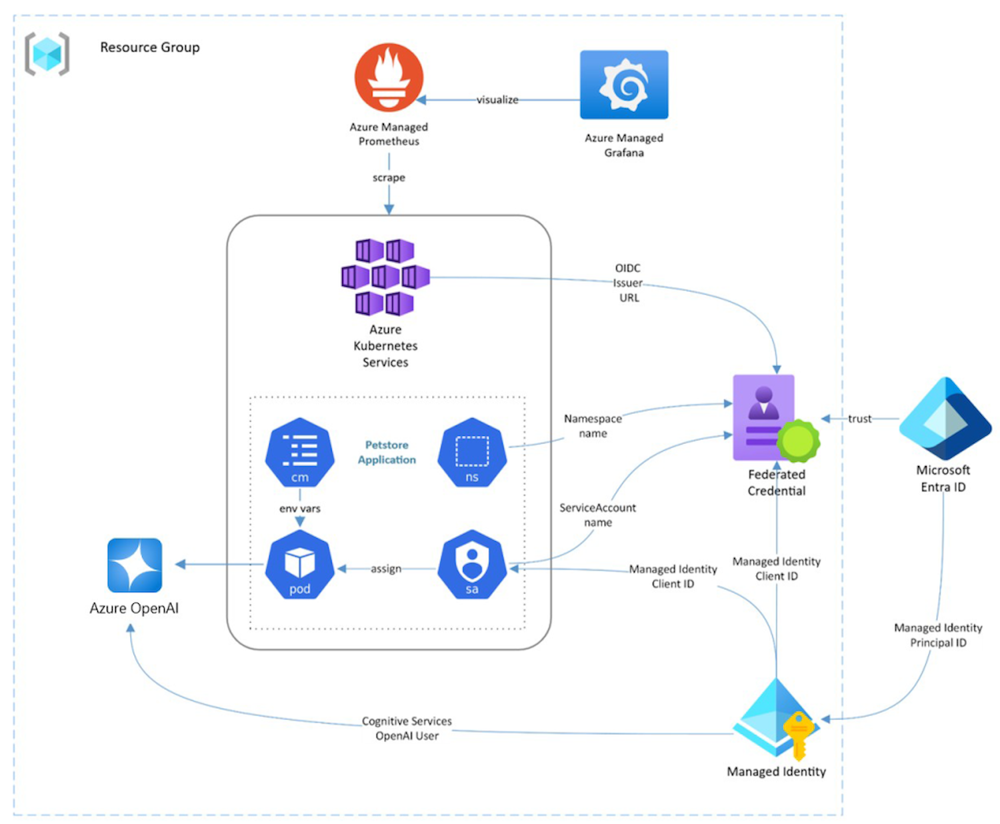
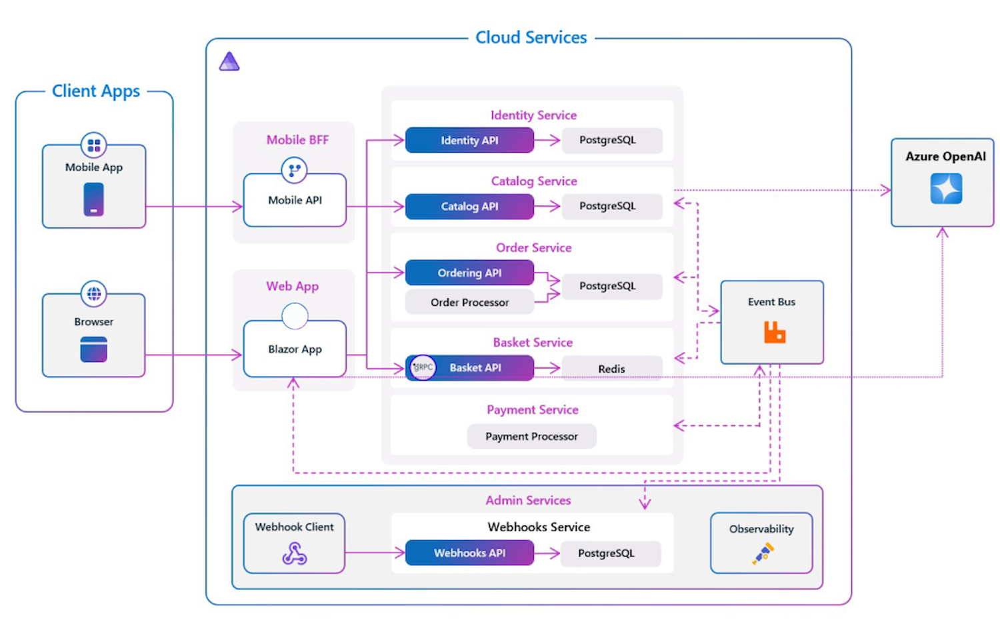
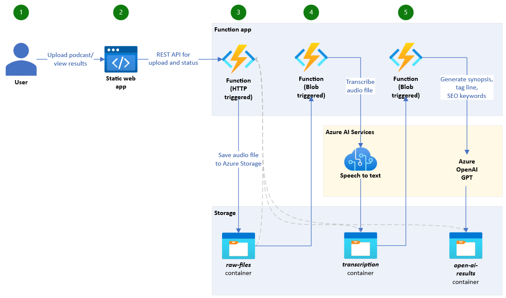

When you consider how much AI costs, you need to include all of the resources and infrastructure in your AI application's architecture. An AI service is just one component in this architecture. 

Let's look at some examples of AI application architectures.

## Example 1: E-commerce Pet Store on Azure Kubernetes Service

This sample demo application consists of a group of containerized microservices that can be deployed into an Azure Kubernetes Service (AKS) cluster. It uses a polyglot architecture, event-driven design, and common open source back-end services (like RabbitMQ and MongoDB). The application also leverages OpenAI models to generate product descriptions.  Deploy this application: [https://learn.microsoft.com/azure/aks/open-ai-quickstart](/azure/aks/open-ai-quickstart)

## Example 2: E-commerce Adventure Store on .NET

This sample uses a services-based architecture to provide a retail (e-commerce) website that is responsive to desktop and mobile devices. OpenAI integrates with the web application, providing an intelligent chatbot that can offer advice and recommendations on products in the catalogue.   Deploy this application: <https://github.com/Azure-Samples/eShopOnAzure>

### Example 3: AI processing of audio files

This application uses Azure Functions for an AI workflow, triggered when an audio podcast file is uploaded. The file is stored and analyzed by Azure's Speech to text AI service to produce a text transcript. Then Azure OpenAI generates a synopsis, tag line and SEO keywords.

Microsoft provides guidance on AI workload design and cost considerations in the Cloud Adoption Framework for Azure and the Well Architected Framework.
