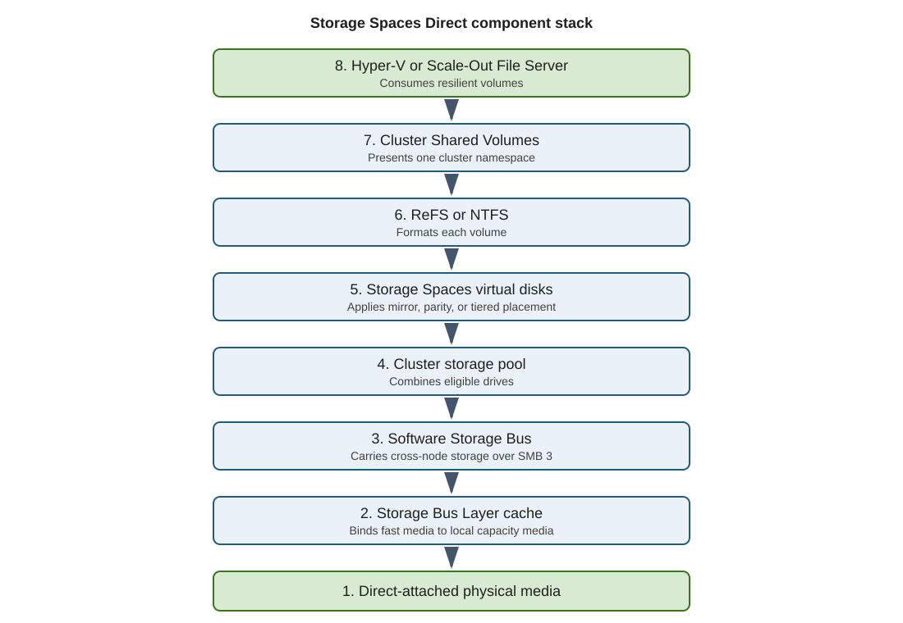
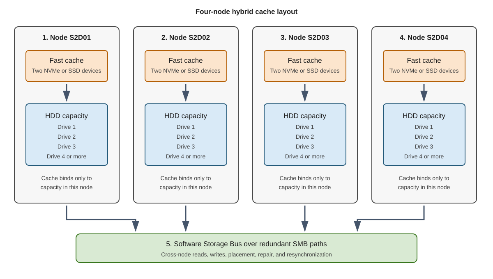

**Storage Spaces Direct (S2D)** is a software-defined storage technology that can be used with Windows Server clusters. S2D combines drives attached to the cluster nodes into a single software-defined storage pool. Volumes created from that pool are accessible to the participating cluster nodes. In a converged deployment, separate compute hosts access the storage through Scale-Out File Server SMB 3 shares, not by directly accessing the pool.

To participate in S2D, disks must be blank, directly attached SATA/SAS/NVMe drives, visible individually through an (Host Bus Adapter) HBA or RAID pass-through, and dedicated to one potential cluster node. 

Disks can be **magnetic HDDs or solid-state drives**. HDD capacity drives require SSD/NVMe cache drives and storage bus caching. All-flash disks don’t require cache drives or storage bus caching. Shared SAN/MPIO, RAID virtual disks, and system/boot disks aren’t eligible.

The minimum disks per node, excluding boot disks:

- **All-flash:** 4 SSD/NVMe capacity disks.
- **Using magnetic HDDs:** 4 HDD capacity disks **plus 2 SSD/NVMe cache disks**.

When you configure Storage Spaces Direct, the process discovers the eligible local disks in the servers that will participating in the cluster logically groups them into a **cluster-wide storage pool**. The drives remain physically attached to their individual servers. 

>[!NOTE]
> A **storage pool** is a logical collection of physical drives, such as SSDs or HDDs. that Windows Server manages as one source of storage capacity. From that pool, you create **virtual disks** with features such as mirroring, parity, thin provisioning, and storage tiers. Those virtual disks are then formatted into usable volumes. With Storage Spaces Direct, drives located across multiple cluster servers form a single cluster-wide pool.

Windows creates virtual disks from the storage pool and distributes their data across constituent disks in participating servers. With a two-way mirror, every block written to a disk on one server is also written to a disk on the other. The virtual disk is then formatted as a Cluster Shared Volume, which both Hyper-V hosts can access as shared storage.

The basic S2D setup process is:

1. Prepare two compatible Windows Server Datacenter hosts with local disks, matching updates, domain membership, and redundant high-speed networking.
1. Install the **Hyper-V**, **Failover Clustering**, and **Data-Center-Bridging** features as required.
1. Run cluster validation, including the Storage Spaces Direct tests.
1. Create a two-node failover cluster without adding traditional shared storage.
1. Configure a cloud witness or file-share witness for quorum.
1. Enable Storage Spaces Direct, which discovers eligible disks and forms the cluster-wide pool.
1. Create a two-way mirrored volume and expose it as a Cluster Shared Volume.
1. Place the VM configuration and virtual disks on that volume, then make the VM highly available through Failover Clustering.
1. Test live migration and a node failure to confirm the VM continues on the surviving server.

> [!NOTE]
> For Storage Spaces Direct, Datacenter Bridging (DCB) is mainly relevant when using **RoCE-based RDMA** for SMB storage traffic. It must be configured consistently on both servers and their network switches. It's generally unnecessary for ordinary TCP networking and usually not required for iWARP RDMA.

## Cluster Shared Volumes (CSV)

A **Cluster Shared Volume (CSV)** is a shared disk volume that all servers in a Windows failover cluster can access simultaneously. **Storage Spaces Direct (S2D)** creates the storage; **Cluster Shared Volumes (CSV)** make that storage simultaneously accessible to every cluster node.

In normal S2D deployments, volumes created from the pool are added as CSVs. S2D supplies capacity, performance, and resiliency, while CSV provides a common path such as `C:\ClusterStorage\Volume1` and supports VM failover and live migration between hosts. CSV is therefore the standard presentation layer for clustered S2D workloads.

For Hyper-V, the CSV stores VM files and appears on every server under the same path, such as `C:\ClusterStorage\Volume1`. This lets a VM move or fail over between servers without moving the VM files or remounting the storage. In Storage Spaces Direct, the CSV sits on top of a resilient virtual disk created from the cluster-wide storage pool.

One node in the cluster acts as the **CSV coordinator** and handles file-system metadata changes. CSV can redirect I/O over the cluster network through the coordinator. The I/O path depends on the file system, storage configuration, and current CSV state. Use `Get-ClusterSharedVolumeState` on a cluster node to inspect direct or redirected access and the reported reason for redirection.

CSVs allow different VMs stored on the same volume to run on different hosts and move between them without the disk itself having to be unmounted and reassigned. CSV uses CSVFS over NTFS or ReFS, with ReFS generally preferred for Hyper-V workloads.

Storage Spaces Direct presents local drives as cluster-wide storage. Each drive remains physically attached to one node. The Software Storage Bus makes eligible drives visible across the cluster.

The following diagram shows how the Storage Spaces Direct components connect physical drives to clustered workloads:



## Scale-Out File Servers (SOFS)

A **Scale-Out File Server (SOFS)** is a clustered Windows Server role that provides highly available **SMB file shares for application data**. Every cluster node can serve the same share simultaneously, creating an active-active service.

Its main purposes are to:

- Store Hyper-V VM files or SQL Server data on SMB shares.
- Keep shares online if a file-server node fails.
- Increase throughput by distributing client connections across nodes.
- Support transparent failover through SMB 3, usually without interrupting applications.

With Storage Spaces Direct, a dedicated storage cluster can use SOFS to expose its CSV-backed storage to separate Hyper-V hosts through a share such as `\\StorageCluster\VMs`. In a hyperconverged cluster where Hyper-V and S2D run on the same nodes, SOFS is generally unnecessary because Hyper-V accesses the CSVs directly.

## Hyper-V failover cluster example

Two Windows Server computers are joined into a two-node failover cluster, with Storage Spaces Direct combining their local SSDs into one storage pool. A two-way mirror keeps a copy of the Hyper-V virtual machine’s files on each server, and the resulting volume is presented as a Cluster Shared Volume. If one server fails, Failover Clustering restarts the virtual machine on the surviving server, which can still access its copy of the storage. A cloud or file-share witness helps the two-node cluster maintain quorum.

## Storage Spaces Direct resiliency options

Storage Spaces Direct protects data by distributing copies or parity across drives and servers.

The following table compares the main resiliency options:

| Option | Minimum nodes | Minimum capacity drives per node | Efficiency | Best use |
|---|---:|---:|---:|---|
| Two-way mirror | 2 | 4 | 50% | High performance; tolerates one failure |
| Nested two-way mirror | 2 | 4 | 25% | Production two-node clusters |
| Nested mirror-accelerated parity | 2 | 4 | ~35–40% | Better capacity with nested protection |
| Three-way mirror | 3 | 4 | 33% | High performance and protection |
| Dual parity | 4 | 4 | 50–80% | Capacity-focused or archival workloads |
| Mirror-accelerated parity | 4 | 4 | Varies | Balance between write performance and capacity |

Windows Server 2019 and later supports up to 400 TB raw capacity per server and 4 PB per pool. For physical Windows Server deployments, four capacity drives per node is the minimum regardless of resiliency type. If storage bus caching is used, each node also requires at least two cache drives. Boot drives aren't included in the numbers in the table.

> [!NOTE]
> To ensure adequate performance, ensure you provision each cluster node with 4 GB of RAM per TB of cache-device capacity for Storage Spaces Direct metadata. This requirement is based on cache capacity, not total pool capacity.

Use **mirroring** for performance-sensitive Hyper-V or SQL Server workloads. Use **parity** for cold or mostly sequential data where capacity efficiency is more important. Microsoft recommends **nested resiliency** for production two-node clusters.

### Deployment models

Storage Spaces Direct supports two main deployment models. 

- **Hyperconverged** combines compute and storage on the same cluster nodes, with Hyper-V VMs stored directly on Cluster Shared Volumes. 
- **Converged (disaggregated)** uses separate compute and storage clusters; the S2D cluster provides storage to Hyper-V hosts through a Scale-Out File Server over SMB3. 

Hyperconverged is simpler, while converged allows compute and storage to scale independently.

The following table compares the two deployment models:

| Model | Compute location | Storage access | Best fit | Main tradeoff |
| --- | --- | --- | --- | --- |
| Hyperconverged | Storage nodes | Local CSV access | General virtualization, branch infrastructure | Compute and storage scale together |
| Converged | Separate compute cluster | Continuously available SMB shares | Independent compute scaling | More servers, networks, permissions, and delegation |

## Storage Spaces Direct networking requirements

S2D doesn't require a SAN or proprietary network, but it requires a **reliable, low-latency Ethernet network** between every node.

- **2–3 nodes:** minimum 10 GbE.
- **4+ nodes or high performance:** 25 GbE or faster with RDMA recommended.
- Use at least two connections per node for redundancy and throughput.
- Switched and fully connected switchless designs are supported.
- RoCE RDMA usually requires Data Center Bridging; iWARP generally doesn't.

S2D uses SMB 3 for storage traffic, repairs, synchronization, and redirected CSV I/O, so network design directly affects storage performance and availability.

> [!IMPORTANT]
> Examples are production-oriented but aren't complete change procedures. Validate commands, firmware, drivers, capacity, backups, and rollback steps in your environment before making changes.

## Storage Spaces Direct repair

When a disk or node participating in a Storage Spaces Direct cluster fails, Storage Spaces Direct regenerates missing mirror copies or parity data from surviving copies and redistributes them across healthy disks and nodes, restoring the configured resiliency automatically. Storage Spaces Direct continuously evaluates placement against the required resiliency. A failed drive or unavailable node can trigger repair:

- Healthy copies or fragments become repair sources.
- Free pool capacity becomes the repair destination.
- Repair traffic competes with workload traffic.
- The cluster remains exposed until required redundancy is restored.

Free capacity is therefore a resiliency resource, not unused waste. Microsoft recommends leaving **the equivalent of one capacity drive per server unallocated**, up to four drives per cluster. For a two-node cluster, reserve **two capacity drives’ worth** of free pool capacity for immediate in-place repair.

## Storage Spaces Direct scale

Windows Server Storage Spaces Direct supports clusters from two through 16 compute nodes. Hardware, node count, media, resiliency, and volume layout constrain usable capacity and fault tolerance. Windows Server 2019 or later supports up to 400 TB raw capacity per server and 4 PB per storage pool.

## Preserve symmetry

Use the same server model, processor generation, memory layout, network adapters, drive count, drive type, firmware, and driver versions on every node.

Using different server models and configurations can create uneven:

- Cache coverage.
- Capacity.
- Repair speed.
- Network throughput.
- CPU cost.
- Failure exposure.

Temporary asymmetry during replacement is expected. Permanent asymmetry should be a documented exception.

### Select storage drives

Use direct-attached SATA, SAS, NVMe, or persistent-memory devices. Requirements include:

- Enterprise power-loss protection for solid-state media.
- Suitable write endurance.
- Predictable error reporting.
- Supported sector size.
- Current supported firmware.
- Unique device identity.

Measure endurance with drive writes per day or terabytes written per day. Cache devices receive concentrated writes. Treat endurance as a sizing constraint.

> [!IMPORTANT]
> Don't use consumer SSDs, shared SAS enclosures, multipath capacity drives, SAN LUNs, or RAID virtual disks for Storage Spaces Direct capacity.

An HBA must expose physical drives directly. A RAID controller is acceptable only when it provides supported physical-disk pass-through behavior.

### Understand hybrid cache

In a **hybrid S2D configuration**, fast NVMe or SSD drives provide a persistent read/write cache for high-capacity HDDs. Frequently accessed data remains on the cache, while writes are absorbed, combined, and later destaged efficiently to the HDDs, providing better latency and throughput while retaining economical capacity.

The following diagram shows how cache and capacity devices are arranged in a four-node hybrid cluster:



When Storage Spaces Direct is enabled, it normally selects the fastest eligible devices as cache:

- Cache devices bind to capacity devices in the same node.
- Cache devices don't become general volume capacity.
- Hybrid cache accelerates reads and writes.
- Writes destage to HDD capacity over time.
- A cache-device failure reduces cache coverage and can affect performance or fault exposure.

The ratio of cache devices to capacity devices affects parallelism and failure impact. Use a whole multiple where practical.

With **automatic cache selection**, S2D assigns every drive of the fastest media type as cache. For example, SSD selected over HDD or NVMe selected over SSD. **Manual cache selection** uses `-CacheDeviceModel` when drives share the same media type but differ in endurance or performance. This allows you to explicitly designate one model as cache. Automatic cache selection is preferred. Manual selection increases deployment risk and must be justified by validated hardware guidance.

### Calculate usable capacity

Start with raw storage capacity. Deduct:

- Resiliency overhead.
- File-system and storage metadata.
- Operational reserve.
- Repair headroom.
- Expected growth.

Example:

- Four nodes.
- Four 8-TB HDDs per node.
- 128 TB raw HDD capacity.
- Three-way mirror provides approximately one-third raw efficiency before other deductions.

The calculation isn't `128 TB / 3` and then fill the result. Ensure that you reserve enough free space to repair after a drive or node failure. Define a warning threshold and a stop-growth threshold before deployment.

For example: reserve one 8-TB capacity drive per node, or 32 TB of the pool, for in-place repair. This leaves 96 TB of physical capacity for volume footprints. With three-way mirroring, the maximum logical capacity is approximately 32 TB. If the warning threshold is 70% and the stop-growth threshold is 80%, begin remediation at about 22.4 TB and prevent further workload growth at about 25.6 TB.

### Determine drive eligibility for S2D

You can check whether a storage device can be used in a storage pool using Get-PhysicalDisk and checking the CanPool status. For example, run the following command on a node or through a cluster-aware management session:

```powershell
Get-PhysicalDisk |
    Sort-Object FriendlyName, SerialNumber |
    Format-Table FriendlyName, SerialNumber, MediaType, CanPool,
        CannotPoolReason, HealthStatus, OperationalStatus
```

Investigate every `CanPool` value of `False`. Expected exclusions include boot devices and drives already in the pool. Unexpected partitions, stale pool metadata, unsupported controllers, or unhealthy devices might be reasons that a device you expect can be used is unavailable for Storage Spaces Direct.

Use reliability counters to identify wear or media risk:

```powershell
Get-PhysicalDisk |
    Get-StorageReliabilityCounter |
    Format-Table DeviceId, Temperature, Wear, ReadErrorsTotal,
        WriteErrorsTotal, PowerOnHours
```

Property availability depends on device telemetry and driver support. Missing telemetry doesn't prove that a drive is healthy.
