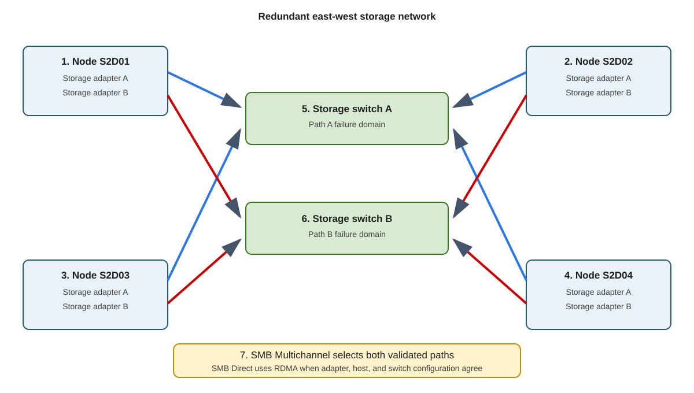

Storage Spaces Direct doesn't require specialized network infrastructure, though you can improve performance by putting faster and more capable network cards and hardware into the deployment. 

Storage Spaces Direct uses SMB 3 for east-west traffic between nodes. The speed of remote reads, writes, repair, resynchronization, and CSV redirection depend on this network.

The following diagram shows redundant SMB storage paths between four cluster nodes:



For a small two-node or three-node cluster, use at least 10-GbE adapters. For the four-node primary scenario, use two or more 25-GbE or faster paths per node.

Design for:

- Low latency.
- No oversubscribed storage uplinks.
- Redundant adapters and switch paths.
- Consistent MTU.
- Consistent VLAN placement.
- Stable adapter firmware and drivers.
- Sufficient repair bandwidth during peak workload.

RDMA is recommended but not required for Storage Spaces Direct. Windows Server supports iWARP and RoCE for RDMA. 

The following table compares the network behavior and dependencies of iWARP and RoCE:

| Transport | Network behavior | Main dependency |
| --- | --- | --- |
| iWARP | RDMA over TCP | Correct routing, adapter support, congestion management |
| RoCE | RDMA over converged Ethernet | Correct data center bridging, priority flow control, VLAN, switch configuration |

Don't mix RDMA protocols inside one storage design unless the hardware vendor and Microsoft support the exact configuration.

## Use SMB Multichannel

SMB Multichannel automatically uses multiple network connections between S2D nodes, increasing throughput, balancing traffic, and providing connection resilience. If one path fails, SMB continues over the remaining paths without disrupting storage access. With RDMA-capable adapters, it can also use multiple SMB Direct connections for high throughput and low CPU usage.

SMB Multichannel provides:

- Aggregate throughput.
- Path failover.
- RSS scaling.
- RDMA selection when SMB Direct is available.

Two links don't guarantee two useful paths. They must have suitable speed, addressing, reachability, and capabilities.

You can inspect the network capabilities of a node by running the following PowerShell commands:

```powershell
Get-NetAdapter | Sort-Object Name
Get-NetAdapterRdma
Get-SmbServerNetworkInterface
Get-SmbClientNetworkInterface
Get-SmbMultichannelConnection
```

Best practice results:

- Storage adapters are `Up`.
- RDMA is enabled on intended interfaces.
- SMB sees every intended server and client interface.
- Active SMB connections use more than one path.
- RDMA-capable paths report RDMA use.

## Converge traffic deliberately

A hyperconverged host can carry the following traffic types:

- Management.
- Cluster heartbeat.
- Storage.
- Live migration.
- Virtual-machine traffic.

You can separate these workloads or converge them through Switch Embedded Teaming. Switch Embedded Teaming (SET) integrates NIC teaming into the Hyper-V virtual switch, combining up to eight matching physical adapters for bandwidth aggregation and failover. It supports features such as RDMA and is the recommended teaming method for S2D hosts. Convergence increases QoS and failure-domain complexity.

Use the following commands to validate the converged network configuration:

```powershell
Get-VMSwitch
Get-NetQosPolicy
Get-NetQosTrafficClass
Get-NetQosFlowControl
```

Use the same adapter make, model, speed, firmware, driver, naming, and PCI placement on each node participating in one converged design.

### Choose switched or switchless links

The difference between switched and switchless links are as follows: 

- **Switched** designs scale more easily. Switch configuration becomes part of the storage support boundary.
- **Switchless** designs remove storage switches but require direct links between every node pair. Cabling grows rapidly as nodes are added. Use switchless designs only within supported scale and topology limits.

> [!NOTE]
> Network ATC is an intent-based feature that automates, validates, and maintains host networking configuration across Windows Server and Azure Local clusters, reducing deployment complexity and configuration drift. Network ATC can configure converged adapters, storage addressing, VLANs, QoS, RDMA settings, and cluster network behavior. This module doesn't teach Network ATC deployment. If you use it, follow the **Deploy host networking with Network ATC** and **Manage Network ATC** resources listed in the Summary's Learn more section.
