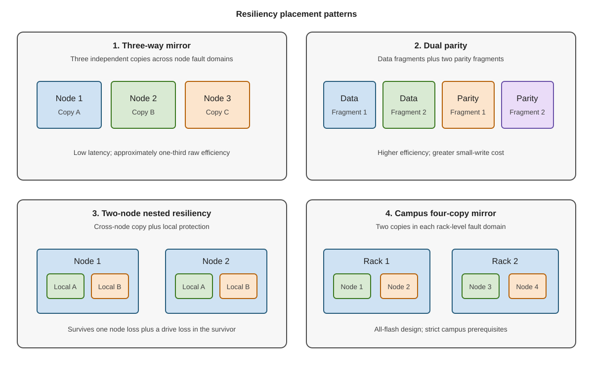

Resiliency settings determine usable storage capacity, write cost, fault tolerance, and repair behavior. Select it per workload. Don't use one layout by habit. The following diagram compares mirror, parity, nested, and rack-level resiliency layouts:



The following table compares the efficiency, strengths, and costs of the standard resiliency layouts:

| Layout | Typical raw efficiency | Strength | Cost |
| --- | --- | --- | --- |
| Two-way mirror | 50 percent | Low latency, simple repair | Tolerates fewer simultaneous faults |
| Three-way mirror | 33 percent | Strong performance, two-fault tolerance | High capacity cost |
| Dual parity | Depends on columns | Efficient for large sequential data | Higher write cost |
| Mirror-accelerated parity | Selected mirror ratio plus parity | Absorbs active writes in mirror | Requires correct tier sizing |


> [!NOTE]
> Simple spaces provide no resiliency. Avoid using this configuration for production data.

### Match node count

The number of nodes in a cluster constrains resiliency options:

- Two nodes support two-way mirror and nested resiliency.
- Three or more nodes support broader mirror and parity layouts.
- Three-way mirror needs enough independent fault domains for three copies.
- Dual parity requires at least four suitable fault domains.
- Parity needs enough columns and fault domains for the selected layout.

### Use nested resiliency on two nodes

A normal two-way mirror places one copy on each node. If one node fails, the surviving copy has no local redundancy.

Nested resiliency adds local protection:

- **Nested two-way mirror** keeps two copies inside each node. It uses four total copies.
- **Nested mirror-accelerated parity** combines local mirror and parity to improve capacity efficiency.

Nested resiliency is appropriate for two-node clusters. If you have a four-node cluster, consider a three-way mirror.

### Size mirror-accelerated parity

When you use mirror-accelerated parity, incoming writes land in the mirror tier when space is available. The ReFS file system rotates colder data into parity. Size the mirror tier for the active write set, not as a token percentage.

Too little mirror space causes:

- Writes to fall through to parity.
- Higher latency.
- More CPU work.
- Unstable performance during sustained writes.

Use mirror-accelerated parity for workloads that benefit from a hot mirror region and tolerate parity behavior for colder data.

### Define fault domains

Fault domains tell the cluster which components can fail together. Common levels include:

- Node.
- Chassis.
- Rack.
- Site.

Inspect configured domains:

```powershell
Get-ClusterFaultDomain
Get-StorageFaultDomain
```

Don't claim rack or site resilience merely because nodes are in different locations. Placement is protected only when the topology is supported, declared, and validated.

### Select a file system

When configuring file systems, you can choose between NTFS and ReFS. ReFS is generally preferred for Hyper-V:

- Block cloning accelerates VHDX operations.
- Sparse valid data length accelerates fixed-file creation.
- Metadata checksums detect corruption.
- ReFS integrates with mirror-accelerated parity data rotation.

NTFS remains appropriate for workloads that require NTFS-only features such as disk quotas. Validate application support before standardizing.

> [!NOTE]
> ReFS in Windows Server 2025 supports almost all NTFS features and has additional benefits for large storage workloads.

Integrity streams add checksums for file data but can change performance and compatibility. Use them only when the workload and protection model require them.

Windows Server 2025 includes ReFS deduplication and compression. When considering implementing deduplication and compression, determine:

- Workload support.
- CPU and memory cost.
- Write pattern.
- Capacity savings.
- Backup compatibility.
- Recovery behavior.

### Understand campus constraints

A Windows Server 2025 campus cluster distributes failover-cluster nodes and data across two physical racks in separate rooms or buildings on the same campus, maintaining workload availability if an entire rack or location goes offline. A Windows Server 2025 campus cluster is a specific topology, not a generic stretched cluster. Every node requires the December 2025 security update (KB5072033) or a later cumulative update that includes it. The design must also meet the following conditions:

- Symmetric nodes across exactly two rack-level fault domains.
- Supported layouts from 1+1 through 5+5.
- Two-copy or four-copy Rack Level Nested Mirror volumes.
- Capacity devices of the same type.
- A witness in a third physical location.
- Supported low latency between racks.

All-flash capacity drives are required. Use SSD or NVMe capacity drives of the same type on every node. Don't use HDD capacity drives or configure a caching tier. The 2+2 contrasting scenario in this module follows the all-flash, no-cache configuration used by the Microsoft campus deployment guide.

The primary hybrid design can't be converted into the 2+2 all-flash scenario merely by splitting nodes across racks.

Define the two rack-level fault domains before enabling Storage Spaces Direct. After enablement, use `Update-StoragePool` to update the pool, then verify that its version is 29 or later and that its `FaultDomainAwareness` value is `StorageRack`.
