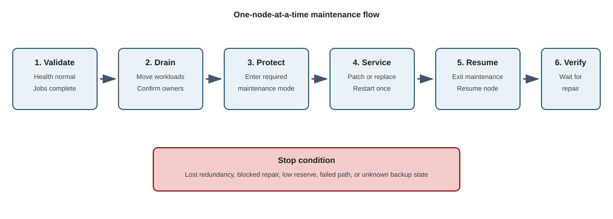

Maintenance mode safely takes an S2D node or storage device offline for planned servicing. Cluster roles are drained, storage I/O uses remaining data copies, and after maintenance the device is resumed and any changed data is resynchronized. Maintenance mode changes fault exposure. Enter maintenance only when the cluster is healthy, repair jobs are complete, reserve is sufficient, and current backups exist.

The following diagram shows the safe node-maintenance flow from prechecks through resumed service:



## Run prechecks

Use the following commands to confirm cluster, storage, and network health before maintenance:

```powershell
Get-ClusterNode
Get-HealthFault
Get-StorageJob
Get-StoragePool -IsPrimordial $false
Get-VirtualDisk
Get-SmbMultichannelConnection
```

Stop when:

- A virtual disk has lost redundancy.
- A repair job is blocked.
- Pool reserve is below policy.
- Another node or storage path is unavailable.
- Backup status is unknown.

## Drain the node

Use the following commands to drain workloads from the node and confirm that no clustered groups remain:

```powershell
$node = 'S2D01'

Suspend-ClusterNode -Name $node -Drain

Get-ClusterGroup |
    Where-Object OwnerNode -eq $node
```

Draining moves clustered workloads. Whether draining also places storage devices into maintenance mode depends on the Windows Server release and the maintenance procedure. Confirm the required storage state for your supported release and hardware before taking the node offline.

## Enter storage maintenance mode

Use the following commands only if the applicable maintenance procedure requires manual entry into storage maintenance mode. Run them from the healthy cluster node used for administration, with `$node` identifying the node being serviced:

```powershell
$storageNode = Get-StorageFaultDomain -Type StorageScaleUnit |
    Where-Object FriendlyName -eq $node

$storageNode | Enable-StorageMaintenanceMode
```

Verify that the target storage devices are in the maintenance state required by the procedure before servicing hardware. Node pause, workload drain, CSV redirection, and storage maintenance mode are separate mechanisms. Perform maintenance on one node at a time unless the supported topology and procedure explicitly permit otherwise.

## Exit maintenance

After the node restarts and storage is visible, follow the applicable procedure to exit maintenance. Continue from a healthy cluster node other than the serviced node. If you opened a new administration session, set `$node` to the name of the node you just serviced before continuing.

If the procedure requires an explicit storage-maintenance exit, re-query the target storage fault domain and disable maintenance mode with the following commands:

```powershell
$storageNode = Get-StorageFaultDomain -Type StorageScaleUnit |
    Where-Object FriendlyName -eq $node

$storageNode | Disable-StorageMaintenanceMode
```

After completing any required storage-maintenance exit, resume the node and inspect repair and health state:

```powershell
Resume-ClusterNode -Name $node -Failback Immediate

Get-StorageJob
Get-HealthFault
Get-VirtualDisk
```

Wait for repair and resynchronization to complete, and verify that the virtual disks are healthy before servicing another node.


## Replacing failed drives

Identify the failed drive by:

- Node.
- Serial number.
- Enclosure.
- Slot.
- Health state.
- Current usage.

Use the following command to verify the failed drive identity and state before replacement:

```powershell
Get-PhysicalDisk |
    Sort-Object HealthStatus, FriendlyName |
    Format-Table FriendlyName, SerialNumber, Usage,
        HealthStatus, OperationalStatus
```

Follow the server-vendor replacement procedure. Don't infer the physical slot from a friendly name.

After replacing the drive, use the following commands to verify onboarding and monitor repair:

```powershell
Get-PhysicalDisk |
    Format-Table FriendlyName, SerialNumber, CanPool,
        CannotPoolReason, Usage, HealthStatus

Get-StorageJob
```

Storage Spaces Direct normally onboards eligible replacement drives. Investigate before forcing pool membership.

Cache-drive replacement can alter cache bindings and performance. Capacity-drive replacement consumes repair reserve. Monitor both.

## Adding capacity

Add the same supported device type and count to every node whenever practical.

After installing the drives, use the following commands to verify eligibility, pool state, and storage jobs:

```powershell
Get-PhysicalDisk |
    Where-Object CanPool |
    Format-Table FriendlyName, SerialNumber, MediaType, Size

Get-StoragePool -IsPrimordial $false
Get-StorageJob
```

Confirm automatic onboarding, then monitor optimization or rebalance work.

## Adding a node to an S2D cluster

Before adding a node:

- Match hardware and firmware.
- Match network adapters and names.
- Match drive layout.
- Run cluster validation against existing nodes plus the new node.
- Confirm licensing and capacity effects.

Use the following validation command before you add the new node:

```powershell
Test-Cluster -Node 'S2D01', 'S2D02', 'S2D03',
    'S2D04', 'S2D05' `
    -Include 'Storage Spaces Direct', 'Inventory',
        'Network', 'System Configuration'
```

After validation succeeds, add the prepared node by running the following command:

Run from an elevated PowerShell session on an existing cluster node, replacing the cluster name:

```powershell
$ClusterName = '<ClusterName>'
$NewNode     = 'S2D05'

Import-Module FailoverClusters

# Add the prepared node to the existing S2D cluster.
Get-Cluster -Name $ClusterName |
    Add-ClusterNode -Name $NewNode

# Verify cluster membership and monitor storage onboarding.
Get-ClusterNode -Cluster $ClusterName -Name $NewNode
Get-StorageJob
Get-PhysicalDisk | Sort-Object FriendlyName |
    Format-Table FriendlyName, CanPool, OperationalStatus, HealthStatus
```

Don't run `Enable-ClusterS2D` again. The existing cluster is already S2D-enabled. Verify that the new node is a member of the intended cluster, then monitor drive onboarding and pool rebalancing.

## Remove a node from an S2D cluster

Before permanently removing a server from the cluster, verify the following conditions:

- The remaining servers provide enough fault domains to maintain the required resiliency.
- The remaining storage has enough free capacity to hold the server's data.
- All virtual disks are healthy.
- All repair and storage jobs are complete.

If any of these conditions aren't met, resolve the issue before proceeding.

Run the following command:

```powershell
Remove-ClusterNode <Name> -CleanUpDisks
```

Replace `<Name>` with the name of the server to remove.

The command:

- Confirms that the remaining servers have sufficient capacity and fault domains.
- Moves the server's data to the remaining servers.
- Removes the server's drives from the storage pool.
- Removes the server from the cluster.

Data evacuation and storage pool cleanup are included in this operation. You don't need to retire the drives separately.

## Temporary node eviction 

If the server or its drives will return to the cluster, run the following command instead:

```powershell
Remove-ClusterNode <Name>
```

This command removes the server from the cluster but leaves its drives associated with the storage pool. It doesn't move the data stored on those drives.

Don't use this command for permanent scale-in because it doesn't evacuate the data or clean up the storage pool.

## Patch the cluster

Cluster-Aware Updating (CAU) is a Windows Server feature that automatically patches failover-cluster nodes sequentially, draining workloads, installing updates, restarting when required, restoring the node, and proceeding to the next while maintaining service availability. Use Cluster-Aware Updating or a controlled rolling process to apply software updates to an S2D cluster:

1. Validate health.
1. Drain one node.
1. Enter required maintenance state.
1. Apply approved updates.
1. Restart.
1. Exit maintenance.
1. Resume the node.
1. Wait for repair.
1. Revalidate.

Firmware, driver, and operating-system updates must remain compatible across the rolling interval.
