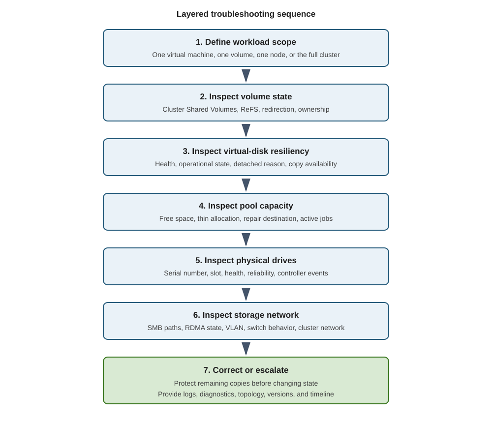

Troubleshoot from workload symptoms toward the physical layer. Preserve evidence before changing state.

The following diagram shows the troubleshooting flow from a workload symptom through evidence collection and escalation:



## Use a layered sequence

1. Confirm workload scope.
1. Inspect CSV and file-system state.
1. Inspect virtual-disk resiliency.
1. Inspect pool state and free capacity.
1. Inspect physical drives.
1. Inspect storage jobs.
1. Inspect SMB paths and RDMA.
1. Inspect cluster membership and networks.

Avoid random repair commands. A command that helps one state can destroy evidence or worsen another.

## Capture evidence

Use the following commands to capture the current cluster, storage, and network state:

```powershell
Get-Date
Get-ClusterNode
Get-ClusterGroup
Get-ClusterSharedVolumeState
Get-HealthFault
Get-StorageJob
Get-StoragePool -IsPrimordial $false
Get-VirtualDisk
Get-PhysicalDisk
Get-SmbMultichannelConnection
```

Collect logs:

```powershell
Get-ClusterLog -UseLocalTime -Destination 'C:\ClusterLogs'

Get-WinEvent `
    -LogName 'Microsoft-Windows-StorageSpaces-Driver/Operational' `
    -MaxEvents 200

Get-WinEvent `
    -LogName 'Microsoft-Windows-FailoverClustering/Operational' `
    -MaxEvents 200
```

Use `Get-SDDCDiagnosticInfo` or the current Microsoft-supported collection workflow when escalating.

## Diagnose degraded virtual disks

Use the following command to inspect virtual-disk health and detachment details:

```powershell
Get-VirtualDisk |
    Format-Table FriendlyName, HealthStatus,
        OperationalStatus, DetachedReason
```

Check:

- Which fault domain is unavailable.
- Whether enough healthy copies remain.
- Whether repair has a destination.
- Whether another drive reports communication loss.
- Whether capacity is exhausted.

Don't detach, remove, or recreate a virtual disk while recoverable copies might exist.

## Diagnose stalled repair

Use the following command to inspect storage-job progress:

```powershell
Get-StorageJob |
    Format-Table Name, JobState, PercentComplete,
        BytesProcessed, BytesTotal, ElapsedTime
```

Common causes:

- Insufficient free capacity.
- A second drive fault.
- An unavailable node.
- Lost SMB path.
- HDD saturation.
- High workload pressure.
- Repeated device resets.

Correlate storage-job throughput with disk, network, and workload performance.

## Diagnose redirected CSV traffic

Redirected I/O can occur during maintenance or faults. It adds network work and can increase latency.

Use the following command to inspect CSV state and redirection:

```powershell
Get-ClusterSharedVolumeState
```

Determine:

- Whether redirection is expected.
- Which node owns the CSV.
- Which path is redirected.
- Which cluster or storage fault caused it.

Don't move ownership repeatedly to mask the underlying fault.

## Diagnose SMB path loss

Use the following commands to inspect SMB paths, interfaces, and RDMA state:

```powershell
Get-SmbMultichannelConnection
Get-SmbClientNetworkInterface
Get-SmbServerNetworkInterface
Get-NetAdapterRdma
```

Look for:

- Missing connections.
- Unexpected TCP fallback.
- Speed mismatch.
- Disabled RDMA.
- VLAN or routing errors.
- RoCE priority flow control mismatch.

If Network ATC is installed, consult Network ATC status and event logs. Its remediation workflow is outside this module.

## Diagnose low capacity

Use the following commands to compare pool free capacity with virtual-disk footprints:

```powershell
Get-StoragePool -IsPrimordial $false |
    Select-Object FriendlyName, Size, AllocatedSize,
        @{Name='FreeBytes'; Expression={$_.Size - $_.AllocatedSize}}

Get-VirtualDisk |
    Sort-Object FootprintOnPool -Descending |
    Select-Object FriendlyName, ProvisioningType,
        Size, FootprintOnPool
```

When reserve is low:

- Stop new allocations.
- Stop uncontrolled thin-volume growth.
- Add symmetric supported capacity.
- Preserve existing metadata.
- Monitor repair.

Don't delete metadata, reset healthy drives, or force no-redundancy layouts as an emergency shortcut.

## Use a symptom table

The following table maps common symptoms to evidence, likely layers, and safe first actions:

| Symptom | Evidence | Likely layer | Safe first action |
| --- | --- | --- | --- |
| High VM latency | Volume history, CSV state | Volume or CSV | Identify affected volume and redirection |
| High CPU plus lower throughput | SMB connections, RDMA state | Network | Confirm RDMA use |
| Repair at zero percent | Pool free space, drive state | Capacity or physical disk | Restore destination capacity or failed path |
| Virtual disk incomplete | Node and drive state | Fault domain | Restore missing fault domain |
| Repeated device resets | Storage event log, reliability counters | Drive or controller | Preserve logs and engage hardware support |

## Escalate with evidence

Escalate when:

- Data availability is at risk.
- A virtual disk is detached or incomplete.
- Repair can't progress.
- Multiple fault domains are affected.
- A controller or firmware defect is suspected.

Provide topology, validation reports, event logs, cluster logs, diagnostics, firmware versions, driver versions, drive serial numbers, and a timeline.

## S2D disaster recovery

Storage Spaces Direct protects service availability. It doesn't replace backup, historical recovery, or an independent disaster-recovery copy.

The following table distinguishes failures handled by S2D resiliency from failures that require additional protection:

| Failure | Storage resiliency | Additional protection |
| --- | --- | --- |
| One drive | Mirror or parity repair | Hardware replacement process |
| One node | Cross-node placement | Quorum plus workload failover |
| Rack failure | Campus topology only | Third-location witness |
| Accidental deletion | No historical copy | Backup or application recovery |
| Ransomware encryption | Replicates changed data | Isolated immutable recovery |
| Regional loss | No | Independent site or cloud copy |

ReFS checksums can detect corruption. Mirror repair can correct data from a healthy copy. Neither restores an earlier business state.

Use:

- Application-consistent backup for recoverable workload state.
- Storage Replica when block-level replication fits the topology and recovery model.
- Application replication when the application owns consistency.
- Campus clustering for supported rack-level availability.
- Independent recovery credentials and storage for ransomware resistance.

Don't treat synchronous replication as backup. It can replicate deletion, corruption, or malicious changes.

## Protect quorum

Witness placement affects survivability:

- A two-node witness must remain reachable when either node fails.
- A campus witness must be outside both rack domains.
- Witness permissions must be restricted.
- Witness dependencies mustn't share the same failure event as the cluster.

## Test recovery

A recovery plan is incomplete until tested. Test:

- Restore authorization.
- Backup integrity.
- Application consistency.
- Network and identity dependencies.
- Recovery timing.
- Failback.

Record the result and correct deviations from the approved recovery objective.
