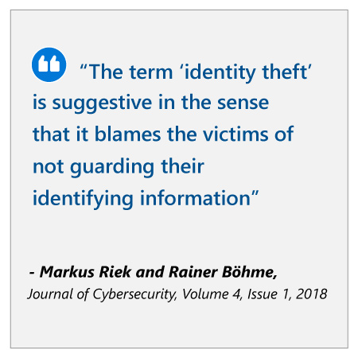

## Abstract

The financial services industry (FSI) has digitized rapidly in the last 10 to 20 years, creating great convenience to customers. The rapid pace of change and new technology has also opened a window for cybercrime, which creates numerous problems for financial institutions and their customers. For customers, financial crime creates the risk of asset loss, increases inconvenient security measures, and leads to a lack of trust in financial institutions.

This case study details how security platform BioCatch leveraged machine learning to create an “invisible” security solution that identifies users based on a unique biometric signature when interacting with technology. Because user authentication takes place in the background, it’s far less intrusive than other authentication methods, leading to happier customers. The solution also has a very low false positive rate, which helps better prevent cybercrime and its associated costs for FSI businesses.

## Industry context

Much of the world is completing a move to digital services, and although it’s been slow to start in some respects, the financial services industry is no exception.

Financial services play a vital intermediary role in the digital economy. An increasing proportion of services like banking, insurance, foreign exchange, and even investment are now carried out online. Use of API-linked payment and financial services is quickly becoming the norm for customers. Users buy and sell online using PayPal and Stripe; they apply for loans and credit using online services; they buy and sell shares; and they check their bank balances with mobile apps.

The rapid digitization of these services has caused enormous disruption in the industry. Fast-moving new fintech companies like PayPal and Square have made the most of the opportunity, and while traditional banks and brokers have also modernized, some conventional players are closing thousands of branches to cut costs.

All FSI institutions, old and new, are also scrambling to improve the customer experience, seeing it as a key way to attract and retain customers. An Adobe report found 28 percent of respondents in the FSI industry ranked optimizing the customer experience as the ‘single most exciting opportunity’ in 2018, compared to 18 percent of their peers across all other sectors.1

Retail banking respondents are even more likely than their FSI counterparts to be focusing on the customer experience, with 41 percent of these participants regarding it as the main focus for differentiation.1

But this dual focus on online services and improving customer experience creates new risks.

## Challenge
:::row:::
:::column span="2":::
As businesses and customers rapidly digitize, cybercrime is becoming more and more of a threat. Estimates of the scale of the issue vary, but all experts agree on one thing: that it’s big (the annual cost of cybercrime was estimated at $400 billion USD in 2014)2 and that it’s getting bigger. One survey found that 10 percent of people over the age of 16 had been the victims of identity theft, with 85 percent experiencing fraudulent account use, and about 12 percent suffering personal monetary loss.3

As the scale and cost of cybercrimes have increased, so have the efforts of businesses to protect their customers. User authentication methods such as two-factor authentication are common and offer increased security.

But there’s a problem with many authentication methods: at best, users find them a nuisance or a chore. At worst, they’re infuriating to the point where a customer will stop using a product. The temptation for users to resort to more convenient but more insecure personal security—such as using the same password for many different sites—is constant.
:::column-end:::
:::column span="2":::

:::column-end:::
:::row-end:::
:::row:::
:::column span="2":::
When it comes to cybersecurity, financial institutions have been slow to embrace the way users actually behave. Rather, they usually encourage users into more-secure behaviors that they’re often not comfortable with, or don’t understand. What’s needed is a paradigm shift in how businesses approach cybersecurity.

“The term ‘identity theft’ is suggestive in the sense that it blames the victims of not guarding their identifying information,” say Markus Riek and Rainer Böhme, co-authors of a study into the costs of consumer-facing cybercrime. “A technically more precise description for this kind of incident is ‘authentication failure.’”

It was this unique combination of challenges that led to BioCatch’s creation of an authentication and fraud detection method that uses AI to work invisibly, without creating hassle for customers.
:::column-end:::
:::column span="2":::

:::column-end:::
:::row-end:::

## Strategy questions

1. Experts suggest a paradigm shift in security culture, changing the mentality of blaming victims for cybercrime, treating “identity theft” as part of the problem of “authentication failure.” What can businesses learn from this paradigm shift?
2. How can FSI businesses secure customers in a way that doesn’t interfere with their user experience?
3. How might AI be leveraged to identify users and prevent or spot fraudulent behaviors?
4. How can FSI businesses truly differentiate their products from the competition in the minds of their customers?
5. How can cybersecurity be proactive, rather than reactive?

Now that you understand the context of the digitized financial service industry’s cybercrime challenge, and you’ve considered critical questions to answer before implementing AI in the industry, watch the executive perspective video with Ganesh Padmanabhan, Head of Cognitive Scale's Business Development & Worldwide Marketing.