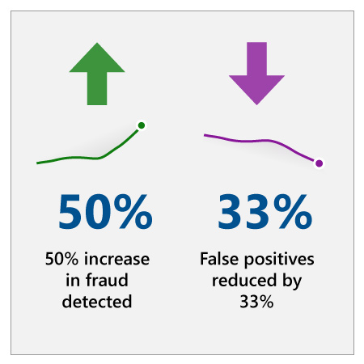

## Approach

BioCatch knew that in order to address authentication successfully, they had to help financial institutions implement an authentication strategy that not only detected and stopped cyber criminals but helped improve customer experience.

With 55 percent of millennials stating that difficulties in resolving problems with their bank are frustrating enough to make them leave and traditional fraud detection measures yielding 30–50 percent false alarm rates,4 BioCatch knew they had to play squarely into next-generation banking approaches to improve business outcomes.

With years of knowledge about white-hat hacking, system vulnerability management, and cyberterrorism from the military intelligence service, BioCatch co-founder Avi Turgeman knew that the methods and attacks used by cybercriminals would only increase in sophistication and frequency. Traditional authentication methods would not be effective against them without vastly inconveniencing users.

Turgeman had a theory that people interact with machines in unique, measurable ways. The idea was that each person’s interaction with a reasonably complex system would form an interactive fingerprint—a kind of behavioral signature, unique to each person.

What if AI could be used to profile a user’s unique interaction for authentication within a given system? It would dramatically improve user experience, safeguard users, and make it easier to spot both intrusions and even sophisticated social engineering schemes like vishing or authorized push payment fraud (where a victim is taking instructions from a criminal to conduct a transaction).

### Invisible protection, continuous authentication, and no disruption

By invisibly “fingerprinting” users as they interact with technology, BioCatch’s behavior-based software measures and analyzes patterns in human activities. BioCatch extracts more than 2,000 profiling metrics from user interaction and selects the 20 that make a person most unique. For instance, it might note how they use a keyboard and mouse, how they hold their phone, or how they swipe and tap.
:::row:::
:::column span="2":::
After a few minutes of user activity, a robust user profile is built using machine learning which is then used to authenticate the user. The software then compares the account holder’s use patterns against their unique biometric profile. The system can detect anomalies and suspicious behavior at an extremely high level of accuracy and low rate of false positives.

The software continuously operates in real time, protecting against identity fraud and other malevolent activity. This continuous operation also means that users are not wrongly identified as fraudulent when they do something differently because they’re tired, or they’re using a different device than they normally use.

Because authentication happens in the background, users don’t find the authentication at all disruptive. It happens invisibly, keeping them safe without the hassle of interruption.
:::column-end:::
:::column span="2":::

:::column-end:::
:::row-end:::

## Results

BioCatch’s patented technology is in use at major banks and ecommerce institutions all over the world, including the Royal Bank of Scotland. Today, they safeguard transactions for more than 90 million users. Institutions benefit from a return of 10–15 times their investment, reducing false positives, authentication escalations, and the number of customers lost to bad user experience.
:::row:::
:::column span="2":::
“There are many proof points on the return on investment that BioCatch generates for a business,” says Frances Zelazny. “Interestingly enough, this comes not only from the actual fraud that is caught but equally, in the case of identity proofing, the number of false declines that are prevented, or in the authentication use case, the cost savings associated with managing false alarms and unnecessary escalations. During the initial evaluation period, one major credit card client reported that the BioCatch system caught 50 percent more fraud while reducing false declines by 33 percent. Looking at it more broadly, this has immediate impact to the bottom line and translates into significant amount of recouped business and increased customer satisfaction.”

Implementation has been easy for financial organizations—BioCatch is provided as an API service, so there is little to no impact on an organization’s existing tech stack. In 2018, BioCatch placed 12th on Deloitte’s Technology Fast 500, after growing over 10,000 percent over three years.5

“Cybersecurity and digital identity are board-level topics today and managing the traditional tradeoff between the user experience and security is something that all business line managers struggle to deal with,” says Frances Zelazny.
:::column-end:::
:::column span="2":::

:::column-end:::
:::row-end:::
“As businesses push the boundaries of digital transformation, one of the main challenges is providing an omni-channel experience that wows the customer at every step of the way, increasing brand loyalty and overall customer satisfaction.”

## Key lessons

### Any data can be relevant

As this case shows, it’s important for organizations to think outside the box when considering what data they can feed into AI solutions. Across industries, organizations have massive amounts of structured and unstructured data. Also, external sources of data are often available either free of charge or for purchase. It can be challenging to make sense of so many data sources, but as this case shows, the most seemingly inaccessible pieces of data can turn into a valuable source of information for AI.

### AI can ignite out-of-the-box thinking

When a new technology emerges, we tend to use it to replace or improve existing processes in familiar ways. While this approach is certainly beneficial, previous breakthroughs have demonstrated that the most impactful use of new technology is to drive creation of new products or services that were not possible before. With AI we will see significant improvements to traditional processes, but the largest potential will come from those that pioneer innovative ideas with AI.

### Evaluation of the strategy using the value framework

Let’s examine how BioCatch’s approach to AI is creating additional value using the value creation framework developed by Peter Zemsky, INSEAD’s Eli Lilly Chaired Professor of Strategy and Innovation:

1. From the **industry environment** perspective, we have discussed how financial services organizations required more sophisticated security systems to prevent cybercrime, while at the same time they are looking for ways to improve customer experience. This approach is unique in the market and targets these two drivers.
2. From the **value creation perspective**, we can conclude that this is a very strong use case for AI: the incremental cost is minimal—and may actually reduce costs compared to alternative security systems. While financial institutions won’t be able to extract additional revenue, the value from customer satisfaction and operational improvement is significant.
3. From the **organization & execution perspective**, this is an interesting use case because it does not require a significant amount of internal skills or archived data. This use case builds internal trust of AI while minimizing the impact in the organization.

Now that you’ve seen how financial services organizations are approaching their AI strategy, let’s wrap up everything you’ve learned with a knowledge check.