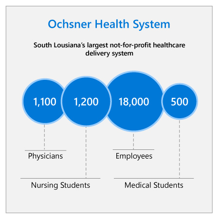

## Industry context

:::row:::
:::column span="2":::
Ochsner Health System is Louisiana’s largest not-for-profit health system with 30 owned, managed, and affiliated hospitals and more than 80 health centers and urgent care centers. Ochsner has more than 18,000 employees and over 1,100 physicians in more than 90 medical specialties and subspecialties.

Ochsner is actively engaged in both training and research. It sponsors or hosts around 290 medical residents, 550 medical students, 150 advanced practice providers, 1,200 nursing students and 575 allied health students every year. Ochsner also conducts more than 700 clinical research studies annually.

Ochsner has a history of expansion and innovation. In 2009, Ochsner partnered with the University of Queensland, Australia, to create the Ochsner Clinical School and an innovation accelerator called innovationOchsner (iO), with the aim of improving the experience of both patients and healthcare providers within their system. Ochsner also showed positive growth in terms of clinical visits, patients served, and revenue in the years 2016, 2017 and 2018, with revenue surpassing $3B for the first time in 2017.
:::column-end:::
:::column span="2":::

:::column-end:::
:::row-end:::

To deal with the challenges of being a large organization in a sector that places extraordinary demands on personnel while still requiring care and attention to detail, Ochsner has turned to AI and machine learning tools to increase care efficiency and improve patient experiences.

## Challenge

In the United States, the healthcare system is competitive, even in the not-for-profit sector. Clinician shortages, time and cost pressures, and increasing patient needs create several challenges for healthcare organizations trying to improve patient experiences and outcomes.

The key to success is cost-effectiveness. One of the more inefficient areas of the health sector is patient monitoring. Clinicians make rounds on patients to check on their general welfare and take notes on their progress. It is during these routine check-ups that clinicians will notice a complication that could lead to an abrupt change in patient welfare. However, these check-ups are time-consuming, offering healthcare organizations an opportunity to enhance efficiency.

To be more cost-effective, healthcare organizations need to better leverage the data already available to them. 30 percent of healthcare executives say their most pressing information technology problem is the difficulty of turning patient data into actionable insights.1 In the patient monitoring context, leveraging this data could make it possible not only to identify patients who are likely to suffer a heart attack in the long term, but to identify patients who are likely to experience a cardiac arrest in the next shift.

Ochsner maintains a vast electronic record system, and can take automated vital measurements, such as heart rate. Theoretically, this data could be utilized to flag patients who are at higher risk of cardiac or respiratory arrest in the near future, but constantly monitoring and reviewing these tools for every patient would require unaffordable staffing rates.

## Strategy questions

1. What data could Ochsner take advantage of to create a solution that provides actionable insights?
2. Modern healthcare solutions need to scale. How might Ochsner approach developing a solution for patient monitoring so that it is less labor intensive and more scalable?
3. Changing the workflow of highly-trained professionals may be met with resistance. What kind of concerns might medical professionals raise, and how might management work with employees to ensure uptake of new technological systems?
4. Medical professionals often report that they do not have time to learn new methods or technologies due to high patient workloads. How might this affect the design goals for a new AI-based technology?
5. Trained AI systems need to be tested before they are relied upon, especially in a safety-critical environment such as healthcare. How could Ochsner gather enough data to measure the effectiveness of a solution, but also keep patients safe?

Now that you understand the context of the challenges Ochsner and similar healthcare organizations face today, and you’ve considered critical questions to answer before implementing AI in the industry, watch the executive perspective video with David Le Penske, Director, Healthcare & Life Sciences at Insight Digital Innovation.