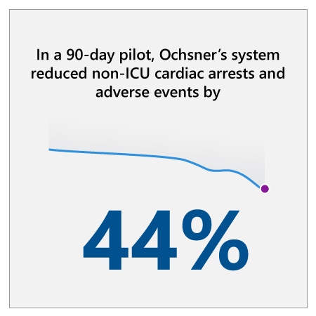

## Approach

:::row:::
:::column span="2":::
To create their AI strategy, Ochsner had to consider a number of factors in the complicated healthcare landscape and produce scalable applications that, crucially, medical staff would both appreciate and use. They had to implement solutions that targeted specific, solvable problems, and that effectively leveraged patient data without compromising on ethics and privacy.

Ochsner chose to implement AI in a way that addressed the issue of inefficient patient monitoring. Oschner’s strategy was to come up with a system that would enable doctors to spend more focused time with patients whose historical data indicated a higher chance of their condition deteriorating.

Ochsner presented the problem of patient monitoring to their innovation accelerator, innovationOchsner (iO). They developed a system that could continually monitor a patient’s vital signs to identify subtle changes in their condition. The high volume of complex data was then analyzed by an AI-powered predictive modeling tool running on Microsoft Azure.
:::column-end:::
:::column span="2":::

:::column-end:::
:::row-end:::

“We have monitors that are taking vitals every minute,” says Jonathan Wilt, CTO of iO. “There are hundreds of constantly changing data points that humans could not possibly digest in real time. And we have new artificial intelligence that can take these data streams and process them and make predictions.”

To train the AI model, data was pulled from Ochsner’s Epic electronic health record system of 125,000 hospitalized patients. The result is an AI-powered alert that prompts clinicians to check on a patient’s welfare within several hours, potentially intervening to avoid a cardiac or respiratory arrest or a deterioration of the patient’s condition.

By consulting with their clinical staff, Ochsner optimized the timing and frequency of alerts. A four-hour warning turned out to be ideal, giving enough time for a rapid-response provider to visit the patient, examine them, and determine why the AI identified this patient as being at heightened risk of a cardiac event. Potential interventions include medication changes, transfer to ICU, and other forms of elevated care.

## Results

:::row:::
:::column span="2":::
In 2018, Ochsner reported that a 90-day pilot with the system reduced cardiac arrests and other adverse events outside the ICU by 44 percent. Although the technical details of the pilot have not yet been formally released for peer review, it is a promising start to a new system designed to save both lives and healthcare costs. Ochsner also expects to improve patient outcomes through:

1. Fewer patient transfers to the ICU
2. Shorter patient stays
3. Fewer complications and lower costs as a result of fewer patients experiencing cardiac or respiratory arrest “A lot of what medicine in general has done has been retroactive studies and trying to understand what happened with the patient after the fact—well, imagine the whole game is shifting,” says Mike Hulefeld, COO of Ochsner Health System. “We’re going to know before it happens. That’s a total game changer.”

Ochsner is continuing to optimize the system and learn from its insights to identify other hospitalization health events with AI applications, and develop more preventive measures and proactive treatment plans.
:::column-end:::
:::column span="2":::

:::column-end:::
:::row-end:::

In the future, Ochsner plans to implement the new system in all of its owned facilities, with potential to scale to managed and affiliated partners.

## Key lessons

### Select a use case that minimizes disruption while maximizes impact

AI has the potential to revolutionize healthcare if leveraged correctly. While there are many examples of impactful applications of AI in healthcare, choosing the appropriate use case is imperative given the current complexity of the industry. In this case study, we see that it is crucial to strategically select a use case that demonstrates the value of AI while minimizing disruption to practitioners in order to create a widely adopted and beneficial solution.

### Leverage existing data

Organizations should also recognize the value of their existing data. Some healthcare organizations focus heavily on gathering external data for AI applications, but these do not necessarily yield more valuable results. Ochsner leveraged its existing data to gain valuable new insights and improve its operational processes.

### Evaluation of the strategy using the value framework

Let’s examine the Ochsner AI strategic use case selection using the value creation framework developed by Peter Zemsky, INSEAD’s Eli Lilly Chaired Professor of Strategy and Innovation:

1. From the **industry perspective** this is an interesting case. While many companies invest heavily in resolving complex healthcare problems with AI, they can run into roadblocks regarding stringent industry and privacy regulations. Ochsner leveraged their preexisting data and implemented a solution that built upon their already-compliant procedures.
2. From the **value creation perspective** this use case provides a good trade off. With a limited investment that didn’t require purchasing external data or large capital expenditure, Ochsner is creating significant value for patients as well as employees. It would be interesting to see how much of that value they will be able to extract in the future with optimized care utilization, lower customer churn, and better ratings in areas like patient safety, patient experience, and value-based care.
3. From the **organization & execution perspective** this is a fantastic example of a company that is building its AI strategy on top of their existing data and skills. This is giving them significant advantages as their ability to execute and understand the value of AI is immediate. Instead of selecting use cases that would require acquiring new data or skills, they accelerated the time to value with a low-friction use case whose value is easily understood by all the stakeholders.

Now that you’ve seen how healthcare organizations are approaching their AI strategy, let’s wrap up everything you’ve learned with a knowledge check.