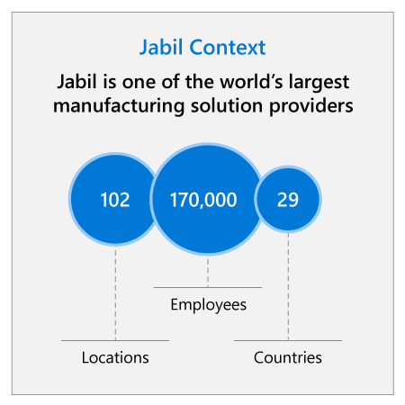

## Abstract

The electronic goods market is fast-growing, fast-moving, and extraordinarily demanding for manufacturers. All manufactured goods require quality checking throughout the manufacturing process, and this is especially true for intricate electronic products. To remain profitable, manufacturers must accelerate production line quality monitoring while maintaining inspection accuracy and reducing the rate of false positive inspections. Traditionally, this exacting work has been performed by highly-trained human operators, augmented by expensive computer analysis equipment. But technology is changing that reality in positive ways.

This case study shows how one of the world’s largest manufacturing solutions providers, Jabil, was able to reduce overhead costs and amplify production line quality by using AI to check electronic products as they were manufactured.

## Industry context

:::row:::
:::column span="2":::
Established in 1966, Jabil is one of the world’s largest manufacturing solution providers. With 170,000 employees in a global operation spanning 102 locations in 29 countries, Jabil works with leading companies in a diverse range of industries to create innovative and reliable products.

The manufacturing industry forms the backbone of modern economies worldwide, with revolutionary developments in manufacturing processes enabling modern society as we currently know it. However, the global share of GDP from manufacturing has been declining for several decades. Manufacturing is now racing to keep up with the emergence of new digital technology, and the challenges of a changing global economy.

Jabil operates a business-to-business (B2B) model that requires extremely complex manufacturing work for a wide variety of industries, including consumer products, defense & aerospace, healthcare, automotive, energy, industrial & building, networking and telecommunications.
:::column-end:::
:::column span="2":::

:::column-end:::
:::row-end:::

Outsourcing manufacturing services to companies like Jabil has been an integral part of electronics OEMs’ business models for the last several decades. With the rise of the digital economy, Jabil has been rapidly growing in value and increasing its use of innovative technology.

## Challenge

:::row:::
:::column span="2":::
Jabil’s customers face numerous competitive challenges within the fast-moving electronic consumer goods industry, which in turn requires Jabil to respond quickly to their demands for speed and customization. This creates high revenue volatility for Jabil and increases the pressure to “get it right first time” during the manufacturing process. Even automated inspection equipment might not make the process fast enough to meet the customer’s deadline. “We have many products that customers expect to be delivered within a week,” says Matt Behringer, Vice-President, Information Technology at Jabil. “And that’s including transit.”

In addition, because of the extremely variable demands of the electronic consumer goods market, many of Jabil’s customers cannot commit to firm production schedules for more than one quarter. This puts further pressure on Jabil to maximize the efficiency of its manufacturing capacity and supply chain.

Jabil recognized this need to modernize in its 2017 Annual Report, stating, “If we are unable to offer technologically advanced, cost effective, quick response manufacturing services that are differentiated from our competition and adapt those services as our customers’ requirements change, demand for our services will decline.”
:::column-end:::
:::column span="2":::

:::column-end:::
:::row-end:::

Jabil also needed to modernize its quality inspection techniques to meet the demands of one-off production lines. In today’s market, even very large global manufacturers behave much like boutique manufacturers, often making a particular product only once. The first product run might be the only one created, or there might be smaller lots of only 5 to 10 items, and no time for multiple iterations. As a result, traditional inspection techniques for ensuring product quality are quickly becoming outdated. For example, it is no longer cost-effective to use a process called first-article inspection, where an initial model is manufactured, checked, and then reworked before production even starts. The wasted time and materials that have always been part of the manufacturing process are becoming less sustainable.

Jabil has made numerous innovations over the years to overcome these challenges. On the assembly line, Jabil uses computer-based automated optical inspection (AOI) to identify potentially defective components. These systems require skilled engineers to build and hard-code algorithms to help the system identify a good component versus a defective one. These systems, however, do not have the ability to learn or adapt, and they produce a false positive rate of around 30 percent.

When a component is flagged as defective, an operator is required to manually inspect it to confirm the diagnosis. With one line producing 2,000 components every day, human operators may have to spend up to 200 minutes each day manually checking components.

The speed of operations leaves manual inspectors with just seconds to decide if the product is defective or not, and a high error rate is the inevitable result for even the most skilled operators. Jabil and their customers all have one thing in common – the need to operate as efficiently and cost-effectively as possible. That means saving even a few milliseconds of time, and associated cost, can make a substantial difference for the business.

To address these challenges, Jabil needed a solution that was both faster and more accurate, which was also capable of learning over time. They needed AI.

## Strategy questions

1. What aspects of the production line would decrease a customer’s time to market?
2. In manufacturing, prototyping and production both require vital refinement processes to ensure the end product meets users’ needs and is reliable. What effects might be felt if these processes were improved?
3. Digital technology offers manufacturers the opportunity to collect massive amounts of data. How could Jabil collect and store this data effectively?
4. How could Jabil use this wealth of data to minimize assembly line downtime?
5. How can Jabil proactively use analytics to anticipate issues in assembly line processes and increase efficiency?
6. What are the key metrics of a prototype solution for Jabil to evaluate?
7. How can Jabil leverage the best thinking of its most skilled operators to train and monitor the AI to improve accuracy?

Now that you’ve gained context on the challenges Jabil faces today and considered critical questions to answer before implementing AI, watch the executive perspective video with Gary Cantrell, SVP & CIO of Jabil.