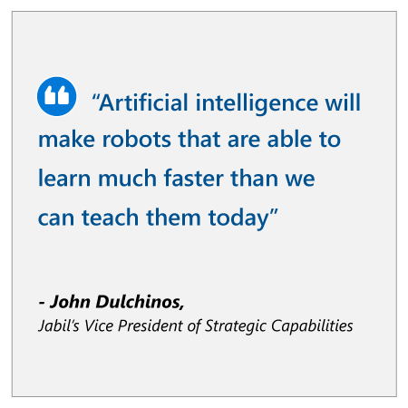

## Approach

“[Manufacturing] is a highly competitive business and Jabil is focused on becoming the world's most technologically advanced manufacturing solutions provider,” says Gary Cantrell, SVP & CIO of Jabil. To achieve this goal, Jabil is using AI to rapidly evolve its manufacturing processes to be more efficient, by creating the next generation of predictive analytics.

With “Project Brainwave,” Jabil leveraged the Internet of Things (IoT) to connect manufacturing processes to key cloud capabilities, such as data warehousing and machine learning, to enhance its automated optical inspection process. In collaboration with Microsoft, Jabil built a predictive deep learning model that is used to detect anomalies on production lines.

“If you think about the IoT mindset, and the ability to connect equipment, sensors, people, and whatever else you can think of, we had to look at our factory holistically versus historical point solutions, and then see where to move forward in a way that enables us to be competitive and differentiated,” says Behringer.

Project Brainwave didn’t stop there. Jabil upgraded the capabilities of its AI so it could be used directly on the factory floor. This is achieved by using a new Intel computer chip called a field programmable gate array (FPGA) to efficiently — and economically — perform calculations with minimal lag time. Microsoft researcher Doug Burger says that Brainwave “processes requests as fast as it receives them, with ultra-low latency”, which means up to 550 images can be processed every second. This super-fast processing allows Jabil to bring AI capabilities to every process in manufacturing.

By improving the automated process, Jabil can detect circuit board errors early in the production line, and free human operators to focus on the value-added tasks that machines cannot do. Ongoing evaluation can also enable the system to develop further accuracy. A skilled operator can quickly train a new predictive model to be deployed to the factory floor, improving the accuracy of fault predictions over time by allowing AI to automatically retrain as more data becomes available.
:::row:::
:::column span="2":::
When a new product line needs to be built, “transfer learning” can be used. This means an existing model, built using a large amount of historical data, can be retrained using only a small amount of new data and repurposed to a new, but similar, problem.

“Machine learning ultimately allows us to take the skillset of the very best operator and very quickly transition it to automation,” says John Dulchinos, Jabil’s Vice President of Strategic Capabilities. “Artificial intelligence will make robots that are able to learn much faster than we can teach them today.”

This solution is readily scalable: AI can collect data from a number of different sources, like other production lines or other factories. The investment is also comparatively small, comprising mainly IoT computing hardware and data storage.
:::column-end:::
:::column span="2":::

:::column-end:::
:::row-end:::

## Results

:::row:::
:::column span="2":::
Manufacturers across the sector are seeing an average of 17 to 20 percent productivity gains from AI-enabled factories. Jabil had particular success in using predictive models to detect circuit board errors early in the production line. Using IoT, Jabil could collect more than 1 million data points from each assembly across a 32-step, four-hour manufacturing process. Predictive models trained on this data allowed Jabil to anticipate and avert more than half of circuit board failures at the second step in the process and avoid the remaining 45 percent of the potential failures at step six.

Early detection of costly errors reduces the volume of scrapped materials and increases overall efficiency and profitability for Jabil. It also reduces warranty costs and prevents faulty products from making it to the end of the production line – or on to shop shelves – which increases customer satisfaction. Jabil is now also looking at ways to use AI to enhance efficiency and lower costs by improving predictive maintenance of manufacturing operations.

Ryan Litvak, Senior Manager, Architecture & Technology at Jabil, is impressed. “AI will make a significant difference in the process from a speed, cost and productivity standpoint, and this will, in turn, give our customers an edge in the marketplace” said Litvak. “Anything you can do to get an advantage for the customer is going to provide incremental improvement.”
:::column-end:::
:::column span="2":::

:::column-end:::
:::row-end:::

## Key lessons

### Align AI investments with business priorities

Organizations should consider how AI can address their biggest risks, challenges, and opportunities. Jabil chose to invest in AI where it would have significant strategic impact – quality assurance processes. Targeting AI to a core manufacturing process allowed Jabil to reap the rewards of optimized production costs, reduced time-to-market, and increased product quality. This put the CIO in a good position to promote future innovative investments.

### Leverage AI in a way that provides rapid value

Organizations also need to consider the time to value of an AI investment. While “Project Brainwave” may have been complex to implement, it provided immediate value for Jabil in an industry where speed is an essential competitive advantage. This rapid value also helped bolster trust in AI throughout the organization.

### Evaluation of the strategy using the value framework

Let’s examine how Jabil’s AI strategy is creating additional value using the value creation framework developed by Peter Zemsky, INSEAD’s Eli Lilly Chaired Professor of Strategy and Innovation:

1. From the **industry environment perspective**, we discussed how customers are demanding faster time to market of more sophisticated customized products which require large CAPEX investments that are elevating the production cost. On the other hand, customers are demanding a broader set of services including logistics and distribution creating a window of opportunity to capture additional value.
2. From the **value creation perspective**, this case illustrates key lessons for manufacturing and process industries. It is critical to start with applications that have clear value drivers where you can demonstrate impact. Here improved efficiency and agility are clear levers for value creation.
3. From the **organization & execution perspective**, the key focus is having an AI strategy that is well-integrated into a broader strategic roadmap. This case also shows the potential of leveraging huge volumes of data coming with the digital transformation of production with AI technologies.

Now that you’ve seen how manufacturing organizations are approaching their AI strategy, let’s wrap up everything you’ve learned with a knowledge check.