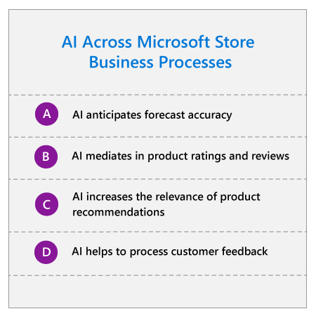

## Approach

At Microsoft Store, we are thinking broadly about AI and exploring various applications and potential impacts across the retail organization. We’ve identified several areas where we could enhance our retail organization with AI solutions, from fulfillment and pricing to recommendations and reviews. Incorporating AI across Microsoft Store business processes has enabled us to efficiently scale and derive meaningful customer insight across an increasing number of data channels.

:::row:::
:::column span="2":::
To bring intelligence to our fulfillment process, we partnered with JDA. Previously, use of traditional physical merchandising tools caused our forecast accuracy for physical goods to be lower than it could be. Now with JDA, we’ve been able to automate the initial forecasting and replenishment for merchandising across our physical and digital stores. As we continue to refine these forecasting models and incorporate AI, we anticipate forecast accuracy to increase dramatically.

AI also plays an integral role within our digital store operations through the mediation of product ratings and reviews. Due to the volume of ratings and reviews we receive, we needed to use tools to create greater efficiency. Now with our AI-mediated process, two things happen automatically whenever a product review is submitted: 1) reviews are scanned for profanity and these words are redacted, and 2) every 24 hours, all new reviews are scanned for spam and flagged posts are removed.

We have also leveraged the power of AI to increase the relevancy of product recommendations within our digital channels. We create a personal score based on machine learning algorithms, which is analyzed in relation to product inventory and release dates to generate the most optimal product recommendation lists for each browsing customer.
:::column-end:::
:::column span="2":::

:::column-end:::
:::row-end:::

Finally, one of the key ways we’ve leveraged AI is with customer feedback. We receive a high volume of customer feedback across numerous channels, including in-store visitor feedback, email post-purchase surveys, employee notes on their customer interactions, and customer reviews posted to our online store. AI is helping us efficiently process this information and surface key trends from the signals that we’re receiving from our customers across channels.

Processing customer feedback with AI is especially interesting because it demonstrates the importance of collecting relevant, curated data. Let’s take a closer look at the capture and analysis of insights from store associates.

## Customer feedback: Insights from store associates

At the close of each business day, each Microsoft Store recaps their daily performance and reviews any notable customer feedback captured by store associates on everything from product features to pricing. Previously, these insights were shared via email. When we evaluated the business challenge—effectively bringing customers’ insights to our employees—we implemented an AI-powered solution to streamline the process.

Since our store associates are at the front-lines of our customer interactions, it was imperative that we design a tool that was easy to use and allowed them to maximize time spent with customers. With this in mind, we streamlined the in-store capture of customer feedback for associates by creating a mobile-optimized feedback form that could be quickly accessed while on the sales floor. At the close of each business day, the store manager reviews all submitted customer insights and selects key pieces of feedback to elevate across the organization.

Once the store manager submits their store report, associate feedback is pushed to a unified database and analyzed with machine learning algorithms and AI-powered language understanding, including sentiment analysis. These algorithms further segment comments by product and theme.

We then surface this data to a wide range of stakeholders including engineers, merchandisers, product managers, and executives through a Power BI dashboard. Now, these stakeholders can get a comprehensive view of customer feedback quickly, rather than spending hours sorting through disparate data points to identify relevant trends. Users can even segment feedback by product and customer type, see top positive and negative themes, and drill down into individual comments for deeper insight.

Our teams communicate on a weekly basis to ensure there is a feedback loop where customer insights turn into customer solutions. At the same time, store managers at our physical storefronts have real-time access to the insights submitted by store associates which enables them to see how their store is performing and respond to customer feedback trends as they emerge.

## Results

Following the implementation of AI-based data analysis, we’ve captured and analyzed thousands of unique pieces of customer feedback from our physical storefronts and digital channels.

The benefits of this improved customer insight are clear. This process helps us resolve product issues quickly and the learnings have influenced everything from product design to go-to-market strategy for new products to end-of-life planning for existing products. For instance, in the lead-up to one product launch, early customer feedback indicated preference for different product colors as well as the importance of having an in-store demo at the time of launch. As a result of this feedback, we have modified our launch strategy to ensure customers could access an in-store demo at all Microsoft Store locations the day of launch.

Finally, access to aggregated insights collected by store associates helps store managers and associates keep their finger on the pulse of customer trends in real-time and respond more quickly.

Ultimately, our customer feedback has equipped our employees across the globe with the insights they need to create a better customer experience.

## Key lessons

### Establish processes for sustaining employee buy-in

Because our customer feedback loop depends so heavily on input from store associates, we needed to create and sustain their motivation to submit insights. We discovered that if the associates question whether anyone is reading or acting on their comments, they quickly lose motivation. We established a feedback loop that outlines how their feedback is implemented. This showcases the importance of associate input and motivates continuous partnership.

### Set parameters on data input to ensure output quality

Once you’ve established processes for keeping all stakeholders invested, it’s important to ensure that insights are provided in a format that is usable by the AI. Initially, there were frequently long submissions that included multiple insights. Our AI system couldn’t accurately segment these submissions by product and theme, because it can’t process and separate insights within a single submission. It was also difficult to accurately determine customer sentiment from these lengthy text submissions. To solve for these challenges, we provided training on how to optimize submissions by limiting submissions to 250 characters. We also built in a separate required field where store associates self-select either positive or negative sentiment for each customer insight to further remove ambiguity.

### Optimize routing of insights for actionability

The end goal of using AI to analyze customer feedback was not just to uncover insights from our customer feedback, but to act on them. If we had built a system that uncovered insights that we couldn’t operationalize, it wouldn’t have been worthwhile. That’s why it was key to ensure that when the system segmented and routed feedback, it was using categories that aligned to the organizational structure in our business, rather than categories based only on concepts. That way we could ensure that feedback on a particular issue would be routed to the stakeholders who are accountable for acting on it.

### Evaluation of the strategy using the value framework

Let’s examine how Microsoft Store’s AI strategy is creating additional value using the value creation framework developed by Peter Zemsky, INSEAD’s Eli Lilly Chaired Professor of Strategy and Innovation:

1. From the **industry environment perspective**, retail companies are struggling to provide a consistent, personalized customer experience and manage operations across channels in an increasingly multi-channel environment. Building a better understanding of the customer and personalizing their experiences are key to retailers’ success.
2. From the **value creation perspective**, the customer feedback program enables Microsoft Store to be more agile in response to customer feedback: we can implement changes based on customer suggestions significantly faster. In addition, our other AI solutions increase efficiency of our supply chain by improving prediction of customer demand and behavior.
3. From the **organization & execution perspective**, it’s interesting to note that Microsoft Store’s existing resources were enhanced through AI. The personnel in our physical locations have always been on the front lines with our customers; we utilized their access to customer opinions and sentiment to infuse customer insights across our entire operation (this is an example of “brick mining,” a topic discussed by Peter Zemsky). In addition, the program enabled us to make better use of the customer data we already had, rather than requiring an effort to seek new data.

Now that you’ve seen how retailers are approaching their AI strategy, let’s wrap up everything you’ve learned with a knowledge check.