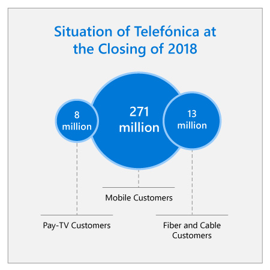

## Abstract

Telefónica is one of the world’s largest telecommunications companies. Like all telecommunications companies, it has been hit by digital disruption and changing customer preferences. This case study describes how Telefónica used AI to transform its relationships with customers, ultimately increasing customer loyalty and satisfaction. Its AI platform improves the customer experience and provides customers with more choice about how to consume its products and services with a new technology that offers voice UI in real-time, using cognitive intelligence for deeper personalization.

## Industry context
:::row:::
:::column span="2":::
Telefónica is one of the largest telecommunications companies in the world, operating world-class fixed, mobile, and broadband networks in several countries across Europe and Latin America under its three commercial brands: Movistar (Spain and Latin America), O2 (Germany and the UK), and Vivo (Brazil). Telefónica offers quality and reliability through simple products and services in regions where many competitors struggle.

At the closing of 2018 Telefónica had over 356 million customers, including 271 million mobile customers, over 13 million fiber and cable customers, and almost 8 million pay-TV customers. In 2018 Telefónica earned 48,693 million euros in revenue, with a net profit of 3,331 million euros.
:::column-end:::
:::column span="2":::

:::column-end:::
:::row-end:::

## Challenge

:::row:::
:::column span="2":::
The entire telco industry is undergoing a long-term fundamental transformation driven by over the top (OTT) providers, voice-over-IP, and the exponential growth of network data traffic. Like all telecommunications companies, Telefónica has been challenged by digital disruption and changing customer preferences.

Telefónica has strong market share in its core markets. Being exposed to multiple countries in different regions, Telefónica is also exposed to economic vulnerabilities in the markets where it operates. In order to address these challenges, Telefónica needed a new strategy – one that would transform its applications and operations and make use of data to better serve customers and employees while providing a robust foundation for the future of their organization.

Telefónica began its transformation in 2010, when it committed to a massive digitalization project to make its platforms intelligent and modernize the business. To make use of its treasure-trove of existing data, Telefónica created a cognitive platform that incorporates information about core connectivity assets, unified IT systems, and products and services offered to users. Over the last few years, the company has also branched out into added-value media and internet services.
:::column-end:::
:::column span="2":::

:::column-end:::
:::row-end:::

## Strategy questions

1. Digital disruptors have raised the bar for customer experience. How can companies use AI to supply value-added communication and entertainment services to customers?
2. Customer trust is a core asset for a company. Customers want to be able to decide who can access their data, and under what conditions. How can companies build trust with customers while leveraging their data to offer improved, personalized experiences?
3. How could Telefónica ensure customer data would be ethically accessed and used?
4. What existing services and solutions could Telefónica take advantage of to improve accessibility to their services?
5. How could Telefónica manage product releases to ensure the lowest possible number of customers experienced problems, and ensure any problems were fixed as soon as possible?
6. How could Telefónica use AI to capitalize on its strengths – a broad customer base, large percentage of market share, and a high degree of customer loyalty?

Now that you’ve gained context on the challenges Telefónica faces today, and considered critical questions to answer before implementing AI, watch the executive perspective video with Chema Alonso, Telefónica’s Chief Data Officer.