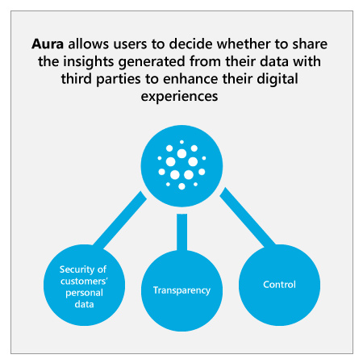
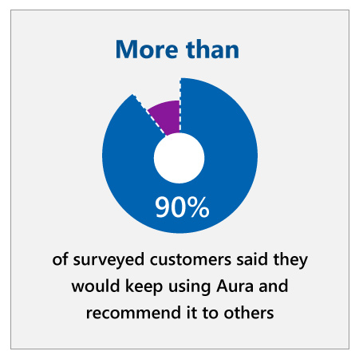

## Approach

Telefónica’s strategy was to use AI to create a platform for customer interaction, providing multiple ways for customers to interact with Telefónica according to their preferences, and allowing them to easily manage their digital life within the company. Telefónica also wanted to give customers visibility and power over their stored data to help build trust. Finally, Telefónica wanted to make better use of its existing data estate by providing AI-powered recommendations to customers and even offering new, relevant services and experiences outside of the telco world.
:::row:::
:::column span="2":::
In February 2018, Telefónica announced the launch of Aura, an AI-powered digital assistant, which is transforming the way customers interact with the company.

Telefónica has built Aura to align with three core principles: transparency, control, and security of customers’ personal data. With full transparency and simple control over how their data is used, Aura allows users to decide whether to share the insights generated from their data with third parties to enhance their digital experiences. Each user has a personal data space, which stores the digital trail they leave when using Telefónica products and services and allows customers to personalize their experience.

Customers can use Aura to ask questions about the products and services they use, create and track a claim, manage and unblock device access to Telefónica-provided Wi-Fi routers, and receive data consumption alerts. With Aura now available in Movistar+ (Telefónica’s pay TV service), customers can search, sort, change channels or launch content on the TV, as well as receive personalized recommendations based on their watch history and preferences.
:::column-end:::
:::column span="2":::

:::column-end:::
:::row-end:::

Aura has let millions of customers all over the world interact with Telefónica's technology in a simple and personalized way. Depending on the country, Aura is delivered to customer devices via mobile app or through third-party channels like WhatsApp, Facebook Messenger, and Google Assistant.

Aura is also able to leverage the power of AI to offer customers customized experiences. It facilitates the adoption of new value-added products, based on data insights.

Telefónica will be adding many more services like this over time, both directly to customers and in collaboration with trusted partners. Integration with other technologies and digital services will make Aura a powerful innovation platform, open to partners and different technologies.

## Results

:::row:::
:::column span="2":::
Aura is the basis for a new relationship model with customers. Just one year after release, Aura has around 2 million monthly active users. In a study to analyze visibility, use, and functionality of Aura in Movistar+, over 90 percent of surveyed customers said they would keep using Aura and that they would recommend it.

Aura goes beyond regulatory compliance and empowers customers with improved experiences and increased value. It rewards customers for engaging and deepening their relationship with Telefónica and its partners, while giving them more reasons to stay with and to recommend Telefónica to others.

Telefónica Chief Data Officer Chema Alonso sees Aura as part of a long-term vision, where customers talk directly to the network, and the network answers back in real time adapting to their needs. “It's time for technology to adapt to people,” he says.

This is their vision for the future: a totally digitalized Telefónica with the customer at the center.
:::column-end:::
:::column span="2":::

:::column-end:::
:::row-end:::

## Key lessons

### Modernize existing applications with AI

One strategic way to quickly take advantage of AI capabilities is by modernizing existing applications with AI. Some new AI services can be easily integrated into costly legacy systems without the need to create and invest in new models and complex deep learning processes. These kinds of incremental investments build credibility and trust in AI, opening the door for larger future investments.

### Enable your technical development teams with AI

Ultimately, the core of AI transformation will happen within key business processes across the company. However, this is not possible without first empowering technical development teams to bring AI to applications and services. Mobilizing the IT department in AI transformation accelerates innovation and results.

### Evaluation of the strategy using the value framework

Let’s examine how Telefónica’s AI strategy is creating additional value using the value creation framework developed by Peter Zemsky, INSEAD’s Eli Lilly Chaired Professor of Strategy and Innovation:

1. From the **industry environment perspective**, telco companies are struggling with strong competition from new industry players that can extract greater value on top of the costly infrastructure that the telecommunications companies provide. Also, most of the offerings are not clearly differentiated, which creates constant customer churn.
2. From the **value creation perspective**, platforms like Aura can provide a clear differentiation that will lead to customer retention and higher value perception. The incremental cost of developing and deploying the platform should be easily compensated by the additional value created by the richness of the data and customer information learned and stored in the platform. Telefónica from now on will know more about customer preferences and will be able to resell and leverage that knowledge.
3. From the **organization and execution perspective**, it is interesting to highlight that this modernization effort is being led by the Chief Data Officer who committed to a massive digitalization project to make the company’s platforms intelligent, starting from their core area of knowledge.

Next, let’s look at Publicis Groupe, one of the “Big Four” multinational advertising and public relations agencies. Publicis found that “chaotic knowledge” ecosystems - born from keeping tech, information, and personnel structured in silos - were making it hard to execute projects quickly, provide value to customers, and keep ahead of competitors. Their new Chief Executive Officer, Arthur Sadoun, proposed a remarkable strategic fix: using AI to “break the silos,” and connect every Publicis employee to teams and tech where they could provide the most value. To do this, they created a platform called Marcel, which uses AI to structure Publicis’ vast treasure-trove of institutional knowledge and make it available to every employee.