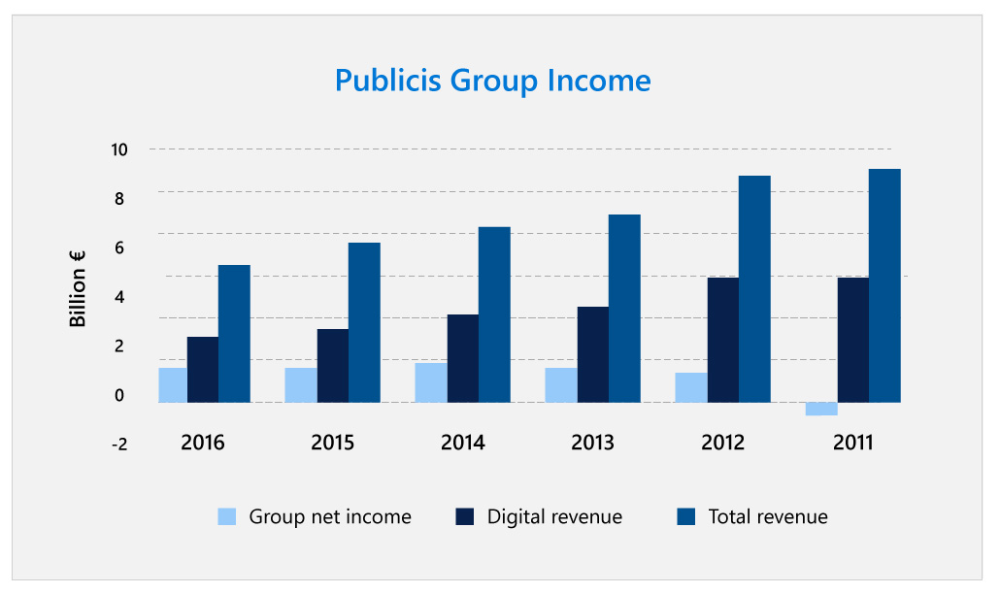

## Abstract

Publicis Groupe is facing new and strong competition as its industry evolves and requires new skills. Radical and innovative solutions are required to stay ahead of the curve and attract both clients and new talent. Founded in 1926, the venerable advertising, media, and consulting network – one of the world’s largest – found that their existing processes kept technology, information, and personnel structured in silos, which made it more difficult to execute projects quickly, provide value to customers, and keep ahead of competitors.

Their recently appointed Chairman and CEO, Arthur Sadoun, proposed a remarkable strategic evolution: using a platform powered by AI to “break the silos,” and connect every Publicis Groupe employee to teams and tech where they could provide the most value. To do this, they created a platform called Marcel, named after Publicis founder Marcel Bleustein-Blanchet, which uses AI to structure Publicis Groupe’s vast treasure-trove of institutional knowledge and make it available, useful, and relevant to every employee.

## Industry context

Publicis Groupe is one of the “Big Four” multinational advertising and public relations agencies. Publicis is a global leader in marketing, communications, and digital transformation, and its network contains some of the best-known names in communications and media, including Leo Burnett Worldwide, Publicis Worldwide, Saatchi & Saatchi, Zenith, Starcom, and more recently Sapient in the consulting space. With over 80,000 employees spanning 200 specialties over 130 countries, thousands of clients, and an almost hundred-year history, Publicis Groupe is one of the largest and oldest companies of its type in the world.

:::row:::
:::column span="2":::
Age brings challenges as well as experience. In recent years, the agency model has stagnated. Established agencies have struggled to offer satisfying solutions to their clients in the face of massive technological change, the mass adoption of online advertising, and small, nimble competitors.

Agencies face the same problem as many old-media companies: diminishing income and relevance. Advertisers have flocked to convenient, highly targeted, and quantifiable online advertising models offered by companies like Google and Facebook. These search and social media platforms are accessible, fast, and often target customers through data analytics and AI. Agencies, on the other hand, have high overhead costs and a far higher price point.

“This is a race. It’s a race to be relevant,” Publicis CEO Arthur Sadoun told the Financial Times in June 2017. “The big difference between today and yesterday is speed. You need to be much faster on the execution.”
:::column-end:::
:::column span="2":::

:::column-end:::
:::row-end:::

## Challenge

Despite competition from new market players, agencies retain huge value in that they have the institutional knowledge and resources to create engaging, emotive, and meaningful campaigns that can make a huge difference to public perception of a brand or product at scale. But here another problem presents itself, which is especially present in older agencies like Publicis Groupe: silos.

In pre-digital days, silos were present out of organizational necessity. The informational hierarchy created by silos meant the knowledge they contained could be given order and structure. Today, thanks to digital disruption and the hugely increased speed of information, silos hamper growth and communication instead. What’s more, as siloed companies have digitized, the data and institutional knowledge they contain has typically become more fragmented and disorganized.

For Publicis Groupe, which owns multiple different agencies, each with their own divisions and internal knowledge silos, this meant that knowledge was frequently inaccessible, lost, or duplicative. Despite the huge expertise of the company as a whole, its individual agencies lacked access to the full resources and best thinking of the company.

When Arthur Sadoun took charge of Publicis, becoming its third leader ever over 91 years of existence, he had one objective in mind: making it possible to execute projects more quickly than ever by breaking down the company’s knowledge and personnel silos and creating an environment where everyone had immediate access to the information they needed.

But with over 80,000 employees in dozens of different organizations spanning over 100 countries, this was much easier said than done.

## Strategy questions

1. What are Publicis’ unique strengths and capabilities that a solution should leverage?
2. For businesses to be efficient, they need stakeholders to have access to the right information, at the right time. In a world drowning in data, how should Publicis approach providing its wealth of information to employees, without generating more surplus data and information?
3. The five characteristics of high-quality information are: that it is accurate, complete, consistent, unique, and timely. How should Publicis ensure the information they provide employees meets this standard?
4. When a project needs fresh advice, experience, or technical know-how, how can employees in a large organization find the right colleague to help?
5. Strategically, how should this be approached so that the well-meaning (but ultimately damaging) habits of some managers to keep their groups exclusive and inward-looking is bypassed?
6. How could Publicis ensure a high probability of internal uptake of a solution? How could this be measured?

Now that you’ve gained context on the challenges Publicis faces today and considered critical questions to answer before implementing AI, let’s look at how Publicis transformed its own organization with AI.