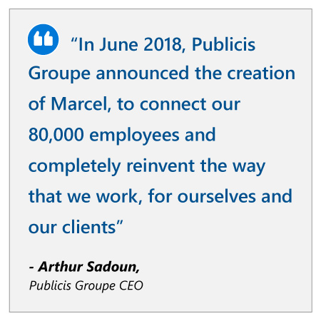
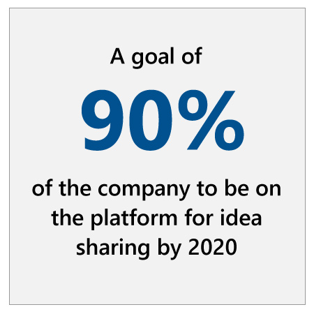

## Approach

"(2017) has been a year of transformation for us in an industry that is being totally destroyed"  
\- Arthur Sadoun, CEO  
  
To help create the momentum it needed to survive and thrive in the modern world, Publicis Groupe is strategically looking to innovative solutions to transform the organization from a holding company to a quick and agile “platform,” while making the most of its colossal internal resources and experience. Publicis chose to concentrate resources on a digital transformation project with AI to bring order to the valuable information and data spread across the organization.

Connecting knowledge on 80,000 employees is not a task suited for traditional tools. Simply finding out which employees had previous experience working for a certain client, for example, was a task that would normally require days of emails, instant messages, and phone calls. A traditional central directory was also not an option: Publicis estimated that it had over five million files containing largely unstructured information on expertise and past projects. Even if such data could somehow be organized, sifting through it would require specialist training for each team member.

But this sort of task — near impossible for humans — is exactly what AI is good at. AI can effortlessly sort through and categorize vast volumes of data, and machine learning can quickly establish and understand the networks that exist within that same knowledge.

### Marcel is born

Using AI, Publicis was able to create an interactive assistant for employees and clients called “Marcel”.

Behind the scenes, Marcel is a platform that uses AI to bring order to Publicis’ vast amount of siloed knowledge. But users don’t see any of this extensive categorization work. For them, the interface works in a similar way to Microsoft’s Cortana, or Apple’s Siri. It can be used to find expertise, share ideas, and to connect creatives to projects. Employees can ask Marcel questions in plain English, such as “Who has done graphic design work for Samsung in the last six months?” They even can ask Marcel who the right person is to help solve an issue on a particular project.

To make sure that communication is enabled without harming productivity, Marcel filters all comms channels, and each day hand-picks six items for each employee that they may be interested in. It also frees employees from repetitive administrative tasks, such as timesheets, through automation.

Marcel helps on the client side as well. Clients can post videos or project descriptions to the platform, polling Publicis employees for ideas. The client can then select the idea and associated team that they find most suited to them. No mass emails, delays, or repetitive phone calls.
:::row:::
:::column span="2":::
Marcel also takes into account existing workloads when making recommendations. The result is a transformative way for employees to find one another in seconds, properly leveraging the expertise of tens of thousands of people. This results in a more flexible, collaborative, environment where silos are broken down without losing the information they contain.

“In June 2018, Publicis Groupe announced the creation of Marcel, to connect our 80,000 employees and completely reinvent the way that we work, for ourselves and our clients,” says Arthur Sadoun.

“Since then, our industry has gone through unprecedented challenges, demonstrating that incremental change is not a solution. The need for reinvention is stronger than ever. At Publicis Groupe, we haven’t waited to act. We are breaking the barriers between talent and opportunity with Marcel.”
:::column-end:::
:::column span="2":::

:::column-end:::
:::row-end:::

## Result

:::row:::
:::column span="2":::
“We are ahead on all the strategic and operational KPIs of our transformation to become the market leader in marketing and business transformation,” says Publicis Groupe CEO Arthur Sadoun.

With the power of AI, the beta version of Marcel is already helping Publicis transform from a holding company into a platform for idea sharing and client engagement, with a goal for 90% of the company to be on the platform by 2020.

Early indications are that Sadoun’s bold silo-breaking strategy is working. After the official unveiling of Marcel in late May 2018, Publicis had a very strong Q3, achieving their aim of organic growth acceleration (up 2.2 percent). Thanks to their unique data strategy and new platform approach, Publicis won four separate pitches with GlaxoSmithKline (GSK), alongside key wins with Western Union, Cathay Pacific, and the Government of Singapore.

“Our model connecting data, dynamic creativity and technology is working beautifully and fits the current and future needs of the clients,” says Sadoun.
:::column-end:::
:::column span="2":::

:::column-end:::
:::row-end:::

“This is why we won the majority of the biggest pitches of 2018, such as Daimler, Campbell's, Marriott, Carrefour, Cathay Pacific, Smucker's, GSK and Fiat-Chrysler. These last two wins represent more than one billion dollars in billings each.”

## Key lessons

### Don’t limit yourself to structured data

Organizations considering AI often limit their thinking to structured data. But unstructured data is an extremely valuable resource for AI – particularly for employees. Workers waste large amounts of time manually searching, understanding, summarizing, and collating unstructured or complex information. The artificial intelligence engine responsible for Marcel works by interpreting and connecting scattered data to create a unified and interpretable source of knowledge. This saves valuable time for employees, allowing them to focus on creative and customer-focused activities, which results in satisfied clients and more efficient and happy workplaces.

### Embrace the citizen data-scientist culture

When non-technical employees are able to leverage the benefits of AI to explore vast amounts of data, they become “citizen data scientists.” Enabling every employee to become a citizen data scientist is crucial in realizing the full potential of AI. Gartner predicts that “by 2019, citizen data scientists will surpass data scientists in terms of the amount of advanced analysis they produce.”1 Only by taking this step can the whole organization be empowered to glean new insights, make better decisions and perform complex analysis using AI.

### Evaluation of the strategy using the value framework

Let’s examine how Publicis’ AI strategy is creating additional value using the value creation framework developed by Peter Zemsky, INSEAD’s Eli Lilly Chaired Professor of Strategy and Innovation:

1. From the **industry environment perspective**, traditional agencies are facing increased competition by new start-ups and born-in-the-cloud agencies while being required to adopt new online advertisement models lowering the potential to add differentiated value.
2. From the **value creation perspective**, agencies like Publicis are very heavily dependent on human resources. With low operating margins derived productivity can have a big impact on value creation. Also, tools allowing employees to reuse existing knowledge and assets will provide significant value.
3. From the **organization and execution perspective**, the ability to extract knowledge from vast amounts of unstructured data immediately creates new sources of value creation. The ability to increase productivity and free-up time for content creation and innovation will lower cost. Also, the use of tools, like bots, reduces the challenges to deploy the technology, which in turn decreases the need for reskilling and training.

Now that you’ve seen how organizations are approaching their AI strategies, let’s wrap up everything you’ve learned with a knowledge check.