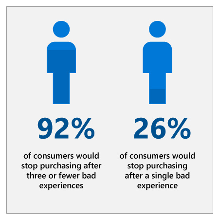

## Abstract

Our customer service organization was looking for ways to meet the ever-growing expectations of our customers at scale. We identified that AI could help us create a better service experience by equipping our agents with predictions and recommendations, surfacing new insights from customer feedback, and streamlining our customers’ self-service experience. Since implementing these solutions, case resolution has sped up dramatically and customer satisfaction scores have increased by nearly a third.

Learn about how we incorporated AI into our customer service processes and consider how AI could transform your own customer service organization.

## Industry context

:::row:::
:::column span="2":::
The bar for the customer service experience is higher than ever before. And the quality of the service experience is a key factor in purchasing decisions: 92% of consumers say they would stop purchasing from a company after three or fewer poor service experiences, and 26% of those would stop after just one bad experience.1

Customers expect service that is immediate, effective, seamless across channels, and aligned to their goals. The traditional response of hiring more service agents to address this is expensive and is not scalable, in part due to the risk of inconsistent service at scale.

To deliver on customer expectations at scale, customer service organizations are looking to AI to supplement and augment the skills of their employees. Gartner estimates that 25% of all customer care and support operations will integrate AI technology across engagement channels by 2020, up from less than 2% in 2017.2
:::column-end:::
:::column span="2":::

:::column-end:::
:::row-end:::

## Microsoft context: Customer experience

At Microsoft, we’ve faced the same hurdles as many other organizations in adapting to meet the needs and expectations of today’s customers. To support our customers more effectively, we envisioned creating better self-service experiences and empowering our service agents with relevant context, insights, and recommendations at their fingertips during interactions with customers. In addition, we hoped to glean more insights from customer chat records and feedback and create processes for surfacing and acting on these insights.

Our goal was to improve customer satisfaction and retention and transform customer service from a cost center to a key differentiator, using AI to drive scale, efficiency, and insights.

## Questions

The following are questions you can use to start thinking about how to implement AI in your own customer service organization. Think critically about these questions before reviewing the executive perspective video and continuing on to the case study resolution.

### Strategy

1. How well do you understand the preferences of your customers? How will you incorporate the voice of the customer in AI planning, development, and implementation?
2. How will you prioritize competing objectives? For example, if gains in business efficiency came with the trade-off of a slightly lower-quality customer experience, would you accept that?
3. How can you use AI to better understand the customer experience and breakpoints in the customer journey?
4. Customer service is a key differentiator in consumer and business purchasing decisions. How can you use AI to differentiate from your competitors? Do you know what your competitors are doing with AI?

### Culture

1. How will you ensure buy-in from both executives and front-line service managers to ensure AI is implemented successfully?
2. How can you incorporate best practices from your frontline service agents into your AI applications?
3. How can you use data from AI to coach service agents and improve their performance?
4. A common use of AI in customer service is a chatbot, which could be perceived as a replacement for service agents. How can you frame AI as empowering your agents and augmenting their skills rather than replacing them?

### Implementation

1. Do you have the data on past customer service cases necessary to train AI models? If not, what data collection or preparation would be required?
2. AI in customer service needs to keep up with rapidly evolving product portfolios. How will you ensure that your AI solutions can learn and improve continuously?
3. How will you monitor how your AI applications are adapting to customer interactions?

## AI maturity

Depending on your organization’s level of AI maturity, your ability to implement AI will vary. We recommend that you evaluate your AI maturity by asking questions like: Is your organization an early adopter of technology or do you wait until it has matured? Do you have governance structures in place to ensure AI applications are driving towards your desired business outcomes?

Now that you understand the context of the challenges customer service organizations face today, and you’ve considered critical questions to answer before implementing AI, watch the executive perspective video with Aileen Allkins, Microsoft Corporate Vice President of Customer Service & Support.