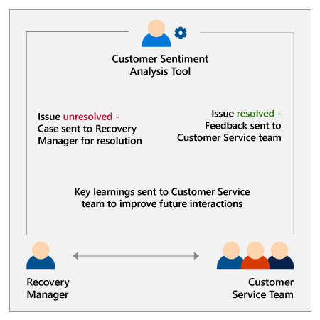
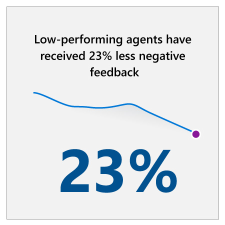

## Our approach and results

At Microsoft, we identified several areas where we could enhance our customer service organization with AI solutions. Typically, the first AI solution that comes to mind for customer service is a customer-facing chatbot. While we have implemented an AI-powered virtual agent, we continue to focus on augmenting the capabilities of our human agents with assistance from AI.

To support our agents with AI insights, we implemented two AI solutions that, respectively, predict the likelihood of case escalation and offer diagnostic recommendations. Next, to glean more insights from customer chat and feedback data, we created an AI-based sentiment analysis solution that automates processing of this data and automatically routes feedback to customer service agents and their managers. Finally, to improve self-service options for customers, we implemented an intelligent virtual agent that can answer routine questions and direct customers to self-service resources.

Read on to explore these four AI solutions in depth.

### Escalation prediction

Our customer service teams identified reducing case escalation as something that would make their lives easier and increase customer satisfaction. Our employees pinpointed several indicators that suggest a customer may escalate a case, including length of conversation and number of repeat contacts. Using these indicators, our customer service team partnered with data scientists to create a solution that predicts the likelihood that cases will be escalated. This enables agents to be proactive to prevent escalation. For instance, if an agent is aware that a case is at-risk for escalation, they can prepare for the call even more thoroughly, or pass the case on to another agent who has deeper subject matter expertise to handle the case effectively.

### Recommendation engine

Because our agents handle customer service for such a wide range of products and services, they wanted assistance in identifying what’s behind a customer’s issues. To accomplish this, our customer service team created a recommendation engine to support our front-line agents. While human agents chat with customers, machine learning algorithms run in the background to determine the probable issues the customer could be facing. Based on this prediction, the recommendation engine suggests the diagnostics from our library that should be run to determine the root cause. This speeds up case resolution and reduces frustration for our agents.

### Customer sentiment analysis

:::row:::
:::column span="2":::
It’s important to our customer service employees to hear and act on the feedback from our customers. But given the amount of feedback we receive, it would take a human 4+ years of work to read a single year’s worth of verbatim feedback for just a few of our product lines and even longer to analyze it. Meanwhile, when we have surfaced and acted on customer feedback in the past, we did so using siloed, disjointed processes and ad-hoc solutions that didn’t scale. We needed to find a better way to process and route relevant feedback from our customers so that employees could implement it at the front line.

Our customer service team partnered with data scientists to use machine learning to create a sentiment analysis tool that automates this work. It analyzes sentiment not only in customer feedback, but also in customer chat conversations. They are experimenting with analyzing sentiment in real time, which would enable us to track customer sentiment throughout their service journey and better identify breakpoints where our service didn’t live up to their expectations. If supervisors can identify breakpoints as they occur, they can intervene proactively to mitigate negative experiences.

We’ve found a set of positive and negative factors that drive sentiment: the customer service experience, product satisfaction, and company procedures and policies, among other drivers (e.g. tools, third parties, etc.). Identifying these has given us actionable insights that help us build our service experience accordingly.
:::column-end:::
:::column span="2":::

:::column-end:::
:::row-end:::

:::row:::
:::column span="2":::
Our customer service team now has two processes for acting on customer feedback. The first is the service professional feedback route, which uses our analytics tool to automatically route relevant feedback. Positive feedback is routed to our agents. 96% have found value in having this feedback sent to them. In addition, a trend analysis of customer sentiment is routed to managers, along with examples of chat sentiment outliers. Through coaching based on this data, low-performing agents have received 23% less negative feedback.

The second process is the customer recovery feedback loop. If customer feedback indicates a lack of resolution, machine learning models detect this and the case is automatically routed to a recovery manager, who researches the case, contacts the customer, and ensures issue resolution. Then, our customer service team takes the opportunity to learn why the initial interaction did not resolve the issue.

The results have been impressive: our customers are happier, and our agents are able to help them more effectively. Sentiment scores for recovered customers increased on average by 180% compared to their first interaction with support.
:::column-end:::
:::column span="2":::

:::column-end:::
:::row-end:::

### Virtual Agent

Finally, we created Virtual Agent, an AI-powered frontline agent that supports customer queries on a variety of Microsoft products, including Windows, Office, Xbox, and more. It provides customers with on-demand interactions through an AI chat experience and promptly helps users find what they’re looking for, resolves issues, and makes recommendations—all in a natural, conversational style.

We implemented the Virtual Agent in response to changing customer preferences. Customers increasingly prefer self-service for product support, with 80% of customers saying self-service is their preferred channel.3 Our self-service options were fragmented, causing customers to go through multiple channels and look at multiple pages before finding the right solution. The Virtual Agent is seamlessly integrated into self-service starting points, such as Windows Settings, streamlining and enriching the self-service experience. Offering instant support at this touchpoint is only possible through AI.

The Virtual Agent responds in different ways depending on the nature of the customer’s intent (issue): it can converse in multi-turn dialogues, offer instant answers, and surface web results from support articles and community forum threads. The queries the Virtual Agent receives are often tricky, requiring comprehension and reasoning, so we’ve customized our natural language understanding models to match the style and vocabulary of customer service interactions.

The option to chat or talk to a human agent is available throughout the chat, and at the end of the chat, the Virtual Agent asks the customer whether their problem is resolved. If it remains unresolved, we use intelligent routing based on the conversation to transfer the user to a human agent with the necessary expertise. This was something that our agents requested because it frustrates them to receive cases that they don’t have the expertise to resolve. The human agent receives all relevant context, including the customer’s entire conversation with the Virtual Agent and any support articles that the customer has been given. Because the case is directed straight to the appropriate human agent, we’ve seen a 3x decrease in agent-to-agent transfers.

As you can see, even with our Virtual Agent, empowering our employees is a priority. Since it was launched, the Virtual Agent has handled 100,000+ support cases per day on average. We’ve found that the Virtual Agent can autonomously solve 12% of chat volume, saving tens of millions of dollars and freeing up our employees’ time so that they can focus on higher-value activities that require human intelligence and ingenuity.

In addition, our customers are more satisfied, as they’ve seen increased self-help success and more effective problem resolution. Over the first nine months after the solution was implemented, the customer satisfaction scores for the top 20% of traffic (i.e. high-volume customer intents) improved by 31%. Additionally, there has been a 2x increase in self-help success and the Virtual Agent has increased problem resolution by 239% for the top 20% of traffic and 185% across all traffic.

## Applying these lessons in your organization

Our journey to transforming customer service with AI has included bumps in the road. In particular, we learned that it’s important to maintain the relevancy of AI solutions by enabling them to learn and improve continuously and by adapting how and where you use them as your business evolves. These are a few lessons from our experience that you can consider on your own journey with AI:

### Enable AI systems to continuously learn and improve

Enabling AI systems to learn and optimize for changing conditions is key to ensuring their accuracy and reliability. For example, our Virtual Agent needs to continually adapt to provide support for our evolving portfolio of products. To serve our customers well, the support knowledge base effectively needs to be updated in real time. We designed our support systems specifically for this agility, to ensure that they could learn and improve in near-real time.

### Maximize the value of your AI applications by adapting how and where you use them

You shouldn’t assume that AI implementation is done the moment you get your application up and running. As your business evolves, the first place you site your AI may no longer be the place where the application can drive the most value. You should adapt the placement and capabilities of your AI applications to match the needs of your business. For instance, we initially implemented the Virtual Agent at microsoft.support.com, but over time we found that it was not driving as much value for our customers as we anticipated. After discovering that Windows Settings is the first place many of our customers go to solve their problems, we moved the Virtual Agent directly to Windows Settings. This has aligned our application closer to the evolving needs of our customers, enabling us to get more value from AI.

### Tips from a change management perspective

Overcoming resistance and driving desire to adopt and support change are two of the most difficult things in change management. We will explore these, share some mistakes we made along the way, and connect the lessons we’ve learned to the corresponding organizational levers from Prosci’s ADKAR change management framework.

### Desire, buy-in, and the issue of “what’s in it for me”

Our customer service teams are highly skilled technical people, and they don’t enjoy wasting time on repetitive tasks. Anything that can help them is always welcome. Our top priorities were to improve the experience of our agents and help them better assist customers. According to Gabriele Masili, CTO of Customer Service and Support at Microsoft, this was always part of the design criteria for AI. Every AI application we have implemented helps make our agents better, whether that is by helping them anticipate a customer’s issue, keeping them informed on our huge product base, or providing them with customer chat history from a virtual agent. In particular, we paid attention to the feedback we receive from our employees—in the case of our recommendation engine, we even created an AI application as a direct response to requests from employees.

Keeping the needs of our customer service teams at the center of our AI strategy was instrumental in driving adoption. By making it clear that our AI applications would address their needs, we helped employees understand “what’s in it for me” and ultimately won their buy-in.

## How our learnings relate to the five organizational levers

|Organizational plans|What we did to help individuals through change and how it relates to ADKAR|
|---|---|
|Communication plan and leadership|The need for change and the value of AI for our organization were clear: with AI we could provide better service to our customers and be more efficient in doing so. Although we made the effort to communicate through the right channels and senders, we didn’t always communicate the right message.  At first, our AI messaging centered on how it would reduce the volume of calls and how the Virtual Agent would enable customers to help themselves. This message lacked an explanation of how this would benefit employees. As Microsoft Customer Service and Support CVP Aileen Allkins explained in her executive perspective video, we should have completed the message by saying, “As a result of that, we will free up capacity to do higher value activities.” Without this message, employees began to ask themselves if this AI initiative was going to take away their jobs, which created a source of resistance to change.  As you can see, the way you communicate about change is really important—and even more so if the message is coming from the leadership team (as it was in our case). It’s crucial to ensure that people understand the value that AI brings both for the organization and for themselves. That was key to enabling change.|
|Coaching plan|The sentiment analysis tool provided powerful insights on the what specifically drives positive or negative sentiment in an interaction between a customer and an agent. This has enabled supervisors to incorporate these insights into their regular coaching conversations and interactions with agents.|
|Resistance management plan|Many employees were skeptical about the quality of the information that AI solutions could provide: Could a virtual agent built on machine learning really know more than the agents themselves? They were particularly skeptical during the early stages of machine learning development, when AI did not always provide meaningful or accurate support. To help improve the quality of the AI solutions and win trust from employees, we enrolled a group of agents to help refine the machine learning models by up-voting or down-voting answers produced by the AI.|

Now that you’ve considered various aspects of what it means to have an AI-ready customer service culture, let’s wrap up everything you’ve learned with a knowledge check.