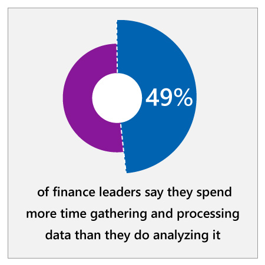

## Abstract

Microsoft’s finance organization was looking for ways to intelligently automate processes and empower employees to deliver more forward-looking insights and forecasts. We embedded AI into key finance operations processes to improve forecast accuracy, reduce strain on employees, and better predict areas of risk. These applications have saved our finance team hundreds and hundreds of hours per month, while enabling better business decision-making and risk mitigation.

Learn about how we incorporated AI into our finance processes and consider how AI could transform your own finance organization.

## Context

:::row:::
:::column span="2":::
The finance organization is at the heart of any business and plays a key role in maintaining fiscal responsibility and controlling vital functions such as budgeting and compliance. It’s essential that businesses keep finance top of mind when reconsidering business processes.

Today, finance organizations face challenges in a number of key areas. The first is the scale and growth of data. According to EY, “many finance teams are simply overwhelmed by the volume and variety” of their data: 49% of finance leaders say they spend more time gathering and processing data than they do analyzing it.1 Meanwhile, the majority of financial analysts continue to use Excel as their primary tool, but growth of data is pushing Excel to its limits. Finance organizations need to augment Excel with intelligent tools that enable them to get the most from their data.

Second, finance organizations are struggling to become more forward-looking. Finance has traditionally been conceived as a backward-looking function that deals largely with reporting the past. To become a better partner to the rest of the business, finance needs to offer forward-looking insights and projections, but many companies lack the tools to do this easily.
:::column-end:::
:::column span="2":::

:::column-end:::
:::row-end:::
:::row:::
:::column span="2":::
Third, finance organizations are dependent on manual, repetitive processes, which create opportunities for human error. These include journal entries, close processes, and reporting—crucial activities that require too much human capital today. There are huge opportunities in these areas to automate processes intelligently and ultimately increase accuracy, efficiency, and transparency.

Fourth, traditional risk management techniques are no longer adequate to address growing business complexity, new regulations, and increased financial and cybersecurity risk. For example, reliance on sampling techniques for internal controls and audits opens the door for potentially risky transactions to fall through the cracks. Because risk management is a foundational responsibility, organizations need to find strategies to mitigate risks and create more transparency in their processes.
:::column-end:::
:::column span="2":::

:::column-end:::
:::row-end:::

## Microsoft’s context: Finance operations

For Microsoft, these challenges are compounded by dramatic growth and change. Over the past decade, we have nearly doubled our revenue and quintupled our stock price, while making major changes to our business model. As our revenue grows and our business becomes ever more complex, the challenge for our finance organization has been to serve the company without increasing the number of finance personnel. This has only been possible thanks to technology and cultural shifts.

This follows a trend that analysts are seeing across organizations. According to Accenture, personnel in finance functions like compliance are staying flat, prompting Accenture to advise that finance organizations "can no longer rely on adding headcount to increase effectiveness."2

Because of the need to manage increasing complexity within our current capacity, our finance team is looking to AI solutions.

### Strategy

1. How can AI enable your finance organization to be more forward-looking with financial insights and forecasting?
2. How does your finance organization manage the growth and scale of incoming data? Do you currently have the resources necessary to effectively manage this data?
3. How can AI facilitate complicated functions like auditing and compliance in your finance organization?
4. How can AI streamline finance processes such as accounts payable and accounts receivable to improve efficiency?

### Culture

1. How does your finance organization determine business use cases for new technology like AI? Who are the crucial decision-makers?
2. What changes would need to be made to institutionalize AI? How would you integrate it into existing finance processes or alter processes to realize the full benefits of AI?
3. How can AI bridge communication gaps and relieve information request bottlenecks between finance and the greater organization?

### Implementation

1. How will you incorporate test cycles in the development and implementation process? How can you incorporate ongoing reviews to maintain accuracy and security of the AI solution?
2. What financial data silos would you need to break down to create more accurate forecasts?

## AI maturity

Depending on your organization’s level of AI maturity, your ability to implement AI will vary. We recommend that you evaluate your AI maturity by asking questions like: How much does automation play a part in your organization’s operations? How collaborative are teams in your organization when it comes to sharing data and insights?

Now that you’ve gained context on the challenges finance organization face today and considered critical questions to answer before implementing AI, watch the executive perspective video with Microsoft Chief Financial Officer Amy Hood.