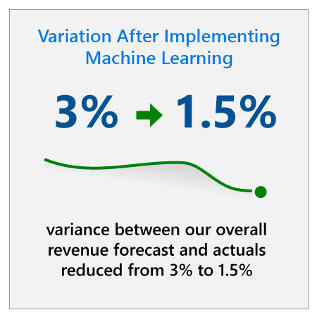

## Our approach and results

Our finance organization leveraged the expertise of our employees to identify opportunities to implement AI across the organization. From improving the accuracy of our revenue forecasts to reducing the strain on employees through automation to better predicting areas of risk, AI is saving our finance team hundreds and hundreds of hours per month, while enabling better business decision-making and risk mitigation.

## Revenue forecasting

For a company of Microsoft’s size, it has historically taken a team of one thousand people three weeks per quarter to create a revenue forecast. This team of skilled financial analysts has created highly granular forecasts, but we recognized that human bias and the disparate priorities of different teams have colored the numbers and produced larger variances between forecasts and actuals than we would like (around 2–3% variance). We also recognized that traditional forecasting methods could not take advantage of powerful new capabilities and were unable to generate predictions on demand for different users.

To help address these issues, our finance organization started using Azure Machine Learning to analyze vast quantities of data and produce a highly accurate forecast. The output was put into CommercialPredict, a Power BI–based tool that synthesizes historical data from our ERP and pipeline data from Dynamics 365 with predictions from Azure Machine Learning to create an unbiased source of truth for the entire organization.

In CommercialPredict, users can get results on demand through a centralized dashboard tailored to their role. They can also create custom views of the data to examine the details of predictions and slice across market segments, sub-segments, pricing levels, and strategic products. This functionality ultimately reduced requests for information and closed knowledge and communication gaps in the organization. For instance, sellers can see how they’re performing by area in particular SKUs and even gain insights on closing the variance between actuals and forecast. Centralizing data and providing these standard views exposes the power of machine learning algorithms to a broad audience.
:::row:::
:::column span="2":::
The results of this initiative have been dramatic. After implementing machine learning, the variance between our overall revenue forecast and actuals reduced from 3% to 1.5% and variance reduced even further in run-rate businesses where we have a greater volume of data, such as our small and medium business space. Tearing down silos provided a new level of transparency that benefits our culture.

Because our goal has been to augment traditional forecasts, not replace them, our finance team has continued to use traditional forecasting tools in parallel with machine learning. One result is that our traditional manual forecasts have improved too. Because our analysts use the machine learning forecast as an input, the variance between the traditional forecast and actuals has dropped to 2%.

The decrease in variance has improved our decision-making, and we see our forecasting as more objective and consistent. A predictive analytics model is dispassionate, so it sidesteps some of the subjective factors of manual forecasting. Working from a centralized pool of data using agreed-upon analytical methods reduces disagreement and democratizes access to accurate forecast data.
:::column-end:::
:::column span="2":::

:::column-end:::
:::row-end:::
After many quarters of running machine learning in parallel with traditional forecasting tools, we now rely almost exclusively on machine learning to lock the high-level revenue forecast, so that our analysts can focus on processes that rely on human intelligence, such as partnering with sales teams to find new revenue opportunities.

## Intelligent chatbots

Finance departments are often gatekeepers to data and insights that their business partners need to make decisions and take action. Employees all over the company have questions that finance needs to answer, many of which are standard and repetitive. Using intelligent chatbots is an efficient way to meet the demands of our internal customers and provide relief to finance, while keeping costs low.

For instance, we created a credit and collections chatbot to enable field sales, operations, and collectors to quickly and easily access the latest information about their customers. For example, they can ask for the customer’s credit limit and any overdue balance, and find out if the customer has exceeded the credit limit and has been placed on hold. As a result, we’ve eliminated finance as a bottleneck for sales teams, and accelerated sales cycles.

In another scenario, our finance operations group trained a bot to help answer the half-a-billion queries received per year about financial systems or processes. To help alleviate this pressure, we built a chatbot to resolve most of these queries at first touch, without human involvement. This chatbot has sentiment analysis capabilities, enabling us to identify and triage high-risk interactions and prioritize interactions for white-glove service. Recently we enabled Bing translation in the chatbot, so it works seamlessly in a wide range of languages, from Czech to Tagalog, which is crucial for a global organization. The chatbot not only saves the finance team hundreds of hours per month, it allows teams to engage in inter-organizational projects that benefit from their experience and knowledge and is significantly reducing support costs.

## Compliance predictive analytics and anomaly detection

A key responsibility for our finance organization is managing risk among the thousands of transactions that we close every day. We are responsible for ensuring these transactions are compliant with Microsoft internal standards and applicable regulations. When deals are audited manually, we use generally accepted sampling methods to randomly select a small group of transactions to review in detail. Any time sampling is used there is risk that some compliance issues could fall through the cracks. To improve our auditing practices, we implemented machine learning–driven predictive analytics to proactively assign a risk score to all of our transactions before they close, enabling mitigation and successful deal closure. By proactively mitigating risky transactions, finance is meeting our goal of being a better partner to the sales organization.

In addition, we are leveraging our anomaly detection capabilities to automate compliance checks in other processes including invoice approvals, purchase order setup, and GDPR compliance. In the invoice payment space, the combination of machine learning and blockchain cuts payment time down from 45 days to just minutes and enables transparency and delivery of an additional layer of assurance to our stakeholders.

## Applying these lessons in your organization

Our journey to transforming finance with AI has included bumps in the road. In particular, we’ve learned that the best ideas often come from your employees, that starting with a minimum viable product can accelerate buy-in, and that you shouldn’t think of AI applications as point-of-time solutions that will be perfect on day one. These are a few lessons from our experience that you can consider on your own journey with AI:

### Encourage employees to innovate with AI

We’ve discovered that the ideas for our most impactful application of AI have come from our employees within the business functions, not from outside or above. For instance, in finance, our compliance predictive analytics tools were developed by employees in our finance teams, not by people who had been hired as data scientists. To foster innovation, we’ve found that it’s key to provide employees with AI training and tools and to champion and reward employees who identify opportunities to resolve business challenges using AI. It may be the voice that’s not heard that has the most insights, so ensure that every employee has the opportunity to innovate with AI and share their ideas.

### Start small with simple applications to test adoption and gain buy-in

In finance, we started with simple applications like a chatbot to accomplish tasks that we knew would have a big impact. We were able to get the chatbot off the ground quickly and we saw immediately the impact it could have: it answered routine yet time-consuming questions at scale, freeing our finance employees to focus on higher-value activities. By starting with a smaller, simpler application like this, we could begin evaluating efficacy sooner, and based on the impact and success of the initial implementation, we increased buy-in among stakeholders and are able to build on the solution in the future. We have seen the benefits of starting small ourselves, which is why we advise our customers to take the same path and start with minimum viable products, rather than aiming for the moon on day one.

### Build in time for AI to learn and improve before rollout

By nature, AI is always learning and improving, so it’s best to view AI implementation as an ongoing learning exercise, rather than a fixed point-in-time solution. While your AI application might not be perfect on day one, if you enable it to learn, it will improve over time. With this in mind, you should build in time for learning before the AI application is rolled out broadly. For instance, when we started using machine learning for revenue forecasting in finance, the predictions from the models were only 60% to 70% accurate, but we knew that with continuous training the model would improve. After months of refining the models and training them weekly, accuracy rose to over 98.5%. Especially in business functions like finance, it’s key to have many review and test cycles to demonstrate the accuracy and security of the solution and to have checkpoints to monitor how your AI system is learning and adapting.

## Tips from a change management perspective

In finance, our focus was on how to foster knowledge and ability, and what needs to be in place for training to be an effective tool. A common mistake in many organizations is to think that communicating and providing high-quality training are enough to create ability. Our experience shows that for training to be effective, organizations need to first ensure that employees understand the need for change, the risks of not changing, and what’s in it for them.

### How our learnings relate to ADKAR

|5 stages of ADKAR|What factors and actions helped our people reach this stage|
|---|---|
|Awareness|We anticipated value from implementing AI in our finance organization, but we did not have a vision for how to leverage it, in part because machine learning was still very new at the time.  As a finance organization, we’ve always encouraged our people to learn new technologies, and machine learning was no exception. We partnered with a recognized expert from our Azure Machine Learning team to design a set of talks and trainings to help our people understand machine learning, including an introductory talk called Demystifying Machine Learning. These sessions were recorded and made available to everyone in our worldwide organization.  Having a better understanding of the value of machine learning and how we could apply it to transform our organization was a catalyst to gaining awareness. We learned that although machine learning has great potential, it’s not magic—a simple lesson that helped us set the right expectations for how long it would take to develop machine learning applications. We also learned how to work with data scientists, and together these lessons created the right conditions for our organization to continue along the learning path.|
|Desire|We knew from the start that we didn’t want AI to replace people. Instead, we wanted AI to reduce the amount of time individuals spent on time-intensive tasks like forecasting, so that they could dedicate more time to higher-value responsibilities. Conveying this intention clearly was a key step to overcoming resistance.  When deciding what our first AI use cases should be, we focused on a task that no one in finance loves: forecasting. This meant that people could stop dedicating time to this time-consuming task that they didn’t enjoy. This provided a good incentive for our people to participate; the “what’s in it for me” was very clear.  Finally, our people worked closely with data scientists to create machine learning models that would best suit their needs, which created a sense of ownership that reinforced their desire to implement this change.|
|Knowledge|Once we had a better understanding of the value of machine learning and had built desire in our teams, we needed to provide them training. After the initial training with our Azure ML expert, Demystifying Machine Learning, we implemented two more pieces of training: a deep introduction to forecasting and a hands-on learning module. After taking these trainings, our people had the knowledge to start designing their own forecasting models.|
|Ability|Ability was developed with time, not only because machine learning needs to learn to become more accurate, but also because the teams themselves needed to learn through practice. The key to building ability was providing people time and support to learn the system and train it to be more accurate. In the beginning, the predictions from the machine learning models were only 60% to 70% accurate. Rather than writing off the application as a failure, we encouraged our team to learn from the initial results and refine and train the model. After months of work to improve the model, accuracy rose to over 98.5%.|
|Reinforcement|Although these efforts were a little disjointed at first, machine learning is now seamlessly integrated into our process and workflow and available to finance people worldwide. Analysts can do their own forecasting and test their models. Now people are constantly seeing value, achieving progress and results, and experimenting without negative consequences—this is a fantastic combination to reinforce the use of AI.|

Now that you’ve considered various aspects of what it means to have an AI-ready culture, let’s wrap up everything you’ve learned with a knowledge check.