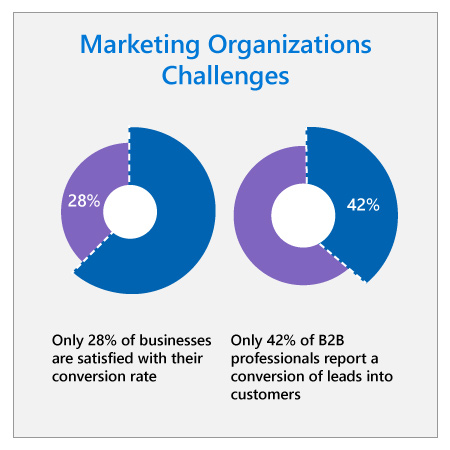

## Context

:::row:::
:::column span="2":::
Marketing faces unique challenges in today’s business environment. While marketers are exceling in generating leads (a key performance indicator), conversion of leads to sales remains low. Only about 28% of businesses are satisfied with their conversion rate,1 and 42% of B2B professionals identify converting leads into customers as their biggest lead generation challenge.2

In part, this may be because sellers today have low confidence in marketing leads, which makes them less likely to act on them: a survey by CEB showed that sellers are only 45% likely to pursue a lead referred by a marketing demand generation program.3 Low confidence is typically driven by past experience with marketing leads. If a seller has had multiple experiences where they’ve contacted a marketing-qualified lead only to discover that the contact information was fake or the lead had no interest, that seller will be reticent to continue pursuing unproductive marketing leads.

It’s no surprise then that lack of alignment between sales and marketing is widespread. Only 46% of organizations say that their sales and marketing functions are aligned.4 And the challenges that prevent alignment are telling: 43% of B2B professionals cite lack of accurate/shared data on target accounts and prospects as their biggest challenge in aligning marketing and sales.4 Clearly, creating a source of accurate, nuanced data on lead quality that both sales and marketing can trust is key to driving alignment and ultimately increasing conversion and revenue.
:::column-end:::
:::column span="2":::

:::column-end:::
:::row-end:::

## Microsoft context

At Microsoft we face many of these same challenges. Although our engagement programs were surfacing plenty of leads, our conversion to sales remained on par with industry benchmarks and we felt that we could do better. Our marketing teams were looking for ways to make better use of our data in identifying and qualifying leads so that we could filter and prioritize them before they are sent to sales to reduce the amount of time sellers spend contacting unproductive leads. By improving marketing lead qualification, we hoped to create a robust foundation for better alignment between marketing and sales.

In short, we face the same challenges as any other marketing organization and we’ve found that we can address many of them with strategic implementation of AI.

## Questions

The following are questions you can use to start thinking about how to implement AI in your own marketing organization. Think critically about these questions before reviewing the executive perspective video and continuing on to the case study resolution.

### Strategy

1. What are the most time-consuming activities for your marketing employees? How could you use AI to augment your employees’ capabilities and skills in these areas?
2. How can you improve existing marketing and lead qualification processes with AI?

### Culture

1. How can you reassure your marketing employees that AI will augment their skills (e.g. help them surface more and better leads), not eliminate their roles? How will you mitigate concerns around this?
2. How will you ensure that the voices of all your marketing employees are heard in developing and implementing AI? How will you empower your marketing employees to develop innovative AI use cases?
3. What changes would need to be made to institutionalize AI? How would you integrate it into existing processes or alter processes to realize the full benefits of AI?
4. How could you improve engagement with other organizations like sales through improved or streamlined processes?

### Implementation

1. Who from your marketing organization can lead the design and implementation process? What other organizations will you need to collaborate with to develop and implement AI (e.g. sales, IT)? Do you currently have the expertise in house to develop and implement AI? Is any special expertise required?
2. What data preparation would be required to implement AI in marketing? What marketing processes need to be changed to ensure data integrity into the future?
3. How will you handle change management to ensure that marketing employees understand, trust, and adopt new processes? What risks do you anticipate in implementing and institutionalizing AI applications? How can you mitigate them?

## AI maturity

Depending on your organization’s level of AI maturity, your ability to implement AI will vary. We recommend that you evaluate your AI maturity by asking questions like: Does your organization have experience in implementing and maintaining data-focused digital platforms? When it comes to content, is your organization largely digital or still paper-based?

Now that you’ve gained context on the challenges marketing departments face today and considered critical questions to answer before implementing AI, watch the executive perspective video with Microsoft Chief Marketing Officer Chris Capossela.