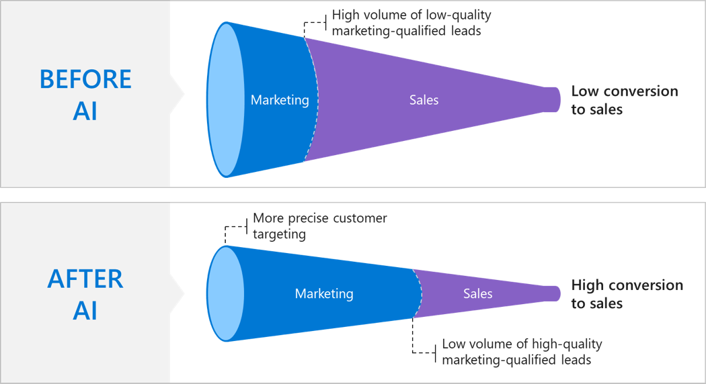

## Our approach

Our marketing organization’s aim is to be agile and responsive to different markets, collaborate effectively across departments, and be model corporate citizens. In particular, our goal is to be a great partner to the sales organization by providing the best leads possible in order to improve conversion rates, accelerate sales cycles, and improve seller efficiency.

One of the ways we have done this is by looking for ways to improve lead generation processes through the Global Demand Center, our globally scaled customer acquisition and engagement marketing engine that handles millions of leads per year. The Global Demand Center starts the acquisition process by generating leads through events and gated content, such as e-books and whitepapers. Leads are placed in personalized engagement programs and then we score them to determine which leads are ready to talk to a seller and which sales channel is appropriate, whether Inside Sales, a partner, or managed account sales.

Our marketing teams identified several points in this process where AI could have significant impact on marketing effectiveness and outcomes.

## Intelligent lead scoring and qualification assistance

First, we wanted to identify and eliminate leads with fake names or invalid contact information, which accounted for around 12% of the leads we were sending to sales. We saw this as an opportunity to combine the expertise of our employees with AI tools. We built a system to identify such leads based on rules created by our employees and then augmented it with machine learning, which is ideal for capturing various types of keyboard gibberish. Machine learning trains our model and, as new data enters the model, the algorithm accurately predicts which leads are fake—saving our sellers valuable time and reducing frustration.

Next, we implemented machine learning–driven lead scoring. Marketing employees partnered with a team of data scientists to create machine learning models that weigh thousands of variables to score our leads. This initiative brought together our marketing employees’ knowledge on lead quality and the desired business outcomes with the machine learning expertise of our data scientists. The lead score helps us predict the probability that a lead will convert with any given sales channel so we can send the lead to the channel with the best probability. This not only helps us increase our conversion rates, it also ensures that we are engaging with customers in the way that serves them best based on their needs.

Leads are then rescored in real time after every new activity, and there are multiple models, optimized for different geographies and products. Importantly, the models are self-learning, adjusting for changing conditions.
:::row:::
:::column span="2":::
Since a lead score is just a prediction of the customer’s likelihood to convert, we wanted to find a way to confirm each customer’s interest to ensure that we send only the best possible leads to sales. We created an AI-based lead qualification assistant that emails customers to determine interest. When the customer responds, the assistant uses natural language processing to understand the customer’s intent, classifying leads as "interested", "not interested", or "hot". The assistant even understands when the customer actually needs support help and classifies the lead accordingly. The assistant is very valuable in identifying what we call “diamonds in the rough,” leads that we deemed low propensity but express interest to buy, and “fool’s gold,” leads that were scored as hot but were found to be uninterested.

The lead qualification assistant has also been implemented after a marketing-qualified lead has expired. The assistant emails the lead again to reevaluate interest, preventing interested customers from falling through the cracks. Earlier this year, after the assistant reached out to an expired lead, the customer expressed interest, leading to a $250,000 sale.
:::column-end:::
:::column span="2":::

:::column-end:::
:::row-end:::
Following qualification, marketing hands off the lead to the appropriate sales channel with the entire email conversation, which provides valuable context. For instance, if the customer expressed interest in getting more technical details in their response to the bot, the seller can bring a technical specialist to their very first conversation, accelerating the sales cycle.

## Account-based marketing recommendations

We have also incorporated AI into our account-based marketing sales motion. First, we create a list of targeted accounts for a given service or sales play based on criteria such as company attributes, lead job titles, past purchases, and other signals. Then, we do demand generation using paid media, webinars, and other content to drive leads to the Global Demand Center. Next, we use AI-based account scoring models to detect marketing surges on an account based on type of engagement and recency of engagement. Accounts and leads within those accounts are stack-ranked by this score and the accounts deemed likely to buy are surfaced to sellers.

Because this is an entirely new sales motion for us, it was important that we seamlessly embed it into the processes and applications currently used by our sellers. To that end, the account-based marketing recommendations are integrated into an AI-based guided selling application called the Daily Recommender. The Daily Recommender enables sellers to drill into the individual leads for the account and access custom sales enablement materials that they can use at every step in the sale, from seller-facing preparation content to personalized email templates to pitch decks.

## Results

With these applications of AI in our marketing function, we are making great headway on our mission to be a better partner to sales and provide the best leads possible. Using AI to eliminate fake leads, we decreased the number of non-workable leads sent to sales by two-thirds. What’s more, the rate of conversion of marketing-qualified leads to sales-qualified opportunities more than doubled, increasing 108% year over year. Combined with accelerated sales cycles, this contributed to improved seller efficiency and ultimately an increase in the sales quota to reflect the greater scale that sellers can now achieve.

But this initiative wouldn’t have been successful without cultural changes. When implementing the lead scoring platform, we needed to ensure that it was trusted and adopted by both the marketing and sales teams as a single source of truth on lead quality. The teams can now have robust discussions of their objectives using shared data, so conversations are less driven by human bias and rule-of-thumb strategies. For instance, marketing can say, “we can give you two thousand more leads with a 2% drop in conversion rate, or we can give you seven hundred more leads with only a 1% drop.” This enables marketing and sales to align on strategic decisions and ultimately be more effective.

## Future steps in AI adoption

Our marketing team’s journey with AI is not over; we will continue to evolve our business processes over the coming months and years. First, our marketers are trying to improve the customer journey with machine learning–enabled hyperpersonalization. By using AI models to predict what content customers need most at any given point in their journey, we can create a more dynamic, tailored customer experience. Next, we want to be a better partner to the sales and support organizations by expanding the capabilities of the lead qualification assistant. We want to enable the assistant to do triage (e.g. routing customers to support, if that’s what they need), to go further into qualification of leads, and to take care of administrative tasks like scheduling to make the handoff to sales as efficient and frictionless as possible. Finally, we would like to expand our ability to predict the lifetime value of each lead, enabling sellers to better prioritize and prepare for sales conversations. These are just some of the ways we’re looking at expanding our use of AI in marketing—we’ll continue to experiment with how AI can help transform our processes and solve business problems.

## Applying these lessons in your organization

Our journey to transforming marketing with AI has included bumps in the road. In particular, we learned the importance of ensuring both that AI is working from accurate data and that it is making the right inferences from that data. These are a few lessons from our experience that you can consider on your own journey with AI:

### Prepare your data before implementing AI and adjust your data practices over time

We found that it’s important to ensure that data is clean and that there are processes to keep it clean before getting started with AI implementation. That said, organizations should acknowledge that they are likely to overlook things in their data preparation and that they will need to adjust data practices over time to keep AI applications functioning optimally. When we started building out our lead scoring platform in marketing, despite everything we did to prepare our data, our models were giving us nonsensical results. From looking at our CRM, we discovered that this was because our sellers were entering inaccurate data for why they were disqualifying leads. We had to partner with sales to train the sellers to provide accurate data to ensure our models could function properly.

### Monitor how AI is learning and adapting to mitigate unintended consequences

By definition, AI will adapt and change over time. We have found that it’s important to monitor AI solutions to ensure they are not making and learning from counterproductive inferences. For example, our lead scoring tool was consistently ranking leads from a particular online sales contact form as a low priority. Investigating further, we found that this was actually because customers were often misusing the form to ask for support help, meaning that it yielded relatively few sales. The AI solution learned from this trend and deprioritized all leads from this source accordingly—leaving some interested customers to slip through the cracks if seller capacity was stretched thin. By monitoring the trends we were seeing in the AI solution, we were able to identify an opportunity to improve our process and better serve customers.

### Tips from a change management perspective

This case illustrates one of the key pillars of an AI-ready culture: the importance of creating an empowering and inclusive environment that enables cross-functional, multidisciplinary collaboration. Rather than focusing on change management concepts at large, we will focus on two factors that have been central to fostering collaboration: leadership and an internal performance recognition and reward system that incentivizes maintaining a growth mindset.

### Why collaboration was vital

As discussed in the case study above, we saw an opportunity to improve our lead scoring system with AI and we knew this would only be possible using quality data. While the lead scoring models fell under the jurisdiction of our marketing department, it was our sellers who were providing the data that fed into the models, so collaboration with the sales organization was key.

### The role of leadership in paving the path

Over the past several years, the leadership teams in both sales and marketing have worked to enable highly seamless and natural collaboration between their teams. Prior to this effort, the Inside Sales teams had been very fragmented; they had different tools and processes, and they lacked a clear collaboration mindset. Leadership made a strategic decision to create better alignment between sales and marketing through an organizational change initiative. Leadership and front-line managers from both sales and marketing started crossing the aisle to collaborate with their counterparts, and together they put in place new goals, SLAs, KPIs, governance, and processes that facilitate alignment. By the time we started working with AI, there was enough alignment between the two organizations to tackle the project, and sponsorship was instrumental in maintaining alignment and providing the right resources and encouragement.

### How Microsoft’s growth mindset and performance recognition and reward system are reinforcing collaborative behavior

Another very important element in forging collaboration is Microsoft’s “growth mindset,” which has been a key piece of our own cultural transformation. Our growth mindset promotes the desire to learn and embrace challenges, seeing failures as essential to mastery, learning from feedback, and finding inspiration in others’ success.

We have integrated our growth mindset into our performance recognition and reward system. We recognize and reward employees based on activities that reflect the growth mindset, including:

* Individual accomplishments that contribute to team business or customer results
* Contribution to the success of others
* Their results that build on the work, ideas, and effort of others

Realizing that we could have a greater impact on the work of others and also that we could leverage what others are doing helped a great deal in bringing us together. By incentivizing these behaviors in various ways, the performance recognition and reward system reinforced our willingness to sustain such behaviors, which has made continuous collaboration a reality.

We designed our AI applications to contribute to these same activities that we reward and recognize our employees for:

* The lead scoring system enables individual marketing employees to accomplish more
* It contributes to the success of others by serving sales teams more effectively
* It builds on the work, ideas, and effort of others in that marketing employees needed to partner with data scientists to get the desired results

As you can see, because our AI solutions are built on the same collaborative principles that we recognize and reward our employees for, our entire company is able to achieve more with AI.

Now that you’ve considered various aspects of what it means to have an AI-ready culture in marketing, let’s wrap up everything you’ve learned with a knowledge check.