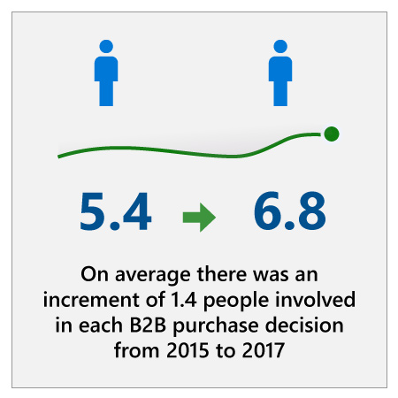

## Context

:::row:::
:::column span="2":::
Sales organizations have more tools and customer information at their fingertips than ever, but they struggle to make this data accessible and turn it into actionable insights. The challenge is to use this data to understand customer behavior so that each seller can deliver the right message to the right customer at the right time—at scale.

In addition, sales organizations are struggling to adapt to the changing sales journey. For instance, there are now more decision-makers and influencers involved in a typical sale. CEB has found that there are now an average of 6.8 people involved in each B2B purchase decision up in 2017 from 5.4 in 2015.1 Moreover, decision-makers and influencers are more informed and prefer to do their own research before they engage with a sales representative. With so many stakeholders in play, each more informed than ever before, it’s essential that sellers identify the most engaged contacts and key influencers on an account and know exactly what matters to them.
:::column-end:::
:::column span="2":::

:::column-end:::
:::row-end:::

## Microsoft context: Sales enablement

At Microsoft, these challenges are compounded by a number of factors, not least of which is our transformation from a company that sells licenses and products to one that sells services. With this transformation, our sales processes and competitor landscape have changed dramatically.

The cloud is one of our most competitive areas and one where we are seeing significant pressure to grow through both net-new and increased consumption. Our sellers are making more calls than they used to, which means they’re spending a lot more time preparing for calls with research and analytics and ensuring data hygiene.

In addition, our sellers deal with a much larger suite of services compared to other companies, even other enterprise leaders. With so many services available to pitch to customers, there is a tremendous need for automated recommendations to ensure that sellers are promoting the right services. Moreover, customers come prepared with plenty of research before making a technology stack decision and often don’t engage with a seller until they are close to 60% of the way through their buying journey. This means sellers need to have the right technical understanding of each service so that they’re prepared to establish their relevance by having in-depth conversations from day one. Supporting sellers with robust learning and readiness content is a challenge.

Finally, we identified that we were missing an opportunity to implement centralized governance around lead targeting criteria and thereby align our sellers around a single source of white space that can be quality controlled, governed, and continuously measured.

## Questions

The following questions can help guide conversations both internal and external about implementing AI in your sales organization. Think critically about these questions before reviewing the executive perspective video and continuing on to the case study resolution.

### Strategy

1. What are the most time-consuming activities for your sales employees? How could you use AI to augment your employees’ capabilities and skills in these areas?
2. Which stakeholders do you need to gain buy-in from to implement a sales AI initiative? Which scenarios provide a convincing business case and are great candidates for AI?

### Culture

1. How can you use AI to increase sales team satisfaction and decrease frustration?
2. How will you ensure the voices of all your sales employees are heard in developing and implementing AI? How will you empower your employees to develop innovative AI use cases?

### Implementation

1. What will you need to do to ensure that sellers trust and adopt the AI applications that you implement? How can you design the implementation process to cause the least disruption possible to sales operations?
2. What sources of information do you need to aggregate to build a more comprehensive view of your customers? Is this data currently siloed? How can you maintain unified data into the future?

## AI maturity

Depending on your organization’s level of AI maturity, your ability to implement AI will vary. We recommend that you evaluate your AI maturity by asking questions like: Is your organization an early adopter of technology or do you wait to implement technology after it has matured? Do you have governance structures in place to ensure AI applications are driving towards your desired business outcomes?

Now that you understand the context of the challenges sales organizations face today, and considered critical questions to answer before implementing AI, watch the executive perspective video with Jean-Philippe Courtois, Microsoft Executive Vice President and President, Global Sales, Marketing, and Operations.