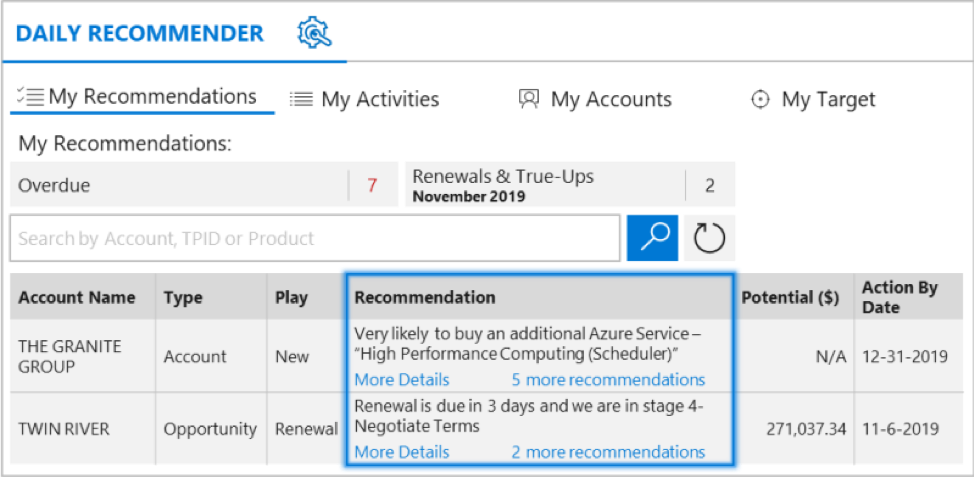
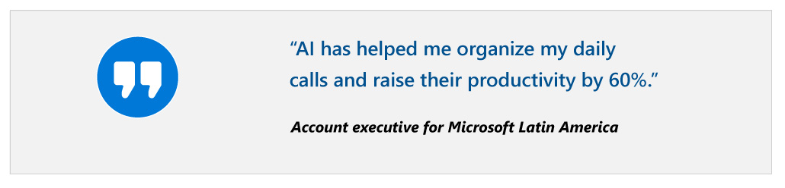

## Our approach

We knew that AI could help our sellers generate new business pipeline, pitch the right services at the right time, and streamline their call preparation so they could spend more time bringing value to our customers. But we also knew that we would need to address challenges within our sales culture and habits to sustain the long-term benefits.

We implemented an AI-based guided selling application, the Daily Recommender, which provides sellers with data-driven insights and actionable product recommendations to help attain quota, resulting in higher conversion rates and increased seller productivity.

Daily Recommender harnesses our data to predict the likelihood for a customer to buy products, consume services, and churn. Recommendations based on the AI predictions are then curated and presented to sellers in a contextually relevant manner, connected to our sales plays, processes, and strategies. Sellers can take action on recommendations within the app (actions include accept and make a call, snooze, and delete)—each action feeds into a supervised learning process that enables the AI to improve over time. Daily Recommender helps sellers become more targeted, increasing the conversion rate. It also reduces seller preparation and analysis time and facilitates consistency across the salesforce by providing seller-facing call preparation content and readymade customer-facing content, including case studies and email templates.

To realize the full benefits of AI, we needed to ensure that the Daily Recommender would be adopted by our full salesforce, a diverse group of sellers who were reluctant to depart from their existing sales tools and methods. With this in mind, we executed an enterprise-grade enablement strategy that focused on sustained behavioral change rather than short-term training.

This included:

1. Driving commitment within our sales team to use Daily Recommender as the gold standard application for discovery of new business
2. Ensuring the underlying AI and application would fit seamlessly into sellers’ day-to-day operations, sales processes, and daily business strategies
3. Implementing AI quality control and governance to further build seller trust
4. Instituting processes for measuring adoption so that we could intervene in areas of low adoption

There’s a lot that goes into transformation with AI. Developing effective AI that could accurately predict customer behavior and offer useful recommendations was highly complex. But that was just the start. Our transformation was as much dependent on strategy, people, processes, and IT, as it was dependent on AI.

## Results

:::row:::
:::column span="2":::
The results have been impressive: sellers have reviewed over 40,000 recommendations and we’ve seen a 4x improvement in recommendation success, raising the recommendation-to-opportunity rate to 40%. This means that for every five recommendations a seller acts on, two will become serious opportunities for a sale. This is significantly higher than the rate we saw with historical business rule–based targeting recommendations, which had a yield of about one in ten. In addition, the Daily Recommender has accelerated the sales cycle. Because sellers have more relevant discussions with the customers from day one, discovery efforts are accelerated. And finally, sellers are spending less time on call preparation. According to an account executive for Microsoft Latin America, “AI has helped me organize my daily calls and raise their productivity by 60%.”
:::column-end:::
:::column span="2":::

:::column-end:::
:::row-end:::

## Applying these lessons in your organization

Our journey to transforming sales with AI has included bumps in the road. In particular, we learned that buy-in from leadership is essential from day one and that in considering AI use cases organizations should find balance between what could drive the most value for their organization with what is feasible given their organization’s level of AI maturity. These are a few lessons that we learned that you can consider on your own journey with AI:

### Establish an end-to-end AI strategy supported by leadership and first-line managers

To enable true transformation with AI, we’ve found that is not enough to implement technology and wait for transformation to occur. AI transformation won’t happen on an individual basis; it needs to be part of a broader cultural shift. And both leadership and first-line managers need to drive that shift. In our own transformation, we found that the tone at the top was paramount to enabling transformation—our leaders needed to be invested and passionate. Executive sponsors should not just sign off on AI initiatives, but drive them forward, ensure they’re funded, keep them on track, and demonstrate their passion for achieving the outcome. That said, first-line manager buy-in is just as essential. Particularly in sales, where we needed to roll out new processes to a global salesforce, first-line managers were key to ensure adoption and change the culture at the day-to-day level.

### Focus on where AI can drive the most value

We could have started with dozens of separate AI initiatives, but we chose to start with only the ones that we knew would have a strategic impact. For example, in sales, we focused our energy on creating a robust Daily Recommender system, because we knew that augmenting the skills of our sellers would have the greatest impact. With all the pressure on enterprises to invest in AI, it’s easy to get caught up in the flurry of possibilities and spread resources too thin by investing in too many applications at once. Organizations should take a more strategic and holistic approach to AI by considering how AI can address the biggest risks, challenges, and opportunities in their organizations.

### Narrow your technology implementation to match your AI maturity

We have a framework that we use for thinking about the AI journey, both for ourselves and for our customers. We believe that for most companies it makes sense to start with low- to no- customization AI solutions, like SaaS applications that are enriched with AI. Then, if a company discovers that it has unique data and needs that can’t be met by a SaaS application, it can use AI “accelerators,” tools that facilitate faster and easier AI development. Finally, when companies truly need to create custom AI models to unlock deep AI capabilities, they can develop fully custom AI using platforms like Azure AI Platform. Our journey to applying AI in sales followed this framework closely. First, we adopted SaaS solutions from Dynamics 365, and while these largely met our needs, we needed to make a few customizations to meet our specific requirements. We recommend taking full advantage of existing SaaS applications and considering your organization’s AI maturity and the prerequisites of your desired AI use cases before pursuing a more custom solution.

### Tips from a change management perspective

This case is a good example of how sponsorship, coaching, and effective communication with employees can help generate awareness, drive desire, and overcome resistance. It also illustrates how the basic change management principles play out and why we need to keep them in mind when preparing for and managing change.

## How our experience relates to the seven basic change concepts

|Change concepts|What we learned and applied along the way|
|---|---|
|Senders and receivers|As part of our journey, we discovered that the sender of a message is an important factor in how that message is received. For instance, if the message conveyed business value, employees understood and received it better if it was sent by the leadership team. Whereas a message conveying how changes could affect the daily lives of people was better received if it came from front-line managers and supervisors.|
|Resistance|There were two main sources of resistance. The first was that, because machine learning models require learning, they are not perfectly accurate on day one. This inspired push-back against AI implementation from some people. The second source of resistance was concern that AI solutions could replace people’s jobs or that it would be an overly radical change in what they do.|
|Value systems|Our sales organization is constantly evolving to adapt to the new products and technologies that we are providing in the market. Our business models and sales processes have also been significantly affected by the cloud. This has created the perception among sales teams that anything can happen at any point in time. Consequently, there is frequently no incentive to resist change. What sense does it make to oppose it if it’s going to happen anyway? Peer pressure and the history of our sales organization favor an unresisting attitude.|
|Authority for change|As stated earlier, leadership and sponsorship were key in promoting AI adoption. Our executive sponsors did not just sign off on AI initiatives, but rather played an active role in driving them forward by ensuring they were funded, keeping them on track, supporting teams through the process, and demonstrating their passion for achieving the outcome.|
|The right answer is not enough|As we found out through this project, it is not enough to implement technology and wait for transformation to occur. In our case, both leadership and first-line managers were key in generating commitment and buy-in from those involved in and impacted by the change.|
|Radical vs incremental change|When thinking about the best approach to favor AI adoption, we could have started with dozens of separate AI initiatives. This would have required a greater effort in creating buy-in and acquiring the necessary skills, and we probably would have had to deal with more resistance. Instead, we chose to start with only those AI initiatives that we knew would have a strategic impact, demonstrate the value of AI, and therefore engender desire to implement new AI tools.|
|Change is a process|We could clearly see that each person’s journey through change is different and may require different things at different times. Some people were early adopters, while others were more skeptical and required proof before moving forward. For the latter group, we created a test lab that helped demonstrate the value of our lead scoring tool. Being able to see the value firsthand was key in encouraging their willingness to participate and adopt the AI solutions.|

## How our learnings relate to ADKAR and the five organizational levers

|Organizational plans|What we did to help individuals through change and how it relates to ADKAR|
|---|---|
|Communications plan|Given the size of our sales organization, our initial approach was to use email as our primary communication channel. However, we soon discovered that emails alone, even if they came from the top management, were not enough to move people forward. To address this, managers themselves started participating in the communication strategy. Moreover, we used several other channels to encourage participation and share progress, including newsletters and all hands meetings. Importantly, we realized that face-to-face communication, either in on one-on-ones meetings or in smaller group sessions, was very effective both in discovering people’s real needs and concerns, and in making them understand the change and how they could benefit from AI. This created awareness, nurtured desire, and helped manage resistance.|
|Sponsorship roadmap|Our leadership team was committed and engaged from day one. They were true evangelists of these initiatives and, as discussed above, they provided support in every possible way. Our leaders constantly communicated the value of AI for the organization and explained the need for change, which was key to generate awareness and reinforce the change.|
|Coaching plan|Firstline managers were key to ensure adoption and to change the culture at the day-to-day level. We realized that to get front-line sellers’ buy-in and commitment, we had to enable managers first. By helping managers understand AI solutions and the change process itself, we enhanced their ability to coach their teams through the change process, at all levels.|
|Resistance management plan|There were two key steps to overcoming resistance and driving desire. First, we realized that the best way to get buy-in from sellers was to make them feel like owners of the AI solutions. We achieved this by enabling sellers to participate in the process of creating the AI solutions and giving them a voice to share their needs. Secondly, we formed a group to champion the use and value of AI. This group was made up of experienced users, frequently from the early adopters group. Their knowledge, ability to set realistic expectations on AI, and consequent ability to influence others were paramount in managing resistance.|

 Now that you’ve considered various aspects of what it means to have an AI-ready sales culture, let’s wrap up everything you’ve learned with a knowledge check.