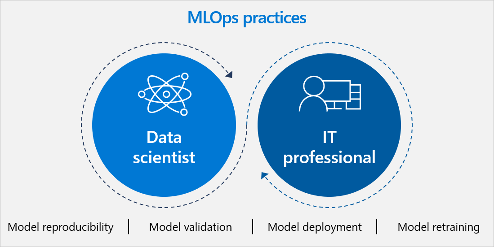
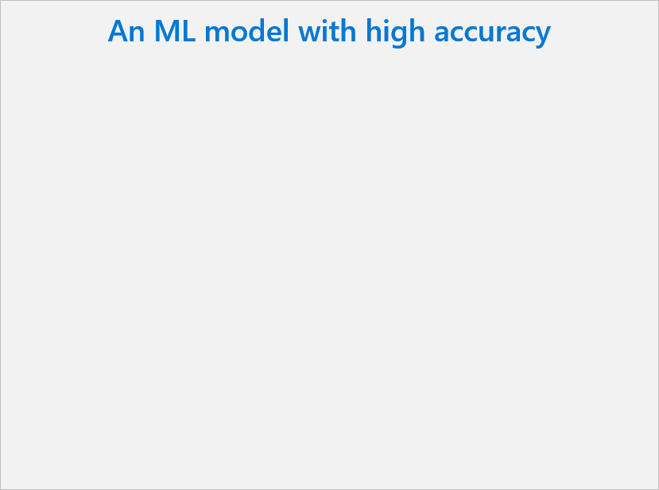
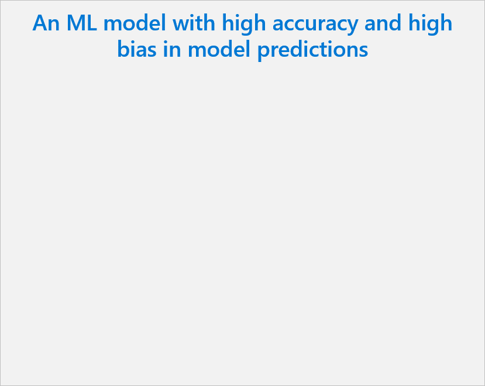

In this unit, we discuss the importance MLOps. MLOps is the practice of collaboration between data scientists, ML engineers, software developers, and other IT teams to manage the end-to-end ML lifecycle.

Companies don't have to build an ML model from scratch. They can purchase products that have AI baked in or use out-of-the-box models like Azure Cognitive Services. For the purposes of this unit, we focus on the lifecycle of a "custom" model built from the ground up, or one built using a pre-trained model as a starting point.

This is the first part of a two-part unit on MLOps. In the following unit, we discuss how MLOps practices help businesses manage, monitor, and retrain models over time.

## ML challenges

As more organizations experiment with AI, they find that creating a machine learning (ML) model is just the first of many steps in the ML lifecycle.

Managing the entire lifecycle at scale is complicated. Organizations have to be able to document and manage data, code, model environments, and the machine learning models themselves. They need to establish processes for developing, packaging, and deploying models, as well as monitoring their performance and occasionally retraining them. And most organizations are managing multiple models in production at the same time, adding to the complexity. All of this is challenging due to lack of:

* **Cross-team alignment:** Siloed teams impede workflow alignment and collaboration.
* **Standard, repeatable processes:** Without automated and repeatable processes, employees have to reinvent the wheel each time they create and deploy new model.
* **Resources:** Large amounts of time and personnel are required to manage the lifecycle.
* **Auditability:** It can be difficult to ensure that models meet regulatory standards and performance thresholds over time.
* **Explainability:** Black box models make it difficult to understand how the model works.

These challenges are similar to what application development teams face when creating and managing apps. To help, they use DevOps, the industry standard for managing operations for an app dev cycle. To address these challenges with machine learning, organizations need an approach that brings the agility of DevOps to the ML lifecycle. We call this approach MLOps.

## Typical ML lifecycle

1. **Train and test:** First, data scientists need to prepare training data. This is often the biggest time commitment in the lifecycle. Preparation includes standardizing the data so it's in a usable format and identifying discrete "features" or variables. For example, to predict credit risk, features might include customer age, account size, and account age. Next, they apply algorithms to the data to "train" a machine learning model. Then they test it with new data to see how accurate its predictions are.

1. **Package:** ML engineers containerize the model with its environment, which means creating a docker container for the model to run in with all its dependencies. The model environment includes metadata like code libraries that the model needs to execute seamlessly.

1. **Validate:** At this point, the team evaluates how model performance compares to their business goals. For example, a company might want to optimize for accuracy over speed in some cases.

   * **Repeat steps 1-3:** It can take hundreds of training hours to find a satisfactory model. The development team may train many versions of the model by adjusting training data, tuning algorithm hyperparameters, or trying totally different algorithms. Ideally the model improves with each round of adjustment. Ultimately, it's development team's role to determine which version of the model best fits the business use case.

1. **Deploy:** Finally, they deploy the model in the cloud (often through an API), on an on-prem server, or at the edge on devices like cameras, IoT gateways, or machinery.

1. **Monitor and retrain:** Even if a model works well at first, it needs to be continually monitored and retrained to stay relevant and accurate.

## Business value of MLOps

MLOps is the practice of collaboration among data scientists, ML engineers, app developers, and other IT teams to manage the ML lifecycle. MLOps processes and tools help those teams collaborate and provide visibility through shared, auditable documentation. MLOps technologies provide the ability to save and track changes to data sources, code, libraries, SDKs, and models. These technologies can also create efficiencies and accelerate the lifecycle with automation, repeatable workflows, and reusable assets. 

### Model reproducibility

During initial iterative training and later model retraining, there are a few things that can make the complex process more manageable.  

First, it's helpful to centrally **manage assets** like environments, code, datasets, and models so teams can share and reuse them.

* **Model registry:** As teams experiment with different versions of a model, a model registry provides a central place to save each version. With a registry, teams can easily revert to a previous version if something isn't working, even after the solution has gone into production. The model registry also serves as an audit trail for each model's history and makes it possible to automatically trigger workflows after certain actions or events.
* **Code management:** Technical decision-makers will need to determine which technologies and processes their teams will use for code management. This generally includes code repositories like GitHub where code can be saved, versioned, shared, and reused. It also includes tools for using and versioning code libraries, notebooks, and software development kits (SDKs).
* **Dataset management:** We also recommend saving training datasets centrally. This way, teams can reuse them, share them with colleagues, or monitor how they change over time in order to manage drift.
* **Shared environments:** Create model environments that can be shared among individuals. This simplifies the handoff between steps in the model creation process and makes it possible for teams to collaborate on certain steps.

Second, we recommend creating **machine learning "pipelines."** Pipelines are independently executable workflows of complete machine learning tasks (such as data preparation, training configuration, training processes, and model validation). Having independent steps saved to a pipeline allows multiple data scientists to work on the same pipeline concurrently. Additionally, when data scientists need to go back and make changes to their work, they can start from where the change needs to occur instead of going back to the beginning. This helps them avoid running costly and time-intensive steps like data ingestion again if the underlying data hasn't changed.

### Model validation

Before a model is deployed, it's critical to validate its performance metrics against the business use case. For example, perhaps you designed a model to predict patient health. As a healthcare provider dealing with life and death situations, you likely prefer to have false positive diagnoses rather than an incredibly high rate of accuracy that misses diagnoses.

You may have several metrics that are used to indicate the "best" model. It's important to work with data scientists to understand what metrics are important and evaluate them before deployment. There are **tools to evaluate model metrics**, such as a loss function or a confusion matrix.

If the model is a newer version of an existing model, you'll need to see if it performs better than the previous one on key metrics.

:::row:::
   :::column span="":::
      
   :::column-end:::
   :::column span="":::
      
   :::column-end:::
:::row-end:::

### Model deployment

Model developers should work with the infrastructure or app developers to determine how to best deploy the model into production. One option is deploying models using the cloud (often leveraging an API). Scalable web infrastructure like Kubernetes or Azure Container Instances are often used to automate and simplify this process. Models can also be deployed directly in on-prem servers or on edge devices like cameras, IoT gateways, and machinery. 

No matter where you deploy the model, the workflow is similar. First, you'll register the model in the model registry. Then, you'll prepare to deploy the model by specifying assets, usage, and the compute target. Finally, you'll deploy it to your desired location, test it, and continue to monitor model-specific metrics throughout the lifecycle.

#### TransLink case study

TransLink, the transit agency for Vancouver, Canada, wanted to provide more accurate time estimates for bus departures. TransLink partnered with Microsoft and T4G to build 18,000 AI models that together automatically predict accurate departure times by considering factors like traffic, bad weather, and other schedule disruptions. TransLink succeeded in creating and managing this high volume of sophisticated models because they adopted MLOps strategies to:

* Automate model training and deployment processes through pipelines
* Create an approval process for automated model training results
* Integrate a data drift system into build-and-release pipelines so that retraining is triggered automatically if data drift is detected

The solution improved the accuracy of predicted departure times by 74% and reduced average customer wait times by 50%.

### Model retraining

Although this is the end of the development process, this is just the beginning of the maintenance cycle. Models need to be monitored and periodically retrained to correct performance issues and take advantage of newer training data. To set yourself up for success, you'll want to create a retraining loop—or a systematic and iterative process to continually refine and ensure the accuracy of the model. 

In the next unit, we'll detail the process for managing, monitoring, and retraining models over time. 
