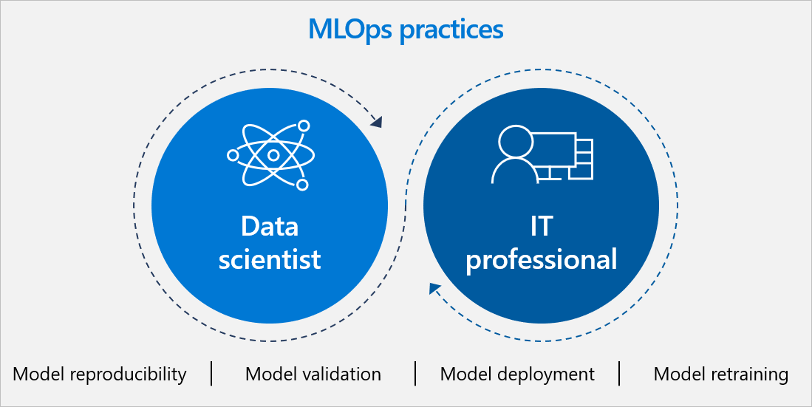

In the previous unit, we introduced the concept of MLOps. MLOps is the practice of collaboration between data scientists, ML engineers, software developers, and other IT teams to manage the end-to-end ML lifecycle. We outlined best practices to efficiently create and deploy AI models.

In this unit, we'll describe the process of managing, monitoring, and retraining those models over time. We discuss the importance of creating dedicated workflows for model monitoring and incident response. 

## ML lifecycle: why do ML models need to be monitored and retrained?

All models—including those that work perfectly on deployment—require monitoring and retraining over time to maintain high performance. This process enables you to correct performance issues or simply take advantage of newer training data.

Reasons for inaccurate predictions might include:

* **Inadequate training**. For example: app users submit photos taken at night for object recognition, but the model was only trained on well-lit photos.
* **Issues with the "live data" that the model evaluates**. For example: sellers record customer data inconsistently in a company's CRM system.
* **The model itself "drifts" or declines over time**. This includes "concept drift," where the concept of what you're trying to predict changes. "Data drift," or when the properties of the data change, is also common. And "upstream data changes," or operational changes to how or what data is collected, can impact models as well. 
* **The world changes**. For example: a financial trading model based on 2001 data probably isn't effective in 2020.

The monitoring and maintenance process is similar for pre-trained models and custom models. However, the responsibilities of different teams may vary.

## MLOps practices for model monitoring and retraining 

### Monitoring

When a model is deployed, the data scientists and developers who built it should provide maintenance instructions to a dedicated MLOps team responsible for monitoring the model. This information includes performance baselines, key metrics to monitor, and the thresholds for automatic alerts. 

There are a few ways to approach monitoring: 

* The first is **automatic monitoring** with established performance thresholds that trigger alerts. For example, the model provides a confidence metric for each prediction it makes. If the team sets a 75% confidence threshold and the application indicates a lower number, it's automatically flagged as a performance concern. Another method of automated monitoring runs on a scheduled basis, as often as every day or every hour. An automated script queries the micro-service that contains the model and logs the analysis. The team can then identify any anomalies that suggest the model isn't performing correctly.  
* Another approach to monitoring is a **manual spot check**, where someone tests the model and does their own analysis. In some cases, this is the only way to determine if and why a model isn't working correctly.

We recommend a combination of automated analysis and manual spot-check analysis to prevent performance issues from falling through the cracks.

Regardless of how you detect a problem, the issue should be recorded in a central log that orchestrates response team activities.

### Incident response 

Let's say your monitoring efforts catch a performance issue. We recommend a three-tiered approach to resolution:

1. Level-one response consists of the MLOps team responsible for ongoing monitoring. These aren't data scientists, but they're operations people who understand the technology that the business uses and how AI models fit into it. They may have scripted approaches for how to respond, such as: if you see issue X, run script Y, and determine if the issue is resolved by executing script Z.
1. If the level-one team can't fix the issue, they then escalate to the level-two team. This team is composed of data scientists who are tasked only with incident response (that is, they're not involved in model or application development). This team will diagnose and attempt to solve the issue at a data science level. For instance, they might examine the models to determine feature distribution and if there are challenges there. Or they will look for anomalies in the datasets and retrain or reevaluate the model.
1. If the level-two team fails to solve the problem, only then do they escalate the problem to the team that built the model. It's important to only pull in the development team when necessary. That way, they can remain focused on developing new models and driving innovation rather than being round-the-clock incident response.

With different tiers responding to problems, it's critical to orchestrate their activities with the central incident log to ensure there's no duplication of efforts.

### Model retraining

:::row:::
   :::column span="":::
      During the incident response process, the level two or level three teams may retrain a model after an "incident" like a decline in performance. To retrain the model, they repeat the initial training process with new data and may tweak model parameters. ML services can help automate aspects of this process, although it's important to keep humans involved in retraining efforts. It's also wise to establish processes for retraining models even when there's not an "incident." You'll need to determine how often retraining needs to be completed based on your use case.
      
      We recommend retraining models using a CI/CD pipeline, a concept from software development. Short for Continuous Integration/Continuous Delivery, a CI/CD pipeline automates the steps in the application delivery process. Every time a model is changed, or a new model is created, an automated build-and-test sequence is run. The pipeline builds the model, tests the model, and then deploys it first to a small instance, like an Azure container instance.
      
      If the model is a newer version of an existing model, you'll need to see if it performs better than the previous one on key metrics. We recommend A/B testing, which involves deploying the new model to only a small percentage of traffic and comparing the two versions.
      
      It's critical to keep a "human in the loop." This means maintaining human oversight of the retraining and outcomes of the new model. If model retraining is entirely automated, bias may be introduced over time or outcomes may shift. Finally, validate the model again by testing it against the desired business outcomes. 
   :::column-end:::
   :::column span="":::
      * **Continuous integration** automates tests and builds for your project. CI helps catch bugs or issues early in the development cycle, when they're easier and faster to fix. Items known as artifacts are produced from CI systems. They're used by the continuous delivery release pipelines to drive automatic deployments.
      * **Continuous delivery** automatically deploys and tests code in multiple stages to help drive quality. Continuous integration systems produce deployable artifacts, which includes infrastructure and apps. Automated release pipelines consume these artifacts to release new versions and fixes to the target of your choice.

   :::column-end:::
:::row-end:::

## Conclusion: Business outcomes of adopting MLOps 

MLOps practices facilitate better business results, enable faster time to market, and accelerate experimentation. These practices also increase collaboration and alignment across teams and help assure model quality and auditability—ultimately accelerating the ML lifecycle.

When you're setting up new processes, be aware that the changes required aren't just technical. There will also be shifts in organizational culture and daily workflows. It's vital to manage those changes carefully.

To more easily track and manage the processes we've discussed, we recommend using a central MLOps platform that supports the entire lifecycle, such as the Microsoft Azure MLOps offering.

Are you ready to take the next step? Microsoft Services partners with forward-thinking businesses to apply enterprise technology to business problems by understanding their goals, identifying risks, and guiding each step of their digital transformation. Call or contact your Microsoft account representative or visit [our services page](https://enterprise.microsoft.com/services) to discover how Microsoft Services can help.

And now that we've covered the details of MLOps and the ML lifecycle, learn more about how MLOps relates to the entire organization in the next unit.