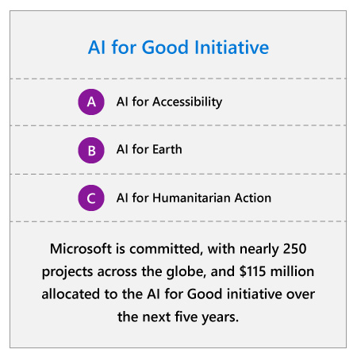

## Abstract

Each company will have their own guiding principles, but ultimately these principles need to be part of a larger responsible AI strategy to be effective. This strategy should encompass how your organization brings these principles to life both within your organization and beyond.

To provide oversight and guidance within your organization, we recommend establishing a governance system that is tailored to your organization’s unique characteristics, culture, guiding principles, and level of engagement with AI. We also recommend understanding the different ways your governance system can foster responsible and trustworthy AI based on whether you are using third-party AI systems or developing in-house AI solutions.

Beyond internal governance, we believe you should consider how to foster responsible and trustworthy AI in your industry and throughout society. We all must work together to maximize AI’s potential for positive change.

Learn how your company can foster responsible and trustworthy AI, both internally and with other organizations.

## Establishing an AI governance system

AI is more than just a new technology. Because of the far-reaching impacts it will have throughout the business, enterprises are seeing a growing need to create governance systems at the highest level of the company that can help their organization engage with AI responsibly.1

As discussed in the previous unit, the first step for any AI governance system is to establish guiding ethical principles for the organization. This is especially important because laws and regulations around ethics and technology are relatively nascent. With guiding principles providing a foundation, governance systems are generally tasked with objectives that include developing and implementing policies, standards, and best practices, building a culture of integrity, providing advice, and educating employees.

To help your organization get started, we have provided an overview of three common governance approaches below: hiring a Chief Ethics Officer, establishing an ethics office, and forming an ethics committee.

This overview is not exhaustive, and we recognize that even the approaches below will continue to change over time. Companies should choose a model, or combination of models, that suits their organization’s AI maturity, unique characteristics, and objectives. For any type of governance system to be successful, it must report to the board of directors and have the financial and human resources, authority, and processes to affect real change throughout the organization. No matter what model you choose, it will be important to be prepared to evolve over time.

## Chief Ethics Officer

Often organizations choose to consolidate their ethics initiatives under a Chief Ethics Officer. While often coupled with legal compliance, the Chief Ethics Officer’s role covers all aspects of remaining ethical and responsible. With the advantage of centralized decision-making, this form of governance enables companies to quickly develop policies around ethics while ensuring there is accountability for each decision. Hiring this public-facing role can also be a good way can showcase a company’s commitment to engage with AI and other technology in a responsible and trustworthy manner.

However, while the Chief Ethics Officer role can very effectively create policies, as an individual without a team they may struggle to implement them across an organization without the support of an ethics office.

## Ethics office

The second governance approach focuses on empowering employees across the organization. It involves forming a dedicated ethics team from different levels of the company that is solely focused on ensuring the ethical principles are being followed by all employees. Depending on your organization, the ethics office can be independent or part of a broader risk, compliance, or legal team. If the ethics office is independent, it can be established without a leading role, but companies often choose a Chief Ethics Officer to head the office.

While ethics offices can be responsible for developing new policies, their key advantage is the ability to implement the policies at scale. With dedicated team members working at all levels of the company, an ethics office can effectively ensure policies and processes are followed in a meaningful way in every stage of AI engagement. Ethics offices also prove adept at building a culture of integrity within an organization.

## Ethics committee

The last approach brings together a diverse array of outside experts and senior leaders from within the company to address AI ethics. Ethics committees generally do not have members dedicated solely to ethics, but work with different groups within the organization to develop and implement policies, standards, and best practices.

This form of governance provides an organization with perspectives from people with a wide range of different backgrounds and expertise, unbiased opinions from external members, and buy-in from senior leaders across the company.

## Governing AI deployment and development

No matter which governance approach you choose, we recommend having your ethical governance system create an overall handbook or manual to govern the use of AI in your organization. Establishing policies around how AI is deployed, used, and maintained – and training employees on how to follow those policies – can help ensure alignment with your internal AI principles and protect employees and customers from unintended consequences.

For example, policies may mandate training employees to understand models and data sources in the AI systems you are deploying, identify bias in datasets or AI recommendations, and report performance issues. They may also require conducting regular audits of AI systems, documenting processes for holding employees accountable, or establishing processes for AI security and privacy. You can use the checklists we provided at the end of the previous unit as a starting point for creating your policies.

More specific processes and polices will depend on whether your company is using third-party systems or developing AI in-house. Based on this factor, we have provided recommendations to help your company govern your AI engagements.

## Third-party AI systems

If your organization plans on leveraging out-of-the-box third-party AI solutions, we recommend learning about the third party’s commitment to responsible AI design to ensure it aligns with your own principles. For custom AI solutions, consider including your principles or standards in your request for proposal. Before deploying any third-party AI solution, create guidelines on how to safely operate and monitor the system and thoroughly train relevant employees on these guidelines. Your governance system should also create processes to ensure these guidelines are being followed throughout the AI system’s entire lifespan. Finally, your governance system should ensure the AI system has been rigorously tested and operates as intended.

## First-party AI systems

If your organization also plans to develop AI solutions or integrate AI into your existing products and services, then we recommend that your ethical governance system review or provide advice before the release of any new AI system, especially for sensitive use cases. They should analyze relevant aspects of the system like its purpose, technical capabilities, reliability, and whether it will be used in sensitive cases like those that may deny people consequential services, create risk of physical or emotional harm, or infringe on human rights. Consider also ensuring employees from all levels of the company have the opportunity to surface ethical concerns before you sell AI or AI-integrated products and services. If concerns do arise while designing, developing, or selling the AI system, then the members of the ethical governance system or senior decision-makers can analyze the case and provide guidance to mitigate the risks. Finally, you should create processes to monitor the AI systems you deploy or sell in order to detect and mitigate model drift and decay over time.

## Developers

If you are developing AI in-house, we also recommend that your ethical governance system provides your developers with detailed and thorough standard guidance that can help them design and develop AI solutions to reflect your organization’s ethical principles.

Because AI systems vary widely in terms of purpose and operation, you might find it necessary to also create guidelines for specific AI technologies. For example, we developed ten guidelines that help developers design bots that adhere to ethical principles and build trust in the company or service the bot represents. Our researchers also synthesized 150+ design recommendations into a unified set of guidelines for human-AI interaction to help developers design human-centered AI systems. These technology-specific guidelines are especially necessary for AI systems that raise complex ethical or human rights considerations. For example, we have established a set of principles specifically for facial recognition technology because, while society could benefit tremendously from its responsible use, it has the potential to be misused by private or public organizations. Access these guidelines and principles in the resources section of this module. Finally, to make the process seamless for your developers, consider developing checklists based on these guidelines that map to the phases of an AI project, from data acquisition to model development and testing.

Along with these guidelines, your ethical governance system should take advantage of tools and resources that make it easier for developers to spot and design against potentially harmful issues like biases, safety and privacy gaps, and exclusionary practices.

## Engaging with external stakeholders

As the use of AI becomes more common, we consider it a shared responsibility across the public and private sectors to engage with AI responsibly. While each organization may have its own principles, governance systems, and guidelines to accomplish this internally, collaboration between enterprises, public organizations, governments, and non-profits will be crucial to ensure these concerns are addressed throughout society while maximizing AI’s potential to deliver broad benefits.

Enterprises can contribute to these collective efforts in a number of ways. At Microsoft, we have focused on joining industry initiatives, influencing policy, addressing future labor and workplace needs, and considering how our technologies can be used to improve the lives of people around the world.

## Participating in industry coalitions

Advances in AI won’t happen at just one company and they won’t happen responsibly without a strong community working together. That’s why enterprises should also take advantage of and contribute to shared initiatives like Partnership on AI (PAI). Partnership on AI is a group of researchers, non-profits, non-governmental organizations (NGOs), and companies dedicated to ensuring that AI is developed and utilized in a responsible manner. PAI is working to advance the public’s understanding of AI, serve as an open platform for discussion and engagement about AI and its influences, and develop best practices for AI technologies. By sharing this knowledge with the world, organizations like PAI can help ensure that intelligent technologies are serving humanity in beneficial and responsible ways. As AI continues to expand, every enterprise should be open to collaboration and join in this shared dialogue.

## Providing a perspective on policy

Given AI is still at a nascent stage of development it is likely that changes to existing laws will be required and new laws may be needed to keep AI on a path that benefits society. We believe it’s important for companies to be aware of these potential changes and get involved where possible in the public dialogue on AI advancements and potential legislation.

For example, last year we publicly called for regulation of facial recognition technology and outlined our recommendations for the public and private sector alike. Over the past decade, facial recognition technology has made rapid advancements in both speed and accuracy, uncovering myriad uses ranging from cataloging photos to enhancing security. Its potential for uses that infringe on fundamental human rights like open public surveillance has highlighted the need for societal scrutiny and government regulation. We believe there is an especially pressing need for laws and regulations around AI technology with sensitive use cases like this.

Other emerging intelligent technologies will raise similar issues in the future, and we will continue to look for opportunities to help government agencies create adequate regulations. We will all need to continue to work together to identify issues that have clear societal or economic consequences and develop solutions to protect people without restricting innovation.

## Addressing future labor and workplace needs

:::row:::
:::column span="2":::
AI is already significantly shifting how people prepare for, find, and accomplish work. Increasingly, workers will have to learn how to maximize the benefits of using emerging intelligent technology in their workplace. Gartner predicts that by 2021, 70% of enterprises will integrate AI to assist employee’s productivity.2 But like other major new technologies, AI raises concerns about long-term impact on employment.

A recent study by Accenture concluded that “AI could double annual economic growth rates in 2035 by changing the nature of work and creating a new relationship between man and machine.” Reference this article in the summary section of the module. That’s why, at Microsoft, we are focused on creating AI that augments human abilities rather than replacing them. We aim to empower the workforce by developing AI technology that leverages the unique strengths of computers—such as probabilistic reasoning and pattern recognition—with the creativity, ingenuity, and capacity for meaning-making of humans.

Yet as the pace of technological innovation and disruption is accelerating, we are seeing a widening skills gap in critical areas of foundational knowledge and expertise. The McKinsey Global Institute estimates that, by 2024, there will be 250,000 unfilled U.S. data science job openings.4 To realize the potential of AI, we must first address the ability of those in the current and future workforce to adapt to, engage with, and fundamentally understand these technological advances and transformations.
:::column-end:::
:::column span="2":::

:::column-end:::
:::row-end:::
We believe enterprises have an important role to play in helping people get the training they need to thrive in today’s shifting economy. At Microsoft, we are focusing on three areas: preparing students for tomorrow’s jobs, helping workers prepare for the changing economy, and helping match workers to 21st century job opportunities.

According to the 2018 WEF Future of Jobs Report, many companies have been focusing their upskilling and retraining efforts on those people who already have higher skills and value to the company. For Microsoft, this means constantly looking for ways to work together to support people in this changing economy. Our publicly available Microsoft Professional Program now has an AI track bringing together expert instructors, provide hands-on labs, offer AI-specific online courses and instructional videos. We have also developed a developer-focused AI School, which provides online videos and other assets that help build professional AI skills. We’re also seeing unique partnerships to further skills development and employability. For example, the Skillful Initiative, a partnership with the Markle Foundation in the US, helps match people with employers and fill high-demand jobs.

## Contributing solutions to societal challenges

:::row:::
:::column span="2":::
By harnessing the power of AI, we have an opportunity to help individuals, organizations, and governments solve some of society’s most daunting problems. AI can help people collect, process, and analyze data, turning it into actionable insights that can accelerate advances in health and wellbeing, education, agriculture, and climate change mitigation. We invite all enterprises to consider making their AI-infused technologies widely available to improve the lives of people around the world.

At Microsoft, we are working to empower those striving to solve humanitarian issues and create a more sustainable and accessible world with technology, resources, and expertise through our AI for Good initiative. We’ve committed $115 million over the next five years to provide financial grants, technology investments, and partnerships that combine our AI and data science experience with these individuals’ and organizations’ core expertise. AI for Good includes three programs: AI for Accessibility, AI for Earth, and AI for Humanitarian Action, which are already supporting nearly 250 projects across the globe.
:::column-end:::
:::column span="2":::

:::column-end:::
:::row-end:::

Next, let’s take a look at the advantages and disadvantages of different governance models.