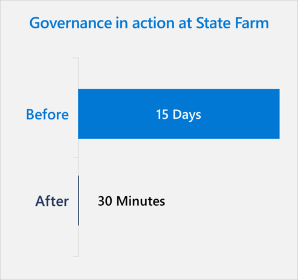

## Responsible AI in the insurance industry

Data and statistical models have always been the lifeblood of the insurance industry. As insurance companies begin to think about new and better ways to serve customers, there are significant opportunities for innovation using data and AI.

We are already seeing AI integrated across many business functions in the insurance industry. Machine learning models are being used to better match consumer price to risk, streamline the claims process, and better detect fraud. Investments in AI technology are growing too. Sixty-three percent of insurers believe intelligent technologies will completely transform the industry. 1

However, as insurance companies invest further in AI, it's imperative that their innovation is guided by a responsible AI strategy. As the leading auto and home insurer in the US, millions of people come to their "Good Neighbor" State Farm for insurance and financial services. Maintaining and amplifying that remarkable service is what guides State Farm decisions about applying AI solutions to enhance decision-making, increase productivity, lower costs, and create even better employee and customer experiences.

To do this responsibly, State Farm has established a governance system that assigns accountability for AI and oversees the development and management of AI solutions that benefit customers.

## Responsible AI governance at State Farm

State Farm is careful to develop and evolve controls for AI systems in parallel with their AI solutions. In their governance approach, controls and oversight are applied throughout the solution's lifecycle from the early development stages to running in production. To oversee responsible design and deployment of AI solutions, State Farm has established processes and assigned accountability to certain positions and groups.

:::row:::
:::column span="2":::
The __Chief Data and Analytics Officer__ has primary executive accountability for responsible AI across the organization. This position is responsible for leading, but not unilaterally dictating, the collaboration and evolution of responsible AI principles across the enterprise. While this role leads the Responsible AI governance effort, it requires the support of other governance entities.

A central __validation team__ reports to the Chief Data and Analytics Officer's department and oversees model validation and AI in software reviews. The team uses a systematic process to assess different aspects of AI models, including evaluating training data sets, mathematical approaches, and intended business uses.

A model risk __governance committee__ includes members from a variety of business areas including corporate law, enterprise risk management, office of privacy, IT, procurement, and executive partners in the lines of business, with corporate law providing legal advice to the committee. The committee provides strategic direction to the validation team by reviewing and approving model risk management procedures and guidelines. Among other responsibilities, the committee also serves as a forum for executive collaboration, education and discussion concerning model risk topics.
:::column-end:::
:::column span="2":::

:::column-end:::
:::row-end:::

Through this governance approach, State Farm looks to continue evolving AI control frameworks and integrate them at greater scale.

## Governance in practice at State Farm

One example of how State Farm has put their governance approach into practice involved a key customer-facing process.

In car accidents where damage to a vehicle is beyond repair or the repair cost exceeds the value of the car, a claim handler may determine that the claim is a "total loss."  To reduce the time to settle an automobile damage claim, State Farm developed an AI model, called the Dynamic Vehicle Assessment Model (DVAM), to help predict a total loss even earlier in the claim process.

The DVAM leverages data collected when a customer files a claim to provide the customer with expanded vehicle inspection and settlement options. Using machine learning, the model predicts with a level of confidence if a vehicle is a total loss or repairable. In some cases, the model allows State Farm to bypass the physical inspection process and yet ensure a thorough investigation of the claim.

:::row:::
:::column span="2":::
By incorporating AI into the total loss process, the claim handler can settle the claim even more quickly – simplifying, expediting, and improving the customer experience. The DVAM solution reduced the total loss process from as high as 15 days to as little as 30 minutes. As a result, State Farm employees and agents have more time to dedicate to providing unmatched customer experience.

While the model itself is impressive, designing and deploying an AI solution at this scale required collaboration across many different decision-making bodies within the organization. The business team and AI development team partnered closely to ensure that the DVAM solution was aligned to their intended business outcomes. Together, they assessed which business area KPIs were impacted, determined the baseline measurements of those KPIs, and finally, measured and monitored KPI changes after the model was launched.

As for AI governance, the business team and validation team collaborated to evaluate the model. The DVAM solution was launched in phases, which allowed State Farm to thoroughly assess the model before it was fully rolled out. The governance processes were transparent to all participants throughout the process, so there were no surprises.s
:::column-end:::
:::column span="2":::

:::column-end:::
:::row-end:::

## Key lessons

1. __Successful AI requires interdisciplinary collaboration__ The process of integrating AI across an organization is inherently cross-functional and involves collaboration across many key business roles. To ensure their AI models make the biggest business impact, State Farm encourages partnerships between different groups throughout the organization with diverse skills and perspectives. When business decision makers work alongside developers and technical experts to design and develop AI solutions, AI initiatives are more likely to achieve organizational objectives.
2. __Innovate AI controls alongside AI technology__ When you adopt new technology, it is important to adopt new controls as well. Governance processes for legacy technology may not adequately regulate newer, more advanced technology. Older processes can also stifle innovation, so innovating AI governance controls in parallel with AI solutions actually accelerates the innovation process and produces better business results. In this case study, the DVAM solution leverages techniques in automated model monitoring.

## Evaluation of the State Farm strategy

Let's examine how the State Farm AI strategy is creating value using the [value creation framework developed by Peter Zemsky](https://docs.microsoft.com/learn/modules/ai-strategy-to-create-business-value/2-holistic-ai-business-strategy-insead), INSEAD's Eli Lilly Chaired Professor of Strategy and Innovation:

1. From the __industry environment perspective__, insurance companies are looking to streamline their business processes and lower costs without jeopardizing the customer experience. The key to success will be balancing advancements in AI capabilities with responsible usage.
2. From the __value creation perspective__, leveraging responsible AI principles to establish a governance system helps State Farm make faster and more informed decisions, generating value by improving customer and employee satisfaction.
3. From the __organization & execution perspective__, State Farm focused on aligning their responsible AI strategy with their strategic business goals. Selecting an appropriate use case and establishing a governance system allowed State Farm to leverage their existing data to bring a transformative AI solution to an established business process.

## Conclusion

State Farm sees their AI governance as essential to their innovation with AI. Their responsible AI frameworks allow them to make faster and more informed decisions, maintain customer trust and create even better customer and employee experiences. Through this approach, State Farm stays true to their deep sense of purpose to help people—a mission that contributes to their success in the long run.

Next, let's wrap up everything you've learned about responsible AI with a knowledge check.
