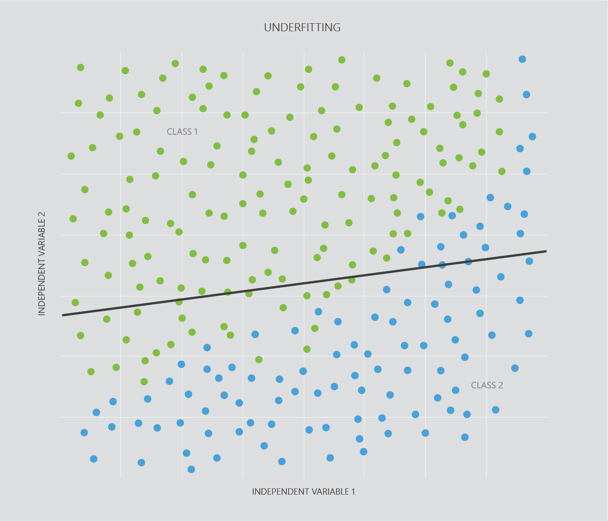

We need training data to train a model. Once trained, we need to check how well our model will work with other similar datasets. To test a model for this, we need separate *test data*.

The larger our training set is, the more accurate our model can be overall. The larger our test set is, the more confident we can be in the model’s accuracy with new data. So, the more data the better.

Normally, we start with a large dataset and split it into training data and test data. How much data goes to testing and training is different for each application, but it’s normal to start out by assigning about 80% of your data to training, and 20% to testing.  
  
## Overfitting

Most datasets have noise - irregular fluctuations that we are not interested in and can obscure what we are trying to measure or visualize. If we collect two datasets of the same thing (for example, leaf size versus trunk girth), these datasets should have approximately the same relationship between variables, but different noise. *Overfitting* occurs when a model is trained so intensely on training data that it not only learns the pattern we are interested in, but it also learns the noise of that particular dataset. Because noise is completely different between datasets, this means that model will not work well on other datasets. In practice this is shown by a model having high accuracy on a training set, but low accuracy on the test set.

The black line in the graph below is an example of overfitting. The *__red__* line is more generalized. Although the red line may be less accurate than the green line on the *training* set, on the test set and future datasets it will give a much better result.  
  
![Scatter plot showing overfitting. The Y-axis represents independent variable 2 and the X-axis represents independent variable 1. The plot has two classes of data points - green and blue data points. They are on opposite diagonal sides of the plot, divided by a non-linear black line that represents overfitting and a red line that is closer to being linear. The black line attempts to perfectly label all the data points into their correct categories, which would give a bad result on the test set. Whereas, the red line is a much more generalized line, far closer to linear than the variable black line. The red line would give a slightly lower result for accuracy on the training set, but a far higher result for accuracy on the test set.](../media/4.3_Overfitting.png)

Overfitting tends to be encouraged by two major factors. Firstly, it can be more likely when training datasets are too small, and/or do not have enough variance, to be properly representative of ‘real world’ data. Secondly, overfitting is more likely to occur in models that are complex than in models that are simple. Roughly speaking, the more complex a model is, the more training data is needed to avoid overfitting.  
  
A balance has to be struck, however, because if a model becomes too simple, it won’t fit either training or test data well.

## Underfitting

Models that are too simple or undertrained fail to find true relationships in our data. This is called *underfitting* and reflected by poor accuracy in both training and test data. Underfitting typically occurs when there is not enough training data, when useful features are not used, or when the type of model is not suitable for the data at hand. For example, the graph below shows underfitting occurring in a linear model that is trying to predict a non-linear problem. While the line does separate the red and blue dots somewhat, a non-linear line is likely to do a better job.
  

To address underfitting problems you may move onto a more complex algorithm (such as an SVM), get more training data, or add more features to your data set.

### Validation sets

It can be time consuming and computationally expensive to use a large training dataset only to find out at the end of training that overfitting has occurred and you have low accuracy on your test set. Using a validation set alongside your training set gives an unbiased result for your model to use to detect overfitting as it is occurring.

The size of your validation set varies depending upon your application. A good starting point is to allocate 60% of your data to a training set, 20% to a validation set, and 20% to a test set.

If the validation sets error begins to increase by a certain amount, overfitting may be occurring, and training can be stopped. This process is called early stopping.

## Summary

Well done! Here we covered:

* __Test sets__ - data to test a model’s accuracy on - separate from the training data.
* __Noise__ - natural variation in the data that we are not interested in.
* __Overfitting__ - when a model is trained too well and learns the noise in the training set, giving poor results on the test set.
* __Underfitting__ - when a model isn’t trained well enough and has mediocre performance on both training and test datasets.
* __Validation sets__ - a dataset used alongside a training dataset to help prevent overfitting.

Now that you’ve been introduced to support vector machines, let’s wrap up what you’ve learned with a knowledge check.
