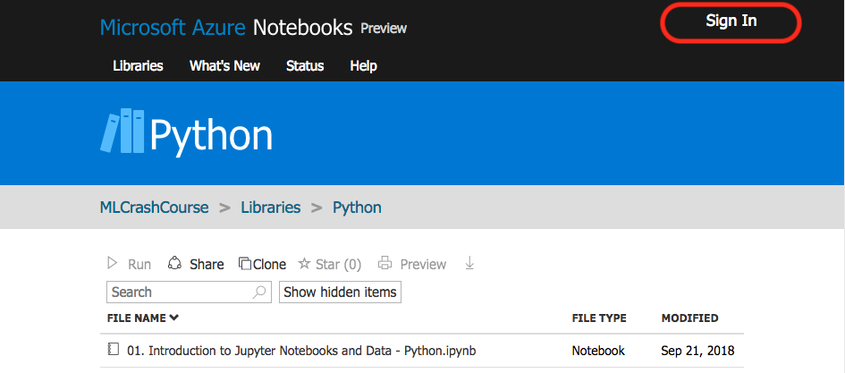
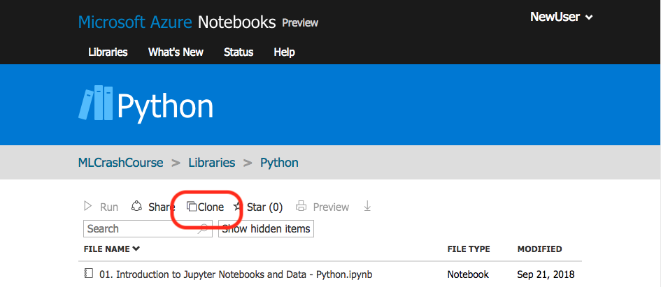
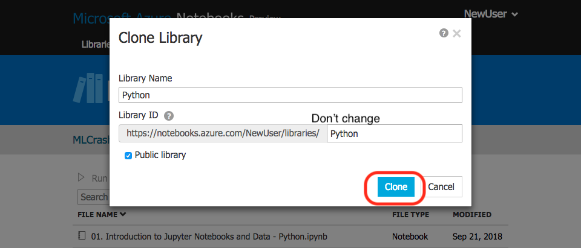
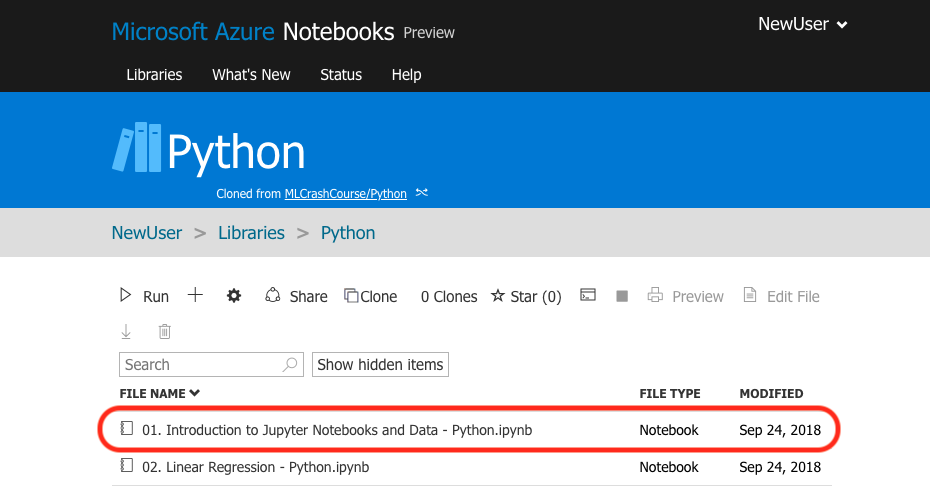

This section will guide you through setting up your Azure Notebooks library, so you can do AI in your browser. The next section will be our first, very simple, programming exercise.

In this course we will do exercises using Jupyter Notebooks. These webpages let you run code, right in the browser. We offer AI programming exercises in both Python and R, which are both great for beginners. We suggest using Python, unless you have experience in R or you plan on using R in the near future. We will keep things simple. The important things to remember are:

* Follow the instructions carefully.
* Be careful not to add spaces or tabs unless asked.
* Remember that things are CaSe SeNsiTiVe. So if you are asked to write in lower case, don’t write in UPPER case.

Follow these five steps to get started:
  
1. Go to the programming exercises in Azure Notebooks.
   * For the Python programming exercises click [__here__](https://notebooks.azure.com/MLCrashCourse/libraries/Python "here").
   * For the R programming exercises click [__here__](https://notebooks.azure.com/MLCrashCourse/projects/R-Exercises "here").
2. Click the ‘Sign In’ link in the top right hand corner.

3. Follow the prompts to sign in, or create a free account.
4. Click on the clone button.

5. Click on the new blue Clone button that appears in the pop-up box.

Now your library is set up and you're ready to start the programming exercises.

We provide links to the programming exercises as we go in the course, but you can do them at your own pace from your library.

Provided you are signed in and have cloned the library, you just need to click on the exercise you want to do.

Click [here](https://notebooks.azure.com/home/libraries/Python "Link to crash course library") to go to your library.

Click on the exercise you wish to do, and it will appear in a new tab.

Next, we'll do a short walkthrough of a programming exercise that will introduce you to Azure Notebooks.